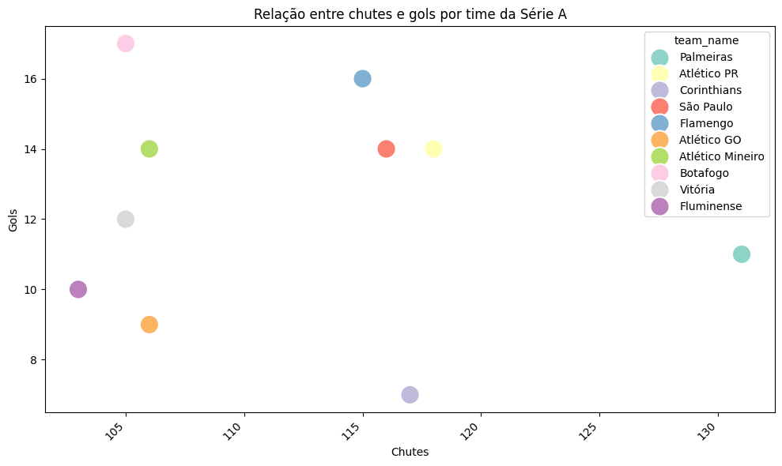

# Documentação Modelo Preditivo - Inteli

## Previgol

### Elementar

#### :student: Integrantes:

- <a href="https://www.linkedin.com/in/bruno-jancso-fabiani-0272532b3/">Bruno Jancsó Fabiani </a>
- <a href="https://www.linkedin.com/in/danielaraujogon%C3%A7alves/">Daniel Augusto de Araújo Gonçalves </a>
- <a href="https://www.linkedin.com/in/davi-basa/">Davi Basã Henrique Alves </a>
- <a href="https://www.linkedin.com/in/fernando-soares-oliveira/">Fernando Soares de Oliveira </a>
- <a href="https://www.linkedin.com/in/giovanna-britto/">Giovanna Fátima de Britto Vieira </a>
- <a href="https://www.linkedin.com/in/gucolombini/">Gustavo Colombini </a>
- <a href="https://www.linkedin.com/in/rafael-furtado-b30715265/">Rafael Furtado Victor dos Santos </a>

## Sumário

[1. Introdução](#c1)

[2. Objetivos e Justificativa](#c2)

[3. Metodologia](#c3)

[4. Desenvolvimento e Resultados](#c4)

[5. Conclusões e Recomendações](#c5)

[6. Referências](#c6)

[Anexos](#attachments)

## <a name="c1"></a> 1. Introdução

&nbsp;&nbsp;&nbsp;&nbsp; O presente projeto tem como tema central o desenvolvimento de um modelo preditivo para a International Business Machine Corp (IBM), com o objetivo de desenvolver um modelo para prever o resultado de partidas de futebol e gerar dados e estatísticas para auxiliar em análises estratégicas, decisões comerciais e para apoiar o desempenho dos jogadores.

&nbsp;&nbsp;&nbsp;&nbsp;Devido à imprevisibilidade dos resultados das partidas, causada pela localização do jogo, pelas condições climáticas, e pelo desempenho da equipe, o futebol se tornou um dos esportes mais populares do mundo, criando um ecossistema lucrativo composto por clubes, patrocinadores e jogadores (Fonte 1). Porém, essa instabilidade apresenta desafios significativos para técnicos e patrocinadores, cujas decisões dependem de análises do desempenho da equipe.

&nbsp;&nbsp;&nbsp;&nbsp; Dessa forma, considerando a necessidade dos técnicos e patrocinadores de possuir informações mais qualificadas para auxiliar nas suas resoluções, surge a demanda de uma ferramenta para prever os resultados de partidas e fornecer insights para criar estratégias de jogos e para decisões comerciais (Fonte 2). Portanto, esse projeto estabelece-se com o objetivo de atender essa necessidade por meio do desenvolvimento de um modelo preditivo treinado com dados históricos de partidas de futebol.

&nbsp;&nbsp;&nbsp;&nbsp; O projeto é organizado em uma série de etapas: a preparação e análise exploratória dos dados, o desenvolvimento do modelo preditivo, e a criação de um ambiente para visualização das previsões. As seções subsequentes deste artigo estão estruturadas da seguinte maneira: a seção 2 aborda o objetivo geral, os objetivos específicos e a justificativa do projeto; a seção 3 detalha a metodologia adotada; a seção 4 apresenta o desenvolvimento e os resultados, com foco na compreensão do problema, tratamento dos dados, modelagem e avaliação dos modelos; a seção 5 discute as conclusões; e, finalmente, a seção 6 traz as referências utilizadas.

## <a name="c2"></a> 2. Objetivos e Justificativa

### 2.1 Objetivos

#### 2.1.1 Objetivo Geral

&nbsp;&nbsp;&nbsp;&nbsp; O presente projeto tem como objetivo geral desenvolver uma solução baseada em um modelo preditivo de aprendizado supervisionado para prever os resultados de partidas de futebol, de forma a fornecer estatísticas e previsões que aprimorem estratégias de jogo, auxiliem na tomada de decisões comerciais e operacionais, e ofereçam suporte estratégico aos técnicos e patrocinadores.

#### 2.1.2 Objetivos Específicos

&nbsp;&nbsp;&nbsp;&nbsp; Por meio das solicitações realizadas, foram definidos os seguintes objetivos específicos do projeto:

1. Criar um modelo preditivo para prever o resultado das partidas, incluindo informações sobre o time vencedor, o autor do primeiro gol, e outros dados estatísticos que possam ser utilizados por técnicos para otimizar estratégias de jogo e por patrocinadores para maximizar seus investimentos.
2. Preparar e processar um grande quantitativo de dados históricos de futebol, por meio de processos de limpeza, normalização e tratamento dos dados.
3. Desenvolver uma interface para o usuário com visualizações interativas, que permitam aos técnicos e patrocinadores acessarem de forma intuitiva e rápida as previsões geradas pelo modelo.
4. Auxiliar os técnicos de futebol a tomar decisões baseadas em dados preditivos, otimizando estratégias e contribuindo para a melhora no desempenho dos jogadores em campo.
5. Fornecer aos patrocinadores dados baseados em análises estatísticas, permitindo asssim melhor alocação de recursos e o aumento do retorno sobre investimentos.

&nbsp;&nbsp;&nbsp;&nbsp; Espera-se que, com esses objetivos, seja possível obter um modelo preditivo capaz de prever os resultados das partidas de futebol a partir do treinamento com dados históricos, fornecendo ferramentas táticas tanto para técnicos quanto para patrocinadores, e impactando positivamente o desempenho dos jogadores.

### 2.2 Proposta de solução

&nbsp;&nbsp;&nbsp;&nbsp; A proposta de solução do projeto consiste no desenvolvimento de um modelo preditivo baseado em técnicas de aprendizado supervisionado, que será utilizado para prever resultados e gerar estatísticas sobre as partidas de futebol. Sendo assim, o modelo será desenvolvido seguindo a sequência de ações descrita abaixo:

1. **Preparação dos Dados:** limpeza, tratamento de valores e normalização.
2. **Análise Exploratória de Dados (EDA):** identificar padrões e relações nos dados.
3. **Desenvolvimento do Modelo Preditivo:** selecionar o algoritmo de aprendizado supervisionado, treinar e validar o modelo, e avaliar o desempenho por meio de métricas.
4. **Desenvolvimento de Interface e Visualizações:** criação de um ambiente para apresentação dos dados.

&nbsp;&nbsp;&nbsp;&nbsp; Por meio disso, o modelo poderá antecipar o resultado de uma partida, prever qual time terá mais probabilidade de vencer ou quem marcará o primeiro gol. Somado a isso, será possível fornecer informações estratégicas aos técnicos, permitindo a otimização das estratégias de jogo e o desempenho dos jogadores, oferecer suporte aos patrocinadores na alocação de recursos e decisões comerciais, e reduzir os custos operacionais dos clubes ao integrar dados em uma plataforma acessível e visualmente simples.

&nbsp;&nbsp;&nbsp;&nbsp; Dessa forma,a solução proposta resolve a dificuldade de realizar previsões de partidas de futebol e atende aos objetivos estabelecidos pelo parceiro do projeto, como: o desenvolvimento de um modelo preditivo, a análise detalhada dos dados, a criação de uma interface intuitiva para visualização dos resultados, e o apoio estratégico para técnicos e patrocinadores, contribuindo para o sucesso operacional e comercial dos clubes de futebol.

### 2.3 Justificativa

&nbsp;&nbsp;&nbsp;&nbsp; Um modelo preditivo é uma função matemática aplicada a uma grande quantidade de dados, com o objetivo de identificar padrões e prever tendências futuras. Ele cruza diversas variáveis que podem influenciar um determinado resultado, permitindo uma análise mais precisa e informada.

&nbsp;&nbsp;&nbsp;&nbsp; Embora os primeiros modelos preditivos tenham surgido na década de 1940, foi apenas no século XXI que a Inteligência Artificial começou a ser amplamente aplicada no esporte para avaliar o desempenho de atletas e equipes. Atualmente, essa tecnologia não só prevê resultados de partidas de futebol, mas também calcula métricas não convencionais, como o tempo de recuperação de posse de bola.

&nbsp;&nbsp;&nbsp;&nbsp; Conforme apresentado por Marques (2019), esse tipo de modelo oferece uma visão analítica confiável, provendo informações e previsões que são escaláveis e adaptáveis a diferentes contextos. No contexto deste projeto, o modelo preditivo será utilizado para gerar previsões sobre os resultados das partidas, fornecer estatísticas detalhadas sobre o desempenho das equipes e criar dados que ajudarão técnicos e patrocinadores a tomar decisões mais assertivas e estratégicas.

&nbsp;&nbsp;&nbsp;&nbsp; Além disso, o projeto proporcionará aos técnicos e patrocinadores acesso a dados personalizados e decisivos, o que poderá melhorar a performance das equipes e otimizar investimentos. A solução também contribuirá para a redução dos custos operacionais associados à gestão dos clubes e para a criação de uma experiência mais envolvente para os torcedores.

&nbsp;&nbsp;&nbsp;&nbsp; Portanto, a proposta não só atende às necessidades do projeto, mas também busca precisão nos resultados, interatividade com os usuários (técnicos e patrocinadores), e suporte estratégico para os times, redefinindo a forma como o futebol é experienciado e assegurando maior eficiência operacional no esporte.

## <a name="c3"></a> 3. Metodologia

&nbsp;&nbsp;&nbsp;&nbsp; A *Cross-Industry Standard Process for Data Mining* (Processo padrão de vários segmentos de mercados para Mineração de Dados, em tradução livre)*,* ou metodologia CRISP-DM são procedimentos que orientam o processo de mineração de dados (Médium). A metodologia CRISP-DM surgiu em 1996 quando um consórcio de empresas fornecedoras e consumidores potenciais de dados a criou, a partir da necessidade de elaboração de modelos com foco na qualidade através da padronização de conceitos e técnicas (Slide).

&nbsp;&nbsp;&nbsp;&nbsp; Essa ferramenta inclui descrições das fases, tarefas e dos relacionamentos de um projeto, fornecendo uma visão geral do ciclo de vida da mineração de dados, além de ser flexível e poder ser customizada, permitindo que o modelo seja adaptado às necessidades do projeto . Com base nesse formato, essa metodologia é composta por seis fases organizadas de maneira cíclica, com fluxo não unidirecional, sendo essas (Artigo Senac):

1. **Entendimento do Negócio**: Esta fase inicial busca compreender o contexto do problema de negócio e definir os objetivos principais do projeto. O foco é identificar as perguntas de negócios que precisam ser respondidas e os resultados esperados a partir da análise dos dados. Nessa etapa, é essencial envolver stakeholders para alinhar as expectativas e definir os critérios de sucesso do projeto. São realizadas tarefas como: definição dos objetivos de negócios, análise de situação, definição de metas de mineração de dados e elaboração de um plano detalhado do projeto.

2. **Entendimento dos Dados**: Uma vez definidos os objetivos do negócio, o próximo passo é explorar os dados disponíveis. Essa fase envolve a coleta, descrição e exploração inicial dos dados, além da verificação de sua qualidade. O objetivo é garantir que os dados sejam adequados para responder às perguntas de negócio e atingir as metas definidas na fase anterior. As principais atividades incluem a coleta de dados iniciais, descrição dos atributos, exploração dos dados para identificar padrões ou anomalias, e verificação da qualidade dos dados. A exploração pode incluir a análise de valores ausentes, inconsistências, erros de medição e outras questões relacionadas à integridade dos dados.

3. **Preparação dos Dados**: Esta é uma das fases mais críticas do CRISP-DM, já que envolve a transformação dos dados brutos em um formato adequado para a modelagem. A preparação de dados inclui uma série de atividades, como seleção de atributos relevantes, limpeza de dados (remoção ou correção de valores omissos e inconsistentes), transformação de variáveis, integração de diferentes fontes de dados e formatação adequada para os modelos a serem usados. A preparação de dados pode consumir até 70% do tempo de um projeto, mas é essencial para garantir a qualidade dos resultados. Nessa fase, também podem ser derivados novos atributos que ajudam a melhorar a performance dos modelos.

4. **Modelagem**: Com os dados preparados, a próxima etapa é a criação de modelos de mineração de dados. Esta fase envolve a escolha de técnicas de modelagem adequadas (como classificação, regressão, clusterização ou redes neurais), a definição de parâmetros e a execução de testes para avaliar o desempenho dos modelos. A modelagem é um processo iterativo, em que diferentes abordagens podem ser testadas e ajustadas para garantir o melhor resultado possível. Frequentemente, a modelagem exige uma análise cuidadosa das suposições feitas sobre os dados e a aplicação de métodos como validação cruzada para evitar sobreajuste.

5. **Avaliação**: Após a criação dos modelos, é fundamental avaliar seu desempenho em relação aos objetivos de negócio definidos na primeira fase. Esta etapa inclui a análise da precisão dos modelos, a validação de sua aplicabilidade no contexto de negócio e a revisão dos resultados obtidos. O objetivo é garantir que o modelo selecionado seja capaz de gerar insights ou previsões úteis, com base em critérios como taxa de erro, precisão, recall, F1-score ou métricas específicas do negócio. Se o modelo não atender às expectativas, pode ser necessário retornar a fases anteriores para realizar ajustes.

6. **Implementação**: Na fase final, o modelo desenvolvido é implementado no ambiente de negócios. Isso pode envolver a integração do modelo com sistemas existentes, o treinamento de usuários para utilizá-lo e o planejamento de monitoramento contínuo para garantir que os resultados permaneçam relevantes ao longo do tempo. A implementação também pode incluir a produção de relatórios finais que documentam o processo e os resultados, bem como a definição de planos para a manutenção e atualização do modelo. Uma implementação bem-sucedida requer não apenas a execução técnica do modelo, mas também a comunicação eficaz dos resultados e seu impacto potencial para os tomadores de decisão.

&nbsp;&nbsp;&nbsp;&nbsp; Aplicada ao contexto do projeto, a metodologia CRISP-DM, com sua estrutura descrita acima é relevante para o desenvolvimento do modelo preditivo que visa prever resultados de partidas de futebol e gerar dados estatísticos para análises estratégicas. Sendo que, a flexibilidade e a organização cíclica do CRISP-DM permitem que todas as etapas do projeto sejam abordadas de maneira eficiente, garantindo resultados confiáveis e alinhados às necessidades de técnicos e patrocinadores.

&nbsp;&nbsp;&nbsp;&nbsp; A fase de **Entendimento do Negócio** é fundamental para identificar os desafios enfrentados pela equipe técnica e pelos patrocinadores no gerenciamento das partidas de futebol. Este entendimento inicial é relevante para assegurar que o modelo preditivo seja focado nos principais objetivos: melhorar as estratégias de jogo e otimizar decisões comerciais. A fase de **Entendimento dos Dados** permite a coleta e análise preliminar dos dados históricos das partidas de futebol, identificando as variáveis mais relevantes para a construção do modelo.

&nbsp;&nbsp;&nbsp;&nbsp; Enquanto isso, a fase de **Preparação dos Dados** é relevante para o sucesso do projeto, considerando o grande volume de dados históricos de partidas que precisa ser tratado e normalizado para garantir a qualidade dos modelos. Essa fase garante que os dados sejam transformados de forma a serem utilizados pelos algoritmos de aprendizado supervisionado de maneira eficiente e precisa.

&nbsp;&nbsp;&nbsp;&nbsp; A **Modelagem** entra como a etapa central, onde serão aplicadas técnicas de aprendizado supervisionado para prever resultados, como o time vencedor e o autor do primeiro gol. Nesta fase, a seleção dos algoritmos, o treinamento e a validação do modelo são importantes para garantir que as previsões ofereçam informações confiáveis para técnicos e patrocinadores. A fase de **Avaliação** assegura que os modelos atendam às expectativas de precisão e forneçam previsões úteis para apoiar decisões estratégicas.

&nbsp;&nbsp;&nbsp;&nbsp; Por fim, a **Implementação** permitirá que o modelo preditivo seja integrado em uma plataforma visual, acessível e intuitiva, oferecendo aos técnicos e patrocinadores uma interface que facilitará o acesso rápido às previsões e às informações. Essa integração tornará as previsões utilizáveis e aplicáveis no dia a dia dos clubes de futebol, contribuindo para a melhoria do desempenho das equipes e maximizando o retorno sobre os investimentos dos patrocinadores.

&nbsp;&nbsp;&nbsp;&nbsp; Portanto, a metodologia CRISP-DM não apenas estrutura o processo de desenvolvimento do modelo preditivo, mas também garante que cada etapa seja executada de forma a gerar resultados precisos e aplicáveis ao contexto esportivo. Ao seguir essa abordagem, o projeto atende diretamente às necessidades identificadas, desde a preparação dos dados até a criação de uma interface interativa, contribuindo significativamente para o sucesso comercial e operacional das equipes de futebol.

## <a name="c4"></a> 4. Desenvolvimento e Resultados

### 4.1. Compreensão do Problema

#### 4.1.1. Contexto da indústria

&nbsp;&nbsp;&nbsp;&nbsp; No cenário dinâmico e competitivo da Inteligência Artificial (IA), a IBM se destaca como uma líder global, presente em mais de 175 países e especializada em soluções que integram IA, nuvem híbrida e consultoria tecnológica. Logo, a empresa tem sido fundamental na revolução digital, oferecendo inovações em IA que ajudam empresas de diferentes setores a otimizar processos, reduzir custos e obter vantagens competitivas. Apesar disso, ela ainda enfrenta problemas, sendo um dos desafios mais recentes e significativos a criação de uma solução preditiva para estádios de futebol, utilizando modelos de aprendizado de máquina para prever resultados de jogos, analisar o desempenho de jogadores e fornecer insights estratégicos. Essa solução não só promete transformar a experiência dos espectadores, como também aperfeiçoar a análise esportiva.

&nbsp;&nbsp;&nbsp;&nbsp; Diferentemente do amplo setor de tecnologia, o mercado de soluções em IA para o setor esportivo está crescendo rapidamente, na qual empresas como Microsoft, SAP e Oracle são concorrentes diretos, cada uma investindo em soluções de IA voltadas para a análise de desempenho e otimização de experiência dos usuários. A Microsoft, por exemplo, desenvolve plataformas baseadas em IA que integram dados esportivos em tempo real, enquanto a SAP oferece o SAP Sports One, focado em gestão de desempenho para clubes e organizações esportivas. A Oracle também investe em IA para análise em tempo real, ampliando a capacidade de decisões estratégicas durante eventos esportivos. Esse cenário reflete um mercado em expansão, onde a inovação em IA é essencial para se destacar.

&nbsp;&nbsp;&nbsp;&nbsp; Com esse foco, a IBM posiciona suas soluções não apenas como ferramentas tecnológicas, mas como ecossistemas integrados que transformam a forma como os esportes são geridos, trazendo informações estratégicas tanto para a performance dos atletas quanto para a gestão dos clubes e ligas. Isso reforça seu diferencial competitivo no uso de IA para além de produtos de tecnologia tradicionais, sendo uma das empresas líderes no setor de soluções preditivas.

&nbsp;&nbsp;&nbsp;&nbsp; Dessa forma, O modelo de negócio da IBM em IA está centrado na oferta de soluções tecnológicas integradas, com foco em inteligência artificial, nuvem híbrida e transformação digital. Então, a empresa adota um modelo de negócios flexível, que inclui parcerias de longo prazo, licenciamento de software e serviços baseados em assinatura, adaptando suas soluções às necessidades específicas de cada cliente. No setor esportivo, a IBM oferece IA aplicada à previsão de resultados, análise de performance de jogadores e otimização da experiência dos torcedores. Com essa abordagem, a IBM não só proporciona vantagens competitivas, mas também atua diretamente na transformação digital do esporte, um mercado que está cada vez mais dependente de tecnologia de ponta para se manter competitivo.

&nbsp;&nbsp;&nbsp;&nbsp; Quanto às tendências de IA no mercado esportivo, há um foco crescente na personalização da experiência do usuário e no uso de dados para tomadas de decisões em tempo real. A integração de machine learning e IA torna as soluções preditivas mais precisas, possibilitando dados detalhados tanto para treinadores quanto para gestores esportivos. Além disso, o potencial futuro da computação quântica, que ainda está em fase de desenvolvimento, pode trazer uma revolução na análise de grandes volumes de dados, aumentando ainda mais a competitividade das empresas que investirem nessa tecnologia. Outro ponto relevante é a adoção de plataformas de nuvem híbrida, que garantem escalabilidade e flexibilidade na gestão dos dados esportivos, sendo um diferencial em um setor que demanda análises complexas e rápidas.

&nbsp;&nbsp;&nbsp;&nbsp; Portanto, em um mercado altamente competitivo, onde a tecnologia desempenha um papel importante na diferenciação das empresas, a IBM se destaca por sua capacidade de integrar inovações em inteligência artificial, computação quântica e nuvem híbrida para criar soluções preditivas que atendem às demandas específicas do setor esportivo. Através de parcerias estratégicas e um modelo de negócio robusto, a IBM não apenas acompanha as tendências do mercado, mas também lidera a transformação digital no esporte, oferecendo soluções que melhoram a experiência dos espectadores e otimizam a performance dos atletas. Assim, a IBM consolida sua posição como um player chave na interseção entre tecnologia e esporte.

#### 4.1.1.1. Análise das 5 Forças de Porter

&nbsp;&nbsp;&nbsp;&nbsp; Em um mundo empresarial cada vez mais dinâmico e competitivo, compreender as forças que influenciam a atratividade e a lucratividade de um mercado é crucial para qualquer negócio. Desenvolvido por Michael E. Porter em 1979, o modelo das Cinco Forças é uma ferramenta estratégica que permite às empresas analisar a intensidade competitiva de um mercado .

&nbsp;&nbsp;&nbsp;&nbsp; Este modelo é fundamental não apenas para a formulação de estratégias, mas também para a tomada de decisões conscientes e embasadas que possam assegurar uma posição vantajosa no mercado. O modelo das Cinco Forças de Porter examina cinco aspectos fundamentais do ambiente competitivo de uma empresa:

- **Ameaça de produtos ou serviços substitutos:** A existência de produtos alternativos que podem atender às mesmas necessidades dos consumidores coloca uma pressão adicional sobre as empresas. Metodologias disruptivas, por exemplo, frequentemente introduzem substitutos que podem rapidamente obsoletizar produtos existentes.
- **Ameaça de novos entrantes:** Mercados lucrativos ou fáceis de desenvolver a infraestrutura de vendas necessária atraem novos participantes, o que pode diluir a quota de mercado das empresas existentes. Todavia, barreiras à entrada, como capital intensivo para contratação de especialistas podem influenciar a uma alta dificuldade de entrantes.
- **Poder de barganha dos compradores:** Compradores fortes, especialmente aqueles que adquirem em grandes volumes, podem influenciar os preços e as condições de venda, exigindo qualidade superior e mais benefícios. Isso é comum em setores onde os produtos são padronizados e a troca entre fornecedores é relativamente simples e sem custo.
- **Poder de barganha dos fornecedores:** Com o grande número de fornecedores de um produto no mercado, o contratante acaba possuindo um maior poder de negociação uma vez que possui diversas opções. Porém, essa perspectiva se inverte quando esses mesmos fornecedores oferecem um serviço único, permitindo um maior poder sobre a escolha do preço do serviço.
- **Rivalidade entre os concorrentes existentes:** Este aspecto refere-se à intensidade da competição entre as empresas já estabelecidas no mercado. Uma alta rivalidade pode levar a guerras de preços, inovações constantes e campanhas de marketing agressivas. Empresas como a Apple, por exemplo, enfrentam forte concorrência em mercados de tecnologia avançada, uma vez que as instituições concorrentes possuem uma alta qualificação e competem pelo mesmo público. Em contrapartida, organizações que possuem serviços únicos e estão presentes em mercados com uma alta barreira de entrada, tendem a possuir poucas rivalidades no mercado.

<br>

&nbsp;&nbsp;&nbsp;&nbsp; A aplicação dessas cinco forças ajuda a empresa a identificar elementos-chave que afetam a competitividade e a planejar estratégias para abordar ou capitalizar sobre essas condições.

&nbsp;&nbsp;&nbsp;&nbsp; A análise das Cinco Forças de Porter é mais do que uma ferramenta de diagnóstico, é um quadro estratégico para entender a posição de uma empresa dentro de seu contexto de mercado. Empresas que efetivamente aplicam este modelo são capazes de antecipar mudanças, adaptar suas estratégias de maneira proativa e, consequentemente, manter ou alcançar uma vantagem competitiva.

&nbsp;&nbsp;&nbsp;&nbsp; Para aqueles que estão apenas começando a explorar conceitos de estratégia empresarial, entender e aplicar as Cinco Forças de Porter pode revelar não apenas como competir mais eficazmente, mas também como perceber oportunidades onde outros veem obstáculos. A partir disso, quando se trata desse framework aplicado à empresa IBM, temos que:

<div align="center">
  <p> <b>Figura 1 </b> - 5 Forças de Porter</p>

 <p><b>Fonte:</b> Material elaborado pelos autores (2024)</p>
</div>

- **Ameaça de produtos ou serviços substitutos:** moderada. Soluções open-source e ofertas de menor custo podem atrair uma parte dos clientes, mas a IBM mitiga essa ameaça ao fornecer soluções integradas e de alta performance, que demonstram maior valor agregado para clientes que buscam mais do que um produto simples.
- **Ameaça de novos entrantes:** baixa a moderada. O mercado de IA esportiva exige grandes investimentos em P&D, infraestrutura e expertise, o que cria barreiras significativas para novos entrantes. A IBM, com sua forte presença e recursos financeiros robustos, se beneficia dessas barreiras, mas precisa inovar constantemente para manter sua liderança.
- **Poder de barganha dos compradores:** moderado a alto. Clientes como grandes ligas esportivas e corporações têm alto poder de negociação, pois podem exigir soluções personalizadas e melhores condições. A IBM responde a essa demanda oferecendo soluções exclusivas e serviços de consultoria que criam uma forte dependência, dificultando a troca por concorrentes.
- **Poder de Barganha dos Fornecedores:** moderado. A IBM depende de fornecedores de componentes tecnológicos, mas sua escala global permite melhores condições de negociação. Além disso, a IBM diversifica sua base de fornecedores e desenvolve tecnologias internamente, o que reduz o poder de barganha de fornecedores externos.
- **Rivalidade entre os concorrentes existentes:** alta. Empresas como Microsoft, Google, Amazon e Oracle competem fortemente em soluções de IA, exigindo que a IBM continue investindo em pesquisa, desenvolvimento e aquisições estratégicas para se manter na liderança do mercado esportivo.

&nbsp;&nbsp;&nbsp;&nbsp; Dessa forma, a análise das Cinco Forças de Porter para da organização revela um mercado competitivo onde a empresa deve continuamente demonstrar o valor superior de suas soluções para enfrentar substitutos mais baratos e open-source. As altas barreiras de entrada protegem contra novos concorrentes, enquanto a forte rivalidade com gigantes como Microsoft e Google exige inovação constante. O poder de barganha dos clientes é significativo, o que pressiona a IBM a oferecer soluções personalizadas e integradas. Em resposta, a empresa equilibra o poder dos fornecedores com sua escala e parcerias estratégicas. Assim, a IBM precisa focar na inovação e parcerias para manter sua vantagem competitiva.

#### 4.1.2. Análise SWOT

&nbsp;&nbsp;&nbsp;&nbsp; A Matriz SWOT, também conhecida como FOFA, é um framework de análise estratégica que examina os pontos fortes (Strengths), fraquezas (Weaknesses), oportunidades (Opportunities) e ameaças (Threats) de uma empresa ou projeto. Esta análise permite identificar e compreender os fatores internos e externos que podem influenciar diretamente os resultados de um produto, serviço ou organização, facilitando a tomada de decisões. 
&nbsp;&nbsp;&nbsp;&nbsp; Por meio dessa ferramenta, obteremos uma visão clara das forças, fraquezas, oportunidades e ameaças da International Business Machines Corporation (IBM). Essa análise será fundamental para identificar os elementos internos e externos que podem impactar o desenvolvimento do modelo preditivo, guiando estratégias para maximizar os resultados e eliminar possíveis riscos. A seguir, apresentaremos uma análise SWOT da IBM, destacando pontos que consideramos relevantes. Esses pontos são ilustrados na figura 02 e no texto abaixo:

<div align="center">
  <p> <b>Figura 2 </b> - Matriz SWOT</p>

 <p><b>Fonte:</b> Material elaborado pelos autores (2024)</p>
</div>

**Forças (_Strengths_):**

- **Pioneirismo na tecnologia:** No início dos anos 80, a IBM se destacou como a primeira empresa a comercializar computadores para uso pessoal. Antes disso, os computadores ocupavam salões inteiros e custavam milhares de dólares. O lançamento do IBM PC foi fundamental para a popularização dos computadores pessoais. Esse avanço foi fruto de um trabalho contínuo iniciado em 1952 com o IBM 701, o primeiro computador científico comercial de grande escala. 
  &nbsp;&nbsp;&nbsp;&nbsp; Atualmente, a instituição continua sendo uma pioneira na tecnologia, agora na corrida quântica. Empresas como Google, Microsoft e Intel também competem no desenvolvimento de computadores quânticos. Nesse sentido, a IBM, com sua plataforma “IBM Quantum Experience” baseada em nuvem, permite que desenvolvedores acessem e programem computadores quânticos, o que mantém o destaque da empresa na vanguarda da inovação tecnológica.
- **Diversidade de produtos e serviços:** A organização possui um portfólio capaz de abranger diversos domínios no setor tecnológico, incluindo computação em nuvem, inteligência artificial, softwares e serviços variados na área de TI, que vão desde consultorias até terceirização de processos de negócios, permitindo que a instituição diminua os riscos de basear-se em apenas um nicho do mercado.
- **Investimento em pesquisa e desenvolvimento:** A IBM investe anualmente mais de US$6 bilhões em pesquisa e desenvolvimento. Esse investimento consagrou a empresa como líder de lançamento de patentes pela 18° vez consecutiva. Além de diversos prêmios, como resultado, a empresa mantém-se como líder de lançamentos tecnológicos.
- **Força de trabalho experiente:** A IBM é reconhecida por sua força de trabalho altamente experiente, que se destaca como uma das principais forças da empresa. Sendo bastante elogiada entre as companhias, sua equipe não é apenas composta por profissionais com anos de mercado, mas sim por indivíduos que trazem conhecimento técnico profundo e habilidades em diversas áreas. A partir da combinação de expertise técnica e do espírito inovador, a IBM não apenas se distingue de outras empresas, mas também aumenta sua capacidade de liderar e inovar em um setor tão competitivo.
- **Constante inovação:** Sua história é com certeza marcada por muitas mudanças, adaptação a novas tecnologias, assim como adaptação a novas oportunidades. A empresa está continuamente explorando metodologias que agreguem às soluções avanços significativos. Isso não apenas mantém a IBM na vanguarda da tecnologia, mas também permite uma rápida adaptação a mudanças do mercado e às necessidades dos clientes.

**Fraquezas (_Weakness_):**

- **Dependência de grandes clientes:** Hoje, a IBM conduz grande parte de seus negócios com um número limitado de grandes clientes que necessitam de suas soluções. Embora seja muito lucrativo devido aos grandes contratos de longa duração, isso também representa um enorme risco. Como a maior parte dos negócios vem de uma única fonte, a instituição fica muito vulnerável a quaisquer mudanças nos requisitos ou circunstâncias desses grandes clientes, como reestruturação, redução de orçamento ou mudança na direção estratégica.
- **Custos de operação:** Além de seus investimentos em pesquisa e desenvolvimento, a empresa também gasta muito para manter sua equipe qualificada e colocar suas soluções em operação. Todos esses custos refletem diretamente na qualidade da solução oferecida, mas também aumentam consideravelmente o preço a ser cobrado por elas, que muitas vezes se tornam caras a ponto de serem inviáveis para algumas empresas.
- **Complexidade organizacional:** A IBM é uma organização grande e complexa, com estruturas organizacionais elaboradas e processos internos demorados. Essa complexidade se deve ao seu tamanho e à diversidade de suas operações, dificultando decisões ágeis e oportunas, essenciais em um mercado tecnológico competitivo. Por exemplo, enquanto startups podem adotar rapidamente novas tecnologias como inteligência artificial ou blockchain, a IBM pode enfrentar atrasos devido à sua burocracia interna. Mudanças de mercado ou estratégias inovadoras podem ser aproveitadas por concorrentes menores e mais ágeis, enquanto a IBM responde devagar.

**Oportunidades (_Opportunities_):**

- **Expansão em Mercados Emergentes:** Mercados emergentes, como os da Ásia e América Latina, oferecem oportunidades de crescimento para a IBM. O aumento da digitalização e do uso de tecnologia nesses mercados pode impulsionar a demanda por soluções da empresa, permitindo que ela expanda sua presença global.
- **Crescimento da Computação em Nuvem:** O mercado de computação em nuvem continua a crescer rapidamente, oferecendo uma excelente oportunidade para a IBM ampliar seus serviços nesse setor. A empresa pode usar sua experiência para ganhar maior participação no mercado e atender à crescente demanda por soluções de nuvem híbrida.
- **Desenvolvimento de Tecnologias Emergentes:** Novas tecnologias como inteligência artificial, blockchain e Internet das Coisas (IoT) são oportunidades para a IBM desenvolver novos produtos e serviços. Essas áreas permitem que a empresa expanda ainda mais seu portfólio e forneça soluções mais específicas, atendendo às necessidades em constante evolução dos clientes.
- **Computação Quântica:** A IBM é líder no mercado da computação quântica, com sua divisão "IBM Quantum" à frente no desenvolvimento de sistemas e softwares quânticos. O contínuo investimento nessa área aproxima a empresa da solução de problemas complexos que os computadores atuais não conseguem resolver.

**Ameaças (_Threats_):**

- **Riscos de Cibersegurança:** À medida que a IBM continua a expandir suas operações na nuvem, IA e serviços digitais, os riscos de ataques cibernéticos aumentam. A exposição a violações de dados, malwares e outras ameaças cibernéticas pode comprometer a segurança dos clientes e a reputação da IBM. Além disso, o ambiente de TI que a IBM gerencia é bastante complexo, tornando a segurança cibernética ainda mais desafiadora. Qualquer tipo de ataque pode levar à perda de confiança, bem como a ações judiciais e penalidades.
- **Problemas com regulamentação:** A IBM opera em várias jurisdições com diferentes regulações, especialmente relacionadas à privacidade de dados e proteção de informações. As leis de proteção de dados, como a LGPD aqui no Brasil, impõem exigências rigorosas que a IBM deve cumprir. O não cumprimento pode resultar em multas pesadas, além de prejudicar sua reputação. Além disso, regulamentações emergentes sobre IA e tecnologia podem impor novas restrições que podem aumentar os custos de conformidade ou limitar a capacidade da IBM de inovar e oferecer certos produtos.
- **Disrupções Tecnológicas:** A tecnologia cresce e recebe inovações quase que diariamente. Esse ritmo pode representar uma ameaça para a IBM, já que novas tecnologias podem surgir e tornar as suas soluções obsoletas. A disrupção tecnológica, seja por startups ou concorrentes estabelecidos, pode diminuir a relevância das ofertas da IBM.
- **Problemas econômicos:** Por operar em um cenário global de constantes instabilidades econômicas, a IBM pode ser afetada por flutuações cambiais ou crises financeiras mundiais. Em períodos de incerteza econômica, as empresas tendem a reduzir seus gastos em inovação e tecnologia, concentrando seus esforços em operações essenciais.

&nbsp;&nbsp;&nbsp;&nbsp; A análise SWOT da IBM revela uma empresa com um legado impressionante e um futuro promissor, mas não isento de desafios. Seu pioneirismo tecnológico, força de trabalho experiente e constante inovação são vantagens significativas no mercado competitivo de tecnologia. No entanto, a dependência de grandes clientes, os altos custos operacionais e a complexidade organizacional são obstáculos que precisam ser superados. As oportunidades em mercados emergentes, computação em nuvem e tecnologias como IA e computação quântica oferecem caminhos para crescimento futuro. Contudo, a IBM deve permanecer vigilante quanto às ameaças de segurança cibernética, regulamentações em evolução e potenciais disrupções tecnológicas. Sendo assim, para manter sua posição de liderança, a IBM precisará capitalizar suas forças, mitigar suas fraquezas, aproveitar as oportunidades emergentes e se preparar proativamente para as ameaças identificadas.

#### 4.1.3. Descrição da Solução

&nbsp;&nbsp;&nbsp;&nbsp; O Futebol é considerado o esporte mais popular do mundo, além de ser responsável por um mercado altamente lucrativo, composto por atletas, por clubes e por patrocinadores. Além disso, é o esporte mais assistido no planeta, sendo responsável por comover diversas gerações de torcedores dada a imprevisibilidade das partidas que dependem de diversos fatores.

&nbsp;&nbsp;&nbsp;&nbsp; Alguns desses fatores responsáveis por influenciar o resultado de uma partida são a localização do jogo, as condições climáticas, o estado de saúde dos jogadores, a relevância da partida e as condições financeiras de cada time. Devido a essa complexidade, realizar estimativas ou previsões sobre os resultados das partidas exige o processamento de uma grande quantidade de dados e informações.

&nbsp;&nbsp;&nbsp;&nbsp; Prever os resultados dos jogos de futebol é de extrema relevância não apenas para os torcedores, que possuem uma ligação emocional com o esporte, mas também para os patrocinadores, que investem recursos significativos nas equipes, e para os técnicos, que utilizam essas previsões para elaborar estratégias de jogo mais eficientes. Para atender a essas necessidades, é fundamental o desenvolvimento de um programa capaz de antecipar os resultados das partidas e de oferecer outras previsões e estatísticas detalhadas.

&nbsp;&nbsp;&nbsp;&nbsp; Assim, propõe-se a criação de um modelo preditivo baseado em aprendizado supervisionado, que será utilizado durante as partidas de futebol e com o objetivo de prever diversas informações, como qual time vencerá o jogo, qual jogador marcará o primeiro gol, e em qual momento do jogo esse gol tem maior probabilidade de ocorrer.

&nbsp;&nbsp;&nbsp;&nbsp; Para isso, o primeiro passo para a criação do modelo consiste na preparação dos dados para análise, incluindo limpeza, normalização e tratamento de valores ausentes, seguidos pela análise exploratória de dados para identificar padrões e relações nos dados, pelo desenvolvimento do modelo preditivo (treinamento e validação do modelo) e pelo desenvolvimento de Interface e Visualizações.

&nbsp;&nbsp;&nbsp;&nbsp; Desse modo, a solução permitirá que técnicos de futebol utilizem previsões para otimizar estratégias de jogo, e que patrocinadores façam decisões comerciais informadas com base em dados. A influência direta nos jogadores se manifestará através do ajuste das táticas em tempo real, refletindo no desempenho durante as partidas. Além disso, a solução aumentará o engajamento dos torcedores ao fornecer previsões em tempo real e estatísticas detalhadas.

&nbsp;&nbsp;&nbsp;&nbsp; Por fim, para avaliar se esse modelo teve sucesso e os benefícios apresentados foram atendidos, são definidas métricas para apurar a precisão das previsões e a eficiência operacional, como, por exemplo, recall, F1-score, AUC-ROC, tempo de processamento e custo operacional. Sendo assim, espera-se que o modelo se torne uma ferramenta essencial para técnicos e patrocinadores durante as partidas, além de impactar diretamente a performance dos jogadores e de proporcionar uma experiência mais envolvente para os torcedores.

#### 4.1.4. Value Proposition Canvas

&nbsp;&nbsp;&nbsp;&nbsp;O Canvas de Proposta de Valor é uma ferramenta que permite que sejam destacados os diferenciais que a empresa terá dentro do mercado, salientando as maneiras como o produto satisfaz as verdadeiras necessidades do cliente. É composto por dois blocos principais, cada um com três subcategorias:

(Canvas preenchido com Técnico de time de futebol como cliente)

Perfil do Cliente:

- **Tarefas do Cliente:** Se refer ao trabalho que o cliente precisa realizar; O técnico tem o seguinte papel:

  - _Planejar, treinar e preparar o time para os próximos jogos_
  - _Gerenciar quais jogadores usar nos jogos e como_

- **Dores:** Quais os desafios que o cliente enfrenta atualmente para realizar esse trabalho;
  Um técnico de uma equipe enfrenta algumas dificuldades no processo de planejamento, devido à:

  - _Dependência de análises pós-jogo_
  - _Previsões de baixa credibilidade_
  - _Dados excessivos, desorganizados e/ou redundantes_

- **Ganhos:** Os benefícios que o cliente espera ou deseja de uma solução proposta. O técnico irá ter mais facilidade em cumprir suas funções se ele tiver:

  - _Arbitragem e planejamento pré-jogo mais eficaz_
  - _Adquirição de jogadores com grande potencial_
  - _Ferramenta melhor para analisar os dados_

Proposta de Valor:

- **Produtos e serviços:** Os formatos em que a solução é vendida para seus clientes; O técnico irá então interagir com:

  - _PreviGol (nome preliminar)_
  - _Modelo de predição para resultados de jogos de futebol_

- **Aliviadores de dores:** Maneiras como a solução mitiga ou remove obstáculos atuais do cliente; As dores do técnico serão reduzidas devido à esses aspectos:

  - _Aplicação de fácil uso com previsões e estatísticas tratadas_ (Facilita o processo da análise dos dados)
  - _Previsões calculadas por modelo preditivo treinado com dados de partidas anteriores_ (Permite melhor direcionamento para treinos futuros)
  - _Aplicação utilizável para gerar previsões antes e durante os jogos_ (Reduz a imprevisibilidade das próximas partidas)

- **Criadores de ganho:** Modos como a solução cria os ganhos e benefícios que seu cliente precisa; Os desejos do técnico serão concedidos pelas seguintes funções do produto:

  - _Estatísticas detalhadas sobre cada time e jogador_ (Traz acesso à informações de quaisquer time ou jogador que necessitar, para qualquer situação em que for necessário)
  - _Relatório de desempenho de cada jogador e predição do futuro desempenho_ (Indica quais jogadores podem ser observados ou potencialmente adquiridos, ou como um jogador do time pode melhorar)
  - _Predição de partidas com atributos customizáveis (ex.: diferentes jogadores)_ (Propicia experimentação de diferentes estratégias com sustentação lógica e racional)

<br>

<div align="center">
<sub>Figura 3 - Canvas de Proposta de Valor (Cliente: Técnico)</sub>

<sup>Fonte: Material produzido pelos autores (2024)</sup>
</div>

#### 4.1.5. Matriz de Riscos

&nbsp;&nbsp;&nbsp;&nbsp; A matriz de risco é uma ferramenta utilizada para gerenciar os riscos e oportunidades dos projetos. Essa ferramenta é fundamental para garantir que os riscos que foram previstos sejam evitados e que as oportunidades sejam aproveitadas, pois permite uma visualização dos potenciais desafios e possíveis benefícios que podem surgir ao longo do caminho. A matriz é estruturada em duas partes: riscos e oportunidades, o quanto mais para cima algo estiver colocado maior a chance de ocorrer, e o quanto mais para o centro maior o seu impacto.

<div align="center">

<sub>Figura 4 - Matriz de Risco do Projeto - Sprint 1</sub> 
<br>

<br>
<sup>Fonte: Material produzido pelos autores (2024)</sup>
</div>

<div align="center">

<sub> Quadro 1 - Plano de Ação para as Ameaças da Matriz de Risco</sub>

| Ameaças                                             | Plano de Ação                                                                                                                  |
| --------------------------------------------------- | ------------------------------------------------------------------------------------------------------------------------------ |
| Não realização de certos autos estudos              | Buscar comprometimento e atenção aos auto estudos para evitar "skill gap entre os membros"                                     |
| Falta de comunicação interna                        | Treinar o uso do slack para comunicar todos os acontecimentos ao grupo                                                         |
| Falta de planejamento do grupo                      | Sempre fazer o kanban da semana no inicio dela e manter ele atualizado tanto online quanto presencialmente                     |
| Falta de comprometimento com as entregas            | Adiantar os prazos das entregas do grupo, e comunicar a todos se precisar de ajuda                                             |
| Skill gap entre os membros do grupo                 | Realizar todos os autos estudos, estudarem por conta própria e tirar dúvidas com com membros do grupo e professores.           |
| Futebol ser um esporte muito imprevisível           | Manter sempre os dados atualizados para a maior precisão possível o modelo                                                     |
| Modelo não garantir a precisão esperada             | Manter a atualizaçao precisa dos dados e fazer questão de alimentar bem o modelo                                               |
| Ausência de algum membro do grupo                   | Membro fazer sua daily online, e comunicar com o grupo no horário do dev se possível                                           |
| Problemas técnicos com o computador de algum membro | Tomar todos os cuidados para evitar qualquer problema de hardware                                                              |
| Dados de baixa precisão                             | Sempre manter eles atualizados, para melhorar a previsão solicitando para a empresa fornecedora                                |
| Sobrecarga de algum membro                          | Scrum deve dividir as tarefas igualmente entre os membros e sempre quem terminar suas tarefas ajudar quem está sobrecarregado. |
| Não adaptação às tecnologias da IBM                 | Sempre pedir ajuda ao professor de programação que tem muita familiaridade com as técnologias                                  |
| Dificuldade de aprendizado novas técnologias        | Se aproveitar dos conhecimentos do professor de programação e estudar muito as técnologias                                     |
|                                                                                 |

<sup>Fonte: Material produzido pelos autores (2024) </sup>
</div>


&nbsp;&nbsp;&nbsp;&nbsp; Com o avanço do projeto, é comum o aparecimento de novos riscos e oportunidades. Por isso, é essencial manter a atualização constante da matriz, fazendo com que ela continue condizente com o projeto. Essas atualizações constantes permitem um controle mais eficaz dos riscos ao longo do tempo, garantindo que a equipe esteja sempre preparada para lidar com os desafios que possam surgir ao longo do projeto.

#### 4.1.6. Personas

&nbsp;&nbsp;&nbsp;&nbsp; Personas são representações imaginárias dos usuários ideais do produto, dentro delas contém: necessidades, descrições, comportamentos, motivações e dores do público-alvo do projeto. Com o uso de personas, as equipes conseguem alinhar seus produtos com as expectativas dos usuários, garantindo uma melhor solução para suprir as dores desses usuários <a href="#Persona">(Peçanha, 2020)</a>.

&nbsp;&nbsp;&nbsp;&nbsp; As personas a seguir foram desenvolvidas com base em pesquisas e dados reais obtidos de entrevistas com stakeholders, relatórios de mercado e análises de comportamento de usuários (Goodman et al., 2012; Pruitt & Adlin, 2006). Cada uma delas serve como um guia para a equipe de desenvolvimento, proporcionando uma compreensão mais profunda dos comportamentos e expectativas dos usuários e orientando as decisões do produto para que atendam da melhor forma possível às suas dores e motivações. As personas também foram analisadas sob a ótica de protopersonas, ajudando a mapear características iniciais e, posteriormente, validando essas hipóteses com dados coletados (Gothelf, 2013).


1. **Personas que usarão o modelo:**

&nbsp;&nbsp;&nbsp;&nbsp; José, de 53 anos, atua como técnico de futebol desde os 35. Recentemente, ele percebeu uma queda no desempenho de sua equipe, com muitos apontando que a causa principal pode ser a ausência de ferramentas que o auxiliem na tomada de decisões estratégicas.

<div align="center">
<sub>Figura 5 - Persona 1: José Ceni Mourinho</sub> 
<br>

<br>
<sup>Fonte: Material produzido pelos autores (2024)</sup>
<p><b>Treinador</b> (usuário da solução, utiliza para otimizar o desempenho de sua equipe em campo.)</p>
</div>

&nbsp;&nbsp;&nbsp;&nbsp; Carlos, 45 anos, é um diretor de marketing altamente respeitado em sua empresa. Ele se juntou à organização em um momento crítico e foi fundamental para aumentar sua popularidade. Recentemente, Carlos foi encarregado de expandir a presença da empresa no mercado esportivo, começando com o patrocínio de jogadores de futebol. No entanto, esse novo desafio tem se mostrado complexo, pois, mesmo sem um conhecimento profundo do universo do futebol, ele precisará escolher qual jogador patrocinar em um cenário onde grandes jogadores disputam intensamente a atenção do público.   

<div align="center">
<sub>Figura 6 - Persona 2: Carlos Andrade Oliveira</sub> 
<br>

<br>
<sup>Fonte: Material produzido pelos autores (2024)</sup>

<p><b>Patrocinador</b> (usuário da solução, utiliza para compreender melhor os resultados das equipes em campo, afim de tomar melhores decisões em quem patrocinar.)</p>
</div>

2. **Persona afetada pelo modelo:**

&nbsp;&nbsp;&nbsp;&nbsp; Manuel Vieira, 23 anos, é um jovem jogador que recentemente subiu das categorias de base. Apesar de ter se destacado nos últimos jogos, ele ainda não garantiu uma posição de titular na equipe. Com a implementação da nova solução, sua titularidade pode ser consolidada ou, por outro lado, prejudicada, dependendo dos resultados e insights gerados. É necessário aprofundar a análise sobre como a solução impacta Manuel, definindo as responsabilidades da equipe no desenvolvimento de uma ferramenta que possa ser justa e transparente.


<div align="center">

<sub>Figura 7 - Persona 3: Manuel Veira</sub> 

<sup>Fonte: Material produzido pelos autores (2024)</sup>

<p><b>Jogador</b> (afetado pela situação,visto que suas oportunidades poderão ser diretamente influeciadas pela solução.)</p>
</div>

&nbsp;&nbsp;&nbsp;&nbsp; Cada persona apresentada representa um perfil distinto entre os potenciais usuários da solução, cada um com necessidades e demandas específicas. Reconhecendo a singularidade de cada persona, podemos adaptar nossa abordagem para garantir que a solução atenda a essas variações de maneira eficaz. Colocando essas personas no centro do nosso processo de desenvolvimento, estaremos melhor posicionados para criar um produto mais relevante e impactante, capaz de gerar resultados significativos para todos os perfis identificados.

&nbsp;&nbsp;&nbsp;&nbsp;Dessa forma muitos pensam que personas são basicamente o público alvo de certo produto, porém elas são muito mais complexas do que isso, enquanto públicos alvos filtram o público a partir de dados genéricos como sexo, renda mensal e idade, gerando dessa forma esteriótipos, as personas exibem dados mais detalhados sobre a vida da pessoa, criando dessa forma uma identidade muito mais precisa de quem são os usuários ideais dos produtos.

&nbsp;&nbsp;&nbsp;&nbsp; Logo, visando atender as demandas de cada persona, foi definido que o objetivo não é criar múltiplas soluções para cada demanda, mas sim desenvolver uma única solução que atenda de forma eficaz às necessidades de cada perfil identificado. Essa abordagem garante que o projeto seja mais eficiente e focado, utilizando as personas como guias para definir um caminho claro e objetivo.

#### 4.1.7. Jornadas do Usuário

&nbsp;&nbsp;&nbsp;&nbsp;A Jornada do Usuário visa representar o caminho que um usuário percorre ao interagir com o produto ou serviço, desde o primeiro contato até a conclusão de suas necessidades. A formulação das jornadas é essencial para entender as experiências e os sentimentos dos usuários em cada etapa, permitindo que sejam encontradas oportunidades de melhorar a eficácia de seus produtos, serviços e suportes oferecidos, assim como sejam delimitadas as responsabilidades da equipe sobre cada uma das etapas do processo.


&nbsp;&nbsp;&nbsp;&nbsp;Neste contexto, a seguir é apresentada a jornada do técnico de futebol, que tem como cenário a preparação para um futuro jogo de seu time, com o técnico fazendo uso da aplicação pela primeira vez; Essa análise se estende desde o momento de contratação do serviço da aplicação até a finalização do jogo, considerando as ações do técnico dentro e fora da aplicação, como o seu uso traz resultados reais, assim como o que ele sente durante todo o processo.

<div align="center">
<sub>Figura 8 - Jornada de usuário 1: Técnico de Futebol (Primeira Persona)</sub> 
<br>

<br>
<sup>Fonte: Material produzido pelos autores (2024)</sup>
</div>

&nbsp;&nbsp;&nbsp;&nbsp;O técnico inicia sua jornada após a contratação do serviço da aplicação, onde ele demonstra incerteza sobre a precisão do modelo. Para utilizar a aplicação, ele deve inserir as informações da partida, consistindo na formação de seu time, assim como qual time que irá enfrentar, ação que deve ser realizada com facilidade, sendo então responsabilidade da equipe de desenvolvimento criar uma interface acessível. Ao obter as primeiras predições, o técnico fica chocado e um pouco triste, mas também aliviado por ter esses resultados com antecedência, e pode começar a experimentar com diferentes escalonamentos de jogadores para otimizar os resultados, o que torna essencial que os dados do modelo sejam atualizados e mantidos corretamente. Com base nas predições obtidas, o técnico então seleciona mudanças que geram melhores resultados e aplica elas na formação e no treinamento de seu time em preparação para o jogo, determinado em levá-los para a vitória. Por fim, após o jogo finalmente ocorrer e finalizar, o técnico compara como as predições afetaram o desempenho de seu time e o resultado final, requerendo então que o modelo preditivo tenha alta taxa de precisão para que esses resultados sejam positivos, assim como para que a aplicação adquira a confiança do usuário.

&nbsp;&nbsp;&nbsp;&nbsp;Compreender a jornada do usuário permite realização de melhora da experiência do usuário, atendendo melhor às suas necessidades, expectativas e sentimentos. No caso do técnico, cada etapa da jornada mostra como ele interage com a aplicação preditiva e quais são os seus sentimentos durante o processo. Ao focar nas responsabilidades e nas oportunidades identificadas, a empresa pode não apenas aumentar a qualidade do seu produto, mas também reforçar a confiança e a satisfação do usuário ao longo de toda a jornada.

#### 4.1.8 Política de Privacidade

&nbsp;&nbsp;&nbsp;&nbsp; A Lei Geral de Proteção de Dados Pessoais (LGPD), Lei nº 13.709/2018, regulamenta o tratamento de dados pessoais no Brasil, estabelecendo diretrizes para garantir a privacidade e proteção das informações dos indivíduos. A LGPD aplica-se a qualquer operação que envolva dados pessoais, como coleta, armazenamento, processamento e compartilhamento, assegurando que esses processos ocorram de forma transparente e segura, respeitando os direitos dos titulares. A lei visa proteger os direitos fundamentais de liberdade, privacidade e o livre desenvolvimento da personalidade da pessoa natural.

&nbsp;&nbsp;&nbsp;&nbsp; Para o desenvolvimento deste projeto, que utiliza dados fornecidos pela IBM, a IBM atua como Controladora dos Dados, responsável por definir as finalidades e meios de tratamento dos dados fornecidos. O Instituto de Tecnologia e Liderança (INTELI), representado pela equipe responsável pelo desenvolvimento do projeto, atua como Operador dos Dados, processando os dados de acordo com as instruções da Controladora (IBM) e garantindo o cumprimento da LGPD em todas as etapas de tratamento.

&nbsp;&nbsp;&nbsp;&nbsp; Nesse sentido, para melhor entendimento do gerenciamento dos dados seguidos pelo projeto, segue abaixo a política de privacidade definida pela equipe:

1. **Dados Coletados**

- **Tipos de Dados Coletados:** Dados estatísticos fornecidos pela IBM, como informações sobre partidas de futebol, estatísticas de jogadores e resultados de jogos. Não são coletados dados pessoais identificáveis de espectadores ou usuários finais.

2. **Fontes de Dados**

- **Coleta de Dados:** Os dados são fornecidos pela IBM (Controladora) e utilizados exclusivamente pelo INTELI (Operador) para o desenvolvimento e aprimoramento do modelo preditivo de resultados de futebol. Não há coleta de dados diretamente dos usuários finais.

3. **Finalidades de Uso de Dados**

- **Utilização dos Dados:** Os dados serão utilizados para desenvolver e treinar modelos preditivos de resultados e eventos em partidas de futebol, além de realizar análises estatísticas para aprimorar as previsões.

4. **Armazenamento dos Dados**

- **Local de Armazenamento:** Os dados fornecidos pela IBM são armazenados de maneira segura pelo INTELI, utilizando arquivos .csv e outras tecnologias adequadas para o desenvolvimento do projeto.

5. **Período de Retenção dos Dados**

- **Período de Retenção:** Os dados serão mantidos pelo tempo necessário para a conclusão do projeto, sendo posteriormente descartados ou anonimizados após o término do tratamento.

6. **Compartilhamento de Dados**

- **Compartilhamento com:** Os dados fornecidos pela IBM poderão ser processados por terceiros contratados pelo INTELI para auxiliar na análise e desenvolvimento dos modelos preditivos, sempre seguindo as instruções da Controladora (IBM) e conforme as disposições da LGPD. Não haverá compartilhamento de dados pessoais de espectadores ou usuários finais.

7. **Medidas de Segurança**

- **Segurança dos Dados:** O INTELI, como Operador, adotará medidas técnicas e administrativas adequadas para proteger a segurança e confidencialidade dos dados fornecidos pela IBM, prevenindo acessos não autorizados e garantindo que os dados sejam utilizados exclusivamente para os fins especificados.

8. **Direitos dos Usuários**

- **Atendimento aos direitos dos usuários:** Embora o projeto não trate de dados pessoais identificáveis de usuários finais, a equipe do INTELI compromete-se a seguir as melhores práticas e diretrizes da LGPD para garantir a segurança e privacidade dos dados fornecidos.

9. **Exercício dos Direitos**

- **Solicitação de Direitos:** Os interessados podem entrar em contato com a equipe responsável pelo projeto, representada pelo INTELI (Operador), para esclarecimentos sobre o uso dos dados fornecidos pela IBM (Controladora).

10. **Contato Encarregado de Proteção de Dados(DPO)**

- **Informação de Contato:**

  **Nome Completo:** Davi Basã Henrique Alves
  **Cargo:** DPO - responsável pela proteção dos dados na organização.
  **Endereço de E-mail:** davi.alves@sou.inteli.edu.br
  **Telefone:** +55 (11) 98570-6747

&nbsp;&nbsp;&nbsp;&nbsp; Além disso, foi estabelecido um termo de consentimento para o tratamento de dados provenientes de terceiros. Este termo de consentimento tem como finalidade esclarecer as práticas adotadas pela equipe responsável pelo projeto preditivo de futebol, desenvolvido em parceria com a IBM, no que diz respeito ao tratamento dos dados fornecidos por terceiros. Sendo que, a IBM fornecerá os dados estatísticos necessários para o desenvolvimento e aprimoramento do modelo preditivo. Considerando que este projeto visa prever resultados de partidas e eventos durante jogos de futebol, sem a coleta ou o tratamento de dados pessoais identificáveis de usuários finais. Todas as operações serão conduzidas de acordo com as diretrizes da LGPD, garantindo a segurança e privacidade dos dados tratados, ainda que não envolvam dados pessoais, conforme consta no termo abaixo.

<div style="border: 2px solid #ccc; padding: 10px; border-radius: 3px;">
<h4>TERMO DE CONSENTIMENTO PARA TRATAMENTO DE DADOS PROVENIENTES DE TERCEIROS</h4>
<p>Em conformidade com a Lei n.º 13.709/2018, Lei Geral de Proteção de Dados Pessoais (LGPD), o presente termo tem como objetivo registrar a autorização para o uso de dados fornecidos pela IBM, utilizados no desenvolvimento do projeto de predição de resultados em partidas de futebol.</p>

<p>A IBM BRASIL - INDÚSTRIA E SERVIÇOS DE INFORMÁTICA LTDA., pessoa jurídica de direito privado, com sede na Av. Paulista, 726 - 17º andar, conjunto 1707d - Bela Vista - São Paulo, Brasil, 01310-910, inscrita no CNPJ/MF sob o nº 33.372.251/0001-03, zela pela segurança e proteção de dados de todos os seus clientes, parceiros, fornecedores e usuários do site ibm.com/br-pt e qualquer outro site e/ou aplicativo operado pela empresa.</p>
<p>O grupo Elementar, formado por estudantes da faculdade Inteli (Instituto de Tecnologia e Liderança), em parceria com a IBM BRASIL - INDÚSTRIA E SERVIÇOS DE INFORMÁTICA LTDA., está comprometido com a proteção de dados pessoais, em conformidade com a Lei Geral de Proteção de Dados Pessoais (LGPD). Trabalhamos em conjunto com a IBM para garantir que todas as práticas de tratamento de dados sigam rigorosamente as disposições legais aplicáveis. Nosso objetivo é assegurar que as informações sejam tratadas de forma transparente e segura, oferecendo total confiança aos nossos clientes e parceiros.</p>
<p>Esta Política de Privacidade (“Política de Privacidade”) destina-se a informá-lo sobre o modo como utilizamos e divulgamos informações coletadas durante suas interações conosco e em quaisquer comunicações realizadas com você (“Comunicações”).</p>
<p>Ter seus dados pessoais protegidos é um direito garantido pela Lei nº 13.709, conhecida como Lei Geral de Proteção de Dados Pessoais (LGPD).</p>
<p>AO ACESSAR O CONTEÚDO, ENVIAR COMUNICAÇÕES OU FORNECER QUALQUER TIPO DE DADO PESSOAL, VOCÊ DECLARA ESTAR CIENTE E DE ACORDO COM ESTA POLÍTICA DE PRIVACIDADE, A QUAL DESCREVE AS FINALIDADES E FORMAS DE TRATAMENTO DE SEUS DADOS PESSOAIS.</p>
<p>Esta Política de Privacidade fornece uma visão geral de nossas práticas de privacidade e das escolhas que você pode fazer, bem como os direitos que você pode exercer em relação aos dados pessoais tratados por nós. Se tiver dúvidas sobre o uso de dados pessoais, entre em contato com nosso DPO (Data Protection Officer) ao final do documento.</p>
<p>Além disso, a Política de Privacidade não se aplica a quaisquer aplicativos, produtos, serviços, sites ou recursos de mídia social de terceiros que possam ser acessados por meio de nossa empresa. O acesso a esses links pode resultar na coleta ou compartilhamento de informações por terceiros. Recomendamos que você revise a política de privacidade de qualquer site com o qual interaja antes de fornecer qualquer dado pessoal.</p>
<p>Se você nos enviar dados pessoais de terceiros, você declara ter o consentimento necessário para autorizar o uso dessas informações nos termos desta Política de Privacidade.</p>
<strong>Definições</strong></br>
<strong>Dados Pessoais:</strong> qualquer informação que identifique ou possa identificar uma pessoa natural, como nome, CPF, data de nascimento, endereço IP, entre outros;</br>
<strong>Dados Pessoais Sensíveis:</strong> dados que revelem origem racial ou étnica, convicções religiosas, opiniões políticas, filiação sindical, dados relacionados à saúde, vida sexual, dados genéticos ou biométricos;</br>
<strong>Tratamento de Dados Pessoais:</strong> qualquer operação realizada com dados pessoais, como coleta, armazenamento, utilização, divulgação ou eliminação;</br>
<strong>Leis de Proteção de Dados:</strong> todas as normas legais que regulam o tratamento de dados pessoais incluindo a Lei nº 13.709/18 (LGPD).</br>
</br>
<p><strong>1. Uso dos Dados Pessoais:</strong> Os dados fornecidos pela IBM, consistindo em informações agregadas e históricas sobre partidas de futebol, estatísticas de jogadores e resultados de jogos, serão utilizados exclusivamente para o desenvolvimento de modelos preditivos de resultados e eventos em partidas de futebol, bem como para análises estatísticas que aprimorem a precisão dessas previsões. Dados pessoais identificáveis de espectadores ou usuários finais não serão tratados.</p>
<p><strong>2. Compartilhamento de Dados:</strong> Os dados fornecidos pela IBM poderão ser processados por terceiros contratados para auxiliar na análise e desenvolvimento dos modelos preditivos. Não haverá compartilhamento de dados pessoais de espectadores ou usuários finais.</p>
<p><strong>3. Segurança dos Dados</strong> Adotaremos medidas técnicas e administrativas adequadas para proteger os dados fornecidos contra acessos não autorizados e garantir sua confidencialidade.</p>
<p><strong>4. Período de Retenção dos Dados</strong> Os dados fornecidos serão mantidos pelo tempo necessário para a conclusão do projeto, sendo descartados ou anonimizados após o término do tratamento.</p>
<p>Ao concordar com este termo, você reconhece que os dados fornecidos pela IBM serão utilizados exclusivamente para fins de análise e desenvolvimento de modelos preditivos de futebol. Reiteramos que não haverá coleta ou uso de dados pessoais de usuários finais, e todas as medidas de segurança serão adotadas para garantir a confidencialidade dos dados utilizados. Estamos comprometidos com a transparência, segurança e conformidade com a legislação vigente.
</p>
</div>

### 4.2. Compreensão dos Dados

#### 4.2.1. Exploração de dados

&nbsp;&nbsp;&nbsp;&nbsp; A análise exploratória de dados desempenha um papel fundamental no desenvolvimento de modelos preditivos, pois permite examinar detalhadamente os dados disponíveis para identificar padrões, tendências e possíveis correlações. Neste notebook, foi dada especial atenção à identificação de colunas numéricas e categóricas, utilizando funções específicas para facilitar a análise. Essa abordagem garante que cada tipo de variável seja tratado adequadamente, refletindo em uma modelagem mais precisa e alinhada com as características dos dados.

&nbsp;&nbsp;&nbsp;&nbsp; Os dados foram classificados em duas categorias principais: numéricos, que representam quantidades mensuráveis, e categóricos, que indicam grupos ou categorias. A utilização das bibliotecas pandas, Seaborn e Matplotlib foi fundamental nesse processo, permitindo a criação de funções reutilizáveis para realizar uma análise descritiva eficiente e clara. Essas funções facilitaram a exploração inicial dos dados, como descrito nos blocos de código e texto explicativos ao longo do notebook, tornando a leitura mais fluida e compreensível.

&nbsp;&nbsp;&nbsp;&nbsp; A análise dos dados fornecidos pela IBM foi conduzida utilizando o Jupyter no ambiente do VS Code, onde foram definidas funções universais para categorização e descrição dos dados, otimizando o fluxo de trabalho. A reutilização dessas funções ao longo da análise facilitou a obtenção dos resultados apresentados a seguir:


<details>
  <summary>Tabela de Informações Gerais da Liga Brasileirão Série A 2024 (brazil-serie-a-league-2024-to-2024-stats (4).csv)</summary>

**Descrição:** Fornece dados gerais sobre a liga da Série A do Campeonato Brasileiro de 2024, número de clubes e estatísticas agregadas da temporada, como o total de partidas e médias de gols.

<div align="center">
  <p> <b>Quadro 2 </b> - Categorização da tabela de informações gerais da liga</p>
</div>

| Coluna                              | Tipo    |
| ----------------------------------- | ------- |
| name                                | object  |
| season                              | int64   |
| status                              | object  |
| format                              | float64 |
| number_of_clubs                     | int64   |
| total_matches                       | int64   |
| matches_completed                   | int64   |
| game_week                           | int64   |
| total_game_week                     | int64   |
| progress                            | int64   |
| average_goals_per_match             | float64 |
| average_scored_home_team            | float64 |
| average_scored_away_team            | float64 |
| btts_percentage                     | int64   |
| clean_sheets_percentage             | int64   |
| prediction_risk                     | int64   |
| home_scored_advantage_percentage    | int64   |
| home_defence_advantage_percentage   | int64   |
| home_advantage_percentage           | int64   |
| average_corners_per_match           | float64 |
| average_corners_per_match_home_team | float64 |
| average_corners_per_match_away_team | float64 |
| total_corners_for_season            | int64   |
| average_cards_per_match             | float64 |
| average_cards_per_match_home_team   | float64 |
| average_cards_per_match_away_team   | float64 |
| total_cards_for_season              | int64   |
| over_05_percentage                  | int64   |
| over_15_percentage                  | int64   |
| over_25_percentage                  | int64   |
| over_35_percentage                  | int64   |
| over_45_percentage                  | int64   |
| over_55_percentage                  | int64   |
| under_05_percentage                 | int64   |
| under_15_percentage                 | int64   |
| under_25_percentage                 | int64   |
| under_35_percentage                 | int64   |
| under_45_percentage                 | int64   |
| under_55_percentage                 | int64   |
| over_65_corners_percentage          | int64   |
| over_75_corners_percentage          | int64   |
| over_85_corners_percentage          | int64   |
| over_95_corners_percentage          | int64   |
| over_105_corners_percentage         | int64   |
| over_115_corners_percentage         | int64   |
| over_125_corners_percentage         | int64   |
| over_135_corners_percentage         | int64   |
| over_05_cards_percentage            | int64   |
| over_15_cards_percentage            | int64   |
| over_25_cards_percentage            | int64   |
| over_35_cards_percentage            | int64   |
| over_45_cards_percentage            | int64   |
| over_55_cards_percentage            | int64   |
| over_65_cards_percentage            | int64   |
| over_75_cards_percentage            | int64   |
| goals_min_0_to_10                   | int64   |
| goals_min_11_to_20                  | int64   |
| goals_min_21_to_30                  | int64   |
| goals_min_31_to_40                  | int64   |
| goals_min_41_to_50                  | int64   |
| goals_min_51_to_60                  | int64   |
| goals_min_61_to_70                  | int64   |
| goals_min_71_to_80                  | int64   |
| goals_min_81_to_90                  | int64   |
| goals_min_0_to_15                   | int64   |
| goals_min_16_to_30                  | int64   |
| goals_min_31_to_45                  | int64   |
| goals_min_46_to_60                  | int64   |
| goals_min_61_to_75                  | int64   |
| goals_min_76_to_90                  | int64   |
| xg_avg_per_match                    | float64 |

<div align="center">
  <p><b>Fonte:</b> Material elaborado pelos autores (2024)</p>
</div>

</details>

<details>
  <summary>Tabela de Dados Detalhados de Partidas de Futebol do Brasileirão Série A 2024 (columns_matches.csv)</summary>

**Descrição:** Contém informações detalhadas sobre partidas da Série A do Campeonato Brasileiro de 2024, incluindo estatísticas como gols, escanteios, cartões, e outras métricas relevantes para a análise das partidas.

<div align="center">
  <p> <b>Quadro 3 </b> - Categorização da tabela de dados das partidas do Brasileirão</p>
</div>

| Coluna                              | Tipo    |
| ----------------------------------- | ------- |
| timestamp                           | int64   |
| date_GMT                            | object  |
| status                              | object  |
| attendance                          | float64 |
| home_team_name                      | object  |
| away_team_name                      | object  |
| referee                             | object  |
| Game Week                           | float64 |
| Pre-Match PPG (Home)                | float64 |
| Pre-Match PPG (Away)                | float64 |
| home_ppg                            | float64 |
| away_ppg                            | float64 |
| home_team_goal_count                | int64   |
| away_team_goal_count                | int64   |
| total_goal_count                    | int64   |
| total_goals_at_half_time            | int64   |
| home_team_goal_count_half_time      | int64   |
| away_team_goal_count_half_time      | int64   |
| home_team_goal_timings              | object  |
| away_team_goal_timings              | object  |
| home_team_corner_count              | int64   |
| away_team_corner_count              | int64   |
| home_team_yellow_cards              | int64   |
| home_team_red_cards                 | int64   |
| away_team_yellow_cards              | int64   |
| away_team_red_cards                 | int64   |
| home_team_first_half_cards          | int64   |
| home_team_second_half_cards         | int64   |
| away_team_first_half_cards          | int64   |
| away_team_second_half_cards         | int64   |
| home_team_shots                     | int64   |
| away_team_shots                     | int64   |
| home_team_shots_on_target           | int64   |
| away_team_shots_on_target           | int64   |
| home_team_shots_off_target          | int64   |
| away_team_shots_off_target          | int64   |
| home_team_fouls                     | int64   |
| away_team_fouls                     | int64   |
| home_team_possession                | int64   |
| away_team_possession                | int64   |
| Home Team Pre-Match xG              | float64 |
| Away Team Pre-Match xG              | float64 |
| team_a_xg                           | float64 |
| team_b_xg                           | float64 |
| average_goals_per_match_pre_match   | float64 |
| btts_percentage_pre_match           | int64   |
| over_15_percentage_pre_match        | int64   |
| over_25_percentage_pre_match        | int64   |
| over_35_percentage_pre_match        | int64   |
| over_45_percentage_pre_match        | int64   |
| over_15_HT_FHG_percentage_pre_match | int64   |
| over_05_HT_FHG_percentage_pre_match | int64   |
| over_15_2HG_percentage_pre_match    | int64   |
| over_05_2HG_percentage_pre_match    | int64   |
| average_corners_per_match_pre_match | float64 |
| average_cards_per_match_pre_match   | float64 |
| stadium_name                        | object  |

<div align="center">
  <p><b>Fonte:</b> Material elaborado pelos autores (2024)</p>
</div>

</details>

<details>
  <summary>Tabela de Dados Detalhados dos Jogadores do Brasileirão Série A 2024 (brazil-serie-a-players-2024-to-2024.csv)</summary>

**Descrição:** Apresenta estatísticas detalhadas sobre jogadores da Série A, incluindo dados como minutos jogados, gols, assistências, cartões, e métricas de desempenho como passagens e tackles, tanto em geral quanto por jogo.

<div align="center">
  <p> <b>Quadro 4 </b> - Categorização da tabela de informações sobre os jogadores do Brasileirão Série A</p>
</div>

| Coluna                                            | Tipo    |
| ------------------------------------------------- | ------- |
| full_name                                         | object  |
| age                                               | int64   |
| birthday                                          | int64   |
| birthday_GMT                                      | object  |
| league                                            | object  |
| season                                            | int64   |
| position                                          | object  |
| Current Club                                      | object  |
| minutes_played_overall                            | int64   |
| minutes_played_home                               | int64   |
| minutes_played_away                               | int64   |
| nationality                                       | object  |
| appearances_overall                               | int64   |
| appearances_home                                  | int64   |
| appearances_away                                  | int64   |
| goals_overall                                     | int64   |
| goals_home                                        | int64   |
| goals_away                                        | int64   |
| assists_overall                                   | int64   |
| assists_home                                      | int64   |
| assists_away                                      | int64   |
| penalty_goals                                     | int64   |
| penalty_misses                                    | int64   |
| clean_sheets_overall                              | int64   |
| clean_sheets_home                                 | int64   |
| clean_sheets_away                                 | int64   |
| conceded_overall                                  | int64   |
| conceded_home                                     | int64   |
| conceded_away                                     | int64   |
| yellow_cards_overall                              | int64   |
| red_cards_overall                                 | int64   |
| goals_involved_per_90_overall                     | float64 |
| assists_per_90_overall                            | float64 |
| goals_per_90_overall                              | float64 |
| goals_per_90_home                                 | float64 |
| goals_per_90_away                                 | float64 |
| min_per_goal_overall                              | int64   |
| conceded_per_90_overall                           | float64 |
| min_per_conceded_overall                          | int64   |
| min_per_match                                     | int64   |
| min_per_card_overall                              | int64   |
| min_per_assist_overall                            | int64   |
| cards_per_90_overall                              | float64 |
| rank_in_league_top_attackers                      | int64   |
| rank_in_league_top_midfielders                    | int64   |
| rank_in_league_top_defenders                      | int64   |
| rank_in_club_top_scorer                           | int64   |
| average_rating_overall                            | float64 |
| assists_per_game_overall                          | float64 |
| sm_assists_total_overall                          | float64 |
| assists_per90_percentile_overall                  | float64 |
| passes_per_90_overall                             | float64 |
| passes_per_game_overall                           | float64 |
| passes_per90_percentile_overall                   | float64 |
| passes_total_overall                              | float64 |
| passes_completed_per_game_overall                 | float64 |
| passes_completed_total_overall                    | float64 |
| pass_completion_rate_percentile_overall           | float64 |
| passes_completed_per_90_overall                   | float64 |
| passes_completed_per90_percentile_overall         | float64 |
| short_passes_per_game_overall                     | float64 |
| long_passes_per_game_overall                      | float64 |
| key_passes_per_game_overall                       | float64 |
| key_passes_total_overall                          | float64 |
| through_passes_per_game_overall                   | float64 |
| crosses_per_game_overall                          | float64 |
| tackles_per_90_overall                            | float64 |
| tackles_per_game_overall                          | float64 |
| tackles_total_overall                             | float64 |
| tackles_successful_per_game_overall               | float64 |
| dispossesed_per_game_overall                      | float64 |
| possession_regained_per_game_overall              | float64 |
| pressures_per_game_overall                        | float64 |
| saves_per_game_overall                            | float64 |
| interceptions_per_game_overall                    | float64 |
| dribbles_successful_per_game_overall              | float64 |
| shots_faced_per_game_overall                      | float64 |
| shots_per_goal_scored_overall                     | float64 |
| shots_per_90_overall                              | float64 |
| shots_off_target_per_game_overall                 | float64 |
| dribbles_per_game_overall                         | float64 |
| distance_travelled_per_game_overall               | float64 |
| shots_on_target_per_game_overall                  | float64 |
| xg_per_game_overall                               | float64 |
| chances_created_per_game_overall                  | float64 |
| aerial_duels_won_per_game_overall                 | float64 |
| aerial_duels_per_game_overall                     | float64 |
| possession_regained_per_90_overall                | float64 |
| possession_regained_total_overall                 | float64 |
| possession_regained_per90_percentile_overall      | float64 |
| additional_info                                   | float64 |
| shots_total_overall                               | float64 |
| shots_per_game_overall                            | float64 |
| shots_per90_percentile_overall                    | float64 |
| shots_on_target_total_overall                     | float64 |
| shots_on_target_per_90_overall                    | float64 |
| shots_on_target_per90_percentile_overall          | float64 |
| shots_off_target_total_overall                    | float64 |
| shots_off_target_per_90_overall                   | float64 |
| shots_off_target_per90_percentile_overall         | float64 |
| games_subbed_out                                  | float64 |
| games_subbed_in                                   | float64 |
| games_started                                     | float64 |
| tackles_per90_percentile_overall                  | float64 |
| tackles_successful_per_90_overall                 | float64 |
| tackles_successful_per90_percentile_overall       | float64 |
| tackles_successful_total_overall                  | float64 |
| interceptions_total_overall                       | float64 |
| interceptions_per_90_overall                      | float64 |
| interceptions_per90_percentile_overall            | float64 |
| crosses_total_overall                             | float64 |
| cross_completion_rate_percentile_overall          | float64 |
| crosses_per_90_overall                            | float64 |
| crosses_per90_percentile_overall                  | float64 |
| through_passes_total_overall                      | float64 |
| through_passes_per_90_overall                     | float64 |
| through_passes_per90_percentile_overall           | float64 |
| long_passes_total_overall                         | float64 |
| long_passes_per_90_overall                        | float64 |
| long_passes_per90_percentile_overall              | float64 |
| short_passes_total_overall                        | float64 |
| short_passes_per_90_overall                       | float64 |
| short_passes_per90_percentile_overall             | float64 |
| key_passes_per_90_overall                         | float64 |
| key_passes_per90_percentile_overall               | float64 |
| dribbles_total_overall                            | float64 |
| dribbles_per_90_overall                           | float64 |
| dribbles_per90_percentile_overall                 | float64 |
| dribbles_successful_total_overall                 | float64 |
| dribbles_successful_per_90_overall                | float64 |
| dribbles_successful_percentage_overall            | float64 |
| chances_created_total_overall                     | float64 |
| chances_created_per_90_overall                    | float64 |
| chances_created_per90_percentile_overall          | float64 |
| saves_total_overall                               | float64 |
| save_percentage_percentile_overall                | float64 |
| saves_per_90_overall                              | float64 |
| saves_per90_percentile_overall                    | float64 |
| shots_faced_total_overall                         | float64 |
| shots_per_goal_conceded_overall                   | float64 |
| sm_goals_conceded_total_overall                   | float64 |
| conceded_per90_percentile_overall                 | float64 |
| shots_faced_per_90_overall                        | float64 |
| shots_faced_per90_percentile_overall              | float64 |
| xg_faced_per_90_overall                           | float64 |
| xg_faced_per90_percentile_overall                 | float64 |
| xg_faced_per_game_overall                         | float64 |
| xg_faced_total_overall                            | float64 |
| save_percentage_overall                           | float64 |
| pressures_total_overall                           | float64 |
| pressures_per_90_overall                          | float64 |
| pressures_per90_percentile_overall                | float64 |
| xg_total_overall                                  | float64 |
| market_value                                      | float64 |
| market_value_percentile                           | float64 |
| pass_completion_rate_overall                      | float64 |
| shot_accuraccy_percentage_overall                 | float64 |
| shot_accuraccy_percentage_percentile_overall      | float64 |
| sm_goals_scored_total_overall                     | float64 |
| dribbled_past_per90_percentile_overall            | float64 |
| dribbled_past_per_game_overall                    | float64 |
| dribbled_past_per_90_overall                      | float64 |
| dribbled_past_total_overall                       | float64 |
| dribbles_successful_per90_percentile_overall      | float64 |
| dribbles_successful_percentage_percentile_overall | float64 |
| age_percentile_overall                            | float64 |
| saves_per_90_overall                              | float64 |
| saves_per90_percentile_overall                    | float64 |
| save_percentage_overall                           | float64 |

<div align="center">
  <p><b>Fonte:</b> Material elaborado pelos autores (2024)</p>
</div>

</details>
</br>
</br>

<div align="center">
  <p> <b>Quadro 5 </b> - Descrição dos tipos de dados</p>
</div>

| Tipo de dado | Descrição                                                                                                                                                                                                                                                           |
| ------------ | ------------------------------------------------------------------------------------------------------------------------------------------------------------------------------------------------------------------------------------------------------------------- |
| int64        | Valor numérico que representa um número inteiro com sinal de 64 bits, ou seja, um número inteiro que pode ter valores entre -9.223.372.036.854.775.808 e 9.223.372.036.854.775.807.                                                                                 |
| float64      | Valores numéricos de ponto flutuante são utilizados quando a precisão dos números inteiros ou decimais simples não é suficiente. Esses números são usados para representar quantidades que podem incluir frações, permitindo uma maior gama de valores e precisões. |
| object       | Armazena strings e dados mistos que podem incluir textos, datas e outros tipos não numéricos.                                                                                                                                                                       |

</br>
<div align="center">
  <p><b>Fonte:</b> Material elaborado pelos autores (2024)</p>
</div>

&nbsp;&nbsp;&nbsp;&nbsp; A análise dos dados revelou que a maioria deles é composta por dados numéricos, o que orientou o início dos tratamentos específicos para cada tipo de dado. Esse processo foi essencial para garantir que cada variável fosse devidamente processada e preparada para as etapas subsequentes da modelagem. 
&nbsp;&nbsp;&nbsp;&nbsp; Após a categorização dos dados, o próximo passo foi explorar as relações entre as variáveis presentes nas colunas. Esta etapa envolve o exame cuidadoso de como cada variável interage com as outras, buscando padrões, correlações e possíveis influências mútuas. Compreender essas relações é importante, pois elas podem revelar tendências importantes sobre o comportamento dos dados e sobre como diferentes fatores podem impactar os resultados dos modelos preditivos. 
&nbsp;&nbsp;&nbsp;&nbsp; Essa análise descritiva dos dados permitiu identificar variáveis significativas e detectar possíveis outliers ou anomalias, garantindo que esses fatores não afetem negativamente o desempenho do modelo. Utilizamos gráficos como scatter plots, box plots e histogramas para explorar as relações entre variáveis, facilitando a identificação de tendências e padrões. Essas visualizações foram criadas com as bibliotecas Seaborn e Matplotlib, garantindo uma interpretação intuitiva dos dados e oferecendo uma base sólida para a tomada de decisões. Abaixo, apresentamos alguns gráficos que destacam as relações mais relevantes identificadas na análise exploratória:


<div align="center">
  <p> <b>Figura 9 </b> - Relação entre o número de chutes e gols dos 10 times com mais finalizações no Brasileirão Série A.</p>

 <p><b>Fonte:</b> Material elaborado pelos autores (2024)</p>
</div>

<p><b>Legenda:</b> O gráfico acima mostra a relação entre o número de chutes e a quantidade de gols por time da Série A. Cada ponto colorido representa um time, com o número de chutes no eixo horizontal (Chutes totais do time) e o número de gols no eixo vertical (Gols marcados pelo time). É possível observar que times como o Atlético Mineiro (em verde claro) têm um número baixo de chutes e uma boa conversão em gols, sugerindo alta eficiência ofensiva. Já o Palmeiras (em azul claro) tem um número de chutes razoável, mas converte menos gols, indicando possíveis dificuldades nas finalizações eficientes. O Fluminense (em roxo) parece marcar uma boa quantidade de gols com menos chutes, destacando-se pela precisão nas finalizações.</p>

<details>
</br>

  <summary>Código para a criação do gráfico.</summary>

      # Importa o arquivo CSV 'matches.csv' para um DataFrame do pandas
      df = pd.read_csv('matches.csv', sep=";")

    # Filtra o DataFrame para remover as partidas com status 'incomplete' ou 'suspended'
      df_clean = df[~df['status'].isin(['incomplete', 'suspended'])]

    # Cria DataFrames separados para dados da equipe da casa e da equipe visitante
      home_df = df_clean[['home_team_name', 'home_team_goal_count', 'home_team_shots']]
      away_df = df_clean[['away_team_name', 'away_team_goal_count', 'away_team_shots']]

    # Obtém uma lista de nomes únicos de times (tanto como equipe da casa quanto visitante)
      times = pd.concat([df_clean['home_team_name'], df_clean['away_team_name']]).unique()

    # Lista para armazenar dados combinados de cada time (casa e visitante)
      times_combinados = []

    # Itera sobre cada time único
      for team in times:
          # Filtra dados do time quando jogou em casa
          team_home = df_clean[df_clean['home_team_name'] == team]
          # Filtra dados do time quando jogou como visitante
          team_away = df_clean[df_clean['away_team_name'] == team]

    # Renomeia as colunas do DataFrame de casa para serem genéricas (comuns a todas as entradas de time)
          team_home = team_home.rename(columns={
              'home_team_name' : 'team_name',
              'home_team_goal_count' : 'goal_count',
              'home_team_shots': 'shots'
          })

    # Renomeia as colunas do DataFrame de visitante para serem genéricas
          team_away = team_away.rename(columns={
              'away_team_name' : 'team_name',
              'away_team_goal_count' : 'goal_count',
              'away_team_shots': 'shots'
          })

    # Concatena os dados de casa e visitante para o time atual
          times_combinado = pd.concat([team_home, team_away])
          # Adiciona o DataFrame combinado à lista de times combinados
          times_combinados.append(times_combinado)

    # Concatena todos os DataFrames de times combinados em um único DataFrame
      final_combinados = pd.concat(times_combinados)

    # Agrupa os dados pelo nome do time e soma os gols e chutes
      final_primeiros = final_combinados.groupby('team_name')[['goal_count', 'shots']].sum().reset_index()

    # Ordena o DataFrame agrupado pelo número de chutes em ordem decrescente
      final_combinados_sorted = final_primeiros.sort_values(by='shots', ascending=False)

    # Obtém os 10 primeiros times com mais chutes
      de = final_combinados_sorted.head(10)

    # Configura o tamanho da figura para o gráfico
      plt.figure(figsize=(10, 6))

    # Cria um gráfico de dispersão dos 10 primeiros times, mostrando a relação entre chutes e gols
      sns.scatterplot(data=de, x='shots', y='goal_count', hue='team_name', alpha=1.0, s=300, palette='Set3', c='blue', edgecolor='w')

    # Define o título e os rótulos dos eixos do gráfico
      plt.title('Relação entre chutes e gols por time da Série A')
      plt.xlabel('Chutes')
      plt.ylabel('Gols')

    # Rotaciona os rótulos do eixo x para evitar sobreposição
      plt.xticks(rotation=45, ha='right')

    # Ajusta automaticamente a disposição dos elementos da figura para melhor visualização
      plt.tight_layout()

    # Mostra o gráfico na tela
      plt.show

</details>

</br>

&nbsp;&nbsp;&nbsp;&nbsp; O gráfico apresentado ilustra a relação entre o número de chutes e o total de gols marcados pelos 10 times com mais finalizações do Campeonato Brasileiro Série A. O eixo X representa o número de chutes dados por esses times, enquanto o eixo Y exibe o número total de gols que esses times marcaram. Este gráfico foi elaborado com o objetivo de analisar a correlação entre a quantidade de chutes e a quantidade de gols marcados. Através dessa análise, conseguimos obter uma visão probabilística sobre a relação entre chutes e gols, o que proporciona uma melhor compreensão da distribuição dos gols e contribui para a previsão de placares futuros. 
&nbsp;&nbsp;&nbsp;&nbsp; O gráfico revela que, embora os chutes sejam fundamentais para a criação de gols, um time que realiza mais chutes não necessariamente marcará mais gols do que times que chutam menos. Ao analisar a tabela, notamos que os três times com maior número de chutes estão significativamente atrás de alguns times que chutam menos, em termos de gols marcados. Isso evidencia a necessidade de cautela ao interpretar a relação entre essas variáveis.

<div align="center">
  <p> <b>Figura 10 </b> - Relação entre Pontos de Performance do Time até o Intervalo e os Minutos até o Time Sofrer Gols em Jogos no Geral</p>

 <p><b>Fonte:</b> Material elaborado pelos autores (2024)</p>
</div>

</br>

<p><b>Legenda:</b> Este gráfico apresenta a relação entre a pontuação de performance, obtidos ao intervalo fora de casa (half_time_points_away) e os minutos até o time sofrer gol fora de casa (minutes_per_goal_conceded_away). Cada ponto azul representa um time. Times com mais pontos até o intervalo, como aqueles no extremo direito, conseguem se manter mais tempo sem sofrer gols, enquanto times no lado esquerdo do gráfico tendem a sofrer gols mais rapidamente, independentemente da pontuação no intervalo.</p>


<details>
  <summary>Código para a criação do gráfico.</summary>

      # Carrega o dataset
      teams_data = pd.read_csv("teams2.csv")

      # Filtrar as colunas relevantes para o gráfico
      df_filtered = teams_data[['half_time_points_away', 'minutes_per_goal_conceded_away']].dropna()

      # Criar o gráfico de dispersão
      plt.figure(figsize=(10, 6))
      sns.scatterplot(data=df_filtered, x='half_time_points_away', y='minutes_per_goal_conceded_away')

      # Definir título e rótulos dos eixos
      plt.title('Relação entre Half Time Points Away e Minutes per Goal Conceded Away')
      plt.xlabel('half_time_points_away')
      plt.ylabel('minutes_per_goal_conceded_away')

      # Mostrar o gráfico
      plt.show()

</details>

</br> 

     O gráfico acima explora a relação entre os pontos obtidos ao final do primeiro tempo em jogos fora de casa ("Half Time Points Away") e o tempo médio para sofrer um gol ao longo da partida ("Minutes per Goal Conceded Overall"). No eixo X, temos os pontos conquistados fora de casa no intervalo do jogo, enquanto o eixo Y mostra o tempo médio, em minutos, para que um gol seja sofrido durante todo o jogo. Cada ponto no gráfico representa uma observação, como um time ou um jogo específico. </br>
    O gráfico sugere que não há uma correlação direta visível entre o número de pontos conquistados fora de casa no intervalo e o tempo médio para sofrer um gol. Os pontos estão espalhados de forma aleatória, o que pode indicar que esses dois fatores não têm uma relação causal direta ou que outros fatores não representados no gráfico influenciam a relação.

</br>

<details>
  <summary>Código para a criação do gráfico.</summary>

      import pandas as pd
      import matplotlib.pyplot as plt
      import seaborn as sns

      # Carregar os dados dos jogadores
      df2 = pd.read_csv('players.csv')

      # Calcular a média de gols por 90 minutos por posição
      media_gols_por_posicao = df2.groupby('position')['goals_per_90_overall'].mean()

      # Contar a quantidade de jogadores por posição
      jogadores_por_posicao = df2['position'].value_counts()

      # Obter a paleta de cores do Seaborn
      cores = sns.color_palette("Set3", len(jogadores_por_posicao))

      # Mapeia cada posição para uma cor específica
      cores_dict = dict(zip(jogadores_por_posicao.index, cores))

      # Ajustar o dicionário de tradução para as posições em inglês
      traducao_posicoes = {
          'Goalkeeper': 'Goleiro',
          'Defender': 'Defesa',
          'Midfielder': 'Meio-campista',
          'Forward': 'Atacante'
      }

      # Converter a série para DataFrame para o gráfico
      df2_media_gols = media_gols_por_posicao.to_frame(name='goals_per_90_overall')

      # Criar o gráfico de barras
      sns.set(style="whitegrid")
      plt.figure(figsize=(9, 6))
      sns.barplot(
          data=df2_media_gols.reset_index(),
          x=[traducao_posicoes.get(pos, pos) for pos in media_gols_por_posicao.index],
          y='goals_per_90_overall',
          palette=[cores_dict[pos] for pos in media_gols_por_posicao.index]
      )

      # Definir rótulos e título
      plt.xlabel('Posição')
      plt.ylabel('Média de gols em 90 minutos')
      plt.title('Média de gols por jogador de cada posição')

      # Mostrar o gráfico
      plt.show()


</details>

</br>

<div align="center">
  <p> <b>Figura 11 </b> - Qual a chance de um jogador de cada posição marcar um gol?</p>

 <p><b>Fonte:</b> Material elaborado pelos autores (2024)</p>
</div>

<p><b>Legenda:</b> O gráfico de barras compara a média de gols por 90 minutos para jogadores de diferentes posições. Atacantes, representados pela barra roxa, têm a maior média de gols, como esperado devido ao seu papel ofensivo. Meio-campistas, em verde, vêm em seguida, com uma contribuição menor mas ainda significativa. Defensores, em amarelo, têm uma média bastante baixa, refletindo seu foco em tarefas defensivas, enquanto os goleiros não apresentam gols, como é natural para essa posição.</p>

</br>
&nbsp;&nbsp;&nbsp;&nbsp;Um dos fatores mais importantes para prever quais jogadores marcarão gols em uma partida é a posição em que atuam. Quanto mais ofensiva for a posição, maiores serão as chances de o jogador fazer gols. O gráfico acima ilustra o impacto significativo da posição na quantidade de gols.

&nbsp;&nbsp;&nbsp;&nbsp;O gráfico acima explora a média de gols marcados pelos jogadores em cada posição, utilizando os valores da posição (‘position’) e a média de gols por 90 minutos (‘goals_per_90_overall’) de cada atleta. O resultado foi o esperado: os atacantes apresentaram a maior média, seguidos pelos meio-campistas, defensores e, por último, o goleiro. <br>
&nbsp;&nbsp;&nbsp;&nbsp;Analisando mais detalhadamente os valores, observa-se que, à medida que avançamos pelas posições, as médias praticamente dobram: os defensores possuem uma média em torno de 0,04 gols, os meio-campistas cerca de 0,08, e os atacantes ultrapassam 0,16. De acordo com o gráfico, há aproximadamente 4/7 de chance de um gol ser marcado por um atacante, 2/7 de chance de ser marcado por um meio-campista e 1/7 de chance de ser marcado por um defensor, com uma chance praticamente inexistente de um goleiro marcar.
&nbsp;&nbsp;&nbsp;&nbsp;Com valores reais para comparar essa discrepância, o modelo preditivo poderá aproveitar a variável da posição do jogador em sua análise sobre os gols a serem marcados durante a partida. Isso permitirá obter resultados muito mais precisos do que ao considerar apenas a média de gols de cada jogador, independentemente de sua posição.

&nbsp;&nbsp;&nbsp;&nbsp; Todas essas análises foram realizadas em um Notebook Jupyter, que está organizado de forma a permitir uma leitura fluida e uma compreensão dos passos realizados, com blocos de texto explicativos entre os blocos de código. Para visualizar essa exploração é preciso acessar o notebook com as funções para [exploração dos dados](../notebooks/EDA/data_exploration.ipynb) e a sua execução no notebook [principal](../notebooks/EDA/main.ipynb).

#### 4.2.2. Pré-processamento dos dados

&nbsp;&nbsp;&nbsp;&nbsp; O pré-processamento de dados é uma etapa fundamental na análise de dados, onde as informações brutas são preparadas para uso em modelos de machine learning e outras técnicas de análise. Esse processo envolve a limpeza, normalização, transformação e organização dos dados, garantindo que estejam em um formato adequado e livre de inconsistências. Durante o pré-processamento, foram utilizadas bibliotecas como ``pandas`` e ``scipy``, que oferecem funções  para manipulação de dados e tratamento de valores ausentes e outliers.

&nbsp;&nbsp;&nbsp;&nbsp; Assim como na construção de uma casa, onde é necessário preparar o terreno antes de erguer as fundações, no desenvolvimento de um modelo preditivo é essencial garantir que os dados estejam em ordem antes de iniciar o treinamento do modelo. O pré-processamento garante uma base sólida para que o modelo seja eficiente e confiável.

&nbsp;&nbsp;&nbsp;&nbsp; O primeiro passo para a construção de um modelo preditivo é a coleta de dados. Esses dados podem ser armazenados de forma estruturada, como em tabelas de bancos de dados, ou de forma não estruturada, como em textos de artigos. Independentemente da origem, é preciso garantir que os dados coletados sejam de alta qualidade e representem fielmente o fenômeno que se deseja modelar.

&nbsp;&nbsp;&nbsp;&nbsp;Uma vez coletados, os dados brutos frequentemente apresentam irregularidades, como valores inconsistentes, duplicações ou erros de entrada, logo a limpeza de dados entra em ação, envolvendo a identificação e correção dessas anomalias para garantir que apenas dados corretos e relevantes sejam utilizados. Este processo pode incluir a remoção de entradas duplicadas, a correção de valores fora do padrão e a normalização de unidades de medida. Assim como na construção civil, onde é necessário limpar o terreno de pedras e detritos para que a fundação seja firme, a limpeza dos dados remove qualquer "entulho" que possa comprometer a integridade do modelo preditivo.

&nbsp;&nbsp;&nbsp;&nbsp; Dessa forma, neste projeto foram desenvolvidas funções específicas para lidar com diferentes aspectos da limpeza, normalização e transformação dos dados, utilizando ``pandas`` para manipulação de dataframes e funções como ``zscore`` da ``scipy`` para identificar e tratar outliers.

**Tratamento de valores ausentes**

Os valores ausentes são uma ocorrência comum em datasets e precisam ser tratados para evitar que comprometam a análise. Nesse aspecto, em nosso processo de pré-processamento, foram aplicadas diferentes técnicas para lidar com esses valores, que são:

1. **Função para tratar valores nulos:** Esta função percorre todas as colunas do dataset. Para colunas numéricas, se houver valores nulos e dados suficientes, eles são preenchidos com a mediana dos valores não nulos. Já para colunas categóricas, os valores nulos são preenchidos com a moda. O objetivo é garantir que os dados estejam completos e sem lacunas que possam impactar negativamente o modelo.
2. **Exclusão de colunas com valores de zero ou nulos:** Em alguns casos, foi necessário remover colunas inteiras que continham apenas zeros ou valores nulos. Isso foi realizado para evitar que informações irrelevantes ou sem variação fossem incluídas no modelo, o que poderia afetar a precisão das previsões.

**Tratamento de outliers**

Foi utilizada uma função para identificar e tratar outliers em colunas numéricas. Outliers são valores que se desviam significativamente dos outros valores em um conjunto de dados e podem distorcer os resultados do modelo. A função calcula o z-score para cada valor, e os valores que excedem um limiar (por exemplo, 3) são substituídos pela mediana da coluna, normalizando a distribuição dos dados.

**Transformação de dados:**

Para que um modelo preditivo se torne o mais eficiente possível, é importante proporcionar os dados para que ele aprenda e encontre o melhor padrão entre os valores fornecidos.

A etapa de transformação de dados é crucial no pré-processamento, pois garante que os dados estejam em um formato adequado para serem usados pelo modelo preditivo. Essa fase envolve ajustes que permitem que os dados sejam interpretados corretamente pelo modelo, melhorando a eficácia e a precisão das previsões. Vamos detalhar cada processo de transformação realizado e a importância de cada um.

1. **Normalização de colunas numéricas:** As colunas numéricas foram normalizadas usando o “StandardScaler”, que ajusta os valores para que estejam na mesma escala. Isso é importante para que o modelo trate todas as variáveis de maneira equilibrada, sem que uma variável com uma escala maior domine as outras.
2. **Codificação de colunas categóricas:** As colunas categóricas foram transformadas em valores numéricos usando o “LabelEncoder”. Esse processo é fundamental para que o modelo possa interpretar categorias como valores numéricos, possibilitando a inclusão dessas informações nas análises.

#### 4.2.2.1 Resultados do Pré-processamento dos dados

Por meio das funções desenvolvidas foram aplicadas várias técnicas para tratar valores ausentes, normalizar dados, e remover colunas não informativas, como descrito a seguir.

**1. Remoção de Colunas Não Informativas**
Durante a análise inicial dos dados, foram identificadas várias colunas que não adicionavam valor informativo ao conjunto de dados ou que poderiam distorcer a análise devido à falta de variabilidade. Para garantir a qualidade dos dados, foram aplicados alguns critérios para a exclusão de colunas, incluindo:

- **Colunas com Valores Constantes ou Majoritariamente Nulos**: foram removidas colunas que contêm apenas zeros ou valores nulos em sua totalidade. Essas colunas não fornecem informações diferenciadoras entre os registros e, portanto, não são úteis para análises estatísticas ou modelagem preditiva.

**1.1. Exemplos de Colunas Removidas:**

- `game_week` e `total_game_week`: Estas colunas foram removidas porque continham apenas valores nulos. Mantê-las teria introduzido ruído nos dados e aumentado desnecessariamente a dimensionalidade do conjunto de dados.
- **Colunas com zeros em todas as entradas:** Colunas como `number_of_clubs`, `total_matches`, `matches_completed`, `progress`, etc., foram removidas por conterem apenas zeros, indicando ausência de informação útil.

**1.2. Resultados Obtidos:**

- **Redução da Dimensionalidade do Conjunto de Dados**: A exclusão de colunas não informativas reduziu a dimensionalidade dos dados, facilitando a manipulação e melhorando o desempenho computacional.
- **Melhoria na Qualidade dos Dados:** Ao remover colunas sem variabilidade, foram eliminadas potenciais fontes de distorção, garantindo que os modelos futuros sejam treinados em dados de alta qualidade.

**2. Tratamento de Valores Ausentes**
Os valores ausentes podem introduzir viés ou reduzir a eficácia de modelos preditivos. Para mitigar esses problemas, foram utilizadas diferentes técnicas de imputação de dados para substituir valores ausentes de acordo com o tipo de variável:

- **Imputação de Mediana para Variáveis Numéricas**: Para variáveis numéricas, a mediana foi usada como valor de substituição.
- **Imputação de Moda para Variáveis Categóricas**: Para variáveis categóricas, a moda (valor mais frequente) foi utilizada para substituir os valores ausentes.

**Exemplos de Colunas Tratadas:**

- `attendance`, `referee`, `Game Week`: Colunas numéricas e categóricas que continham valores nulos foram preenchidas com a mediana ou a moda, conforme apropriado.
- `home_team_goal_timings` e `away_team_goal_timings`: Tratadas para substituir valores nulos de forma a manter a integridade dos dados e evitar perda de informação relevante.

**Resultados Obtidos:**

- **Dados Completos para Análise**: O tratamento dos valores ausentes garantiu que não houvesse dados incompletos, evitando erros nas análises subsequentes.
- **Preservação das Distribuições Originais**: Ao utilizar a mediana e a moda para imputação, foi preservado a distribuição dos dados, minimizando o impacto de valores ausentes nas estatísticas descritivas e modelos preditivos.

**3. Normalização dos Dados Numéricos**
A normalização dos dados é importante para algoritmos de aprendizado de máquina que são sensíveis à escala dos dados, como a regressão linear e as redes neurais. Sendo assim foi aplicada a normalização z-score a todas as variáveis numéricas, o que ajusta os valores para que tenham uma média de 0 e um desvio padrão de 1.

- **Z-Score Normalization**: Este método de normalização é eficaz em trazer todas as variáveis para a mesma escala, especialmente quando os dados têm distribuições normais ou aproximadamente normais.

**Resultados Obtidos:**

- **Escala Uniforme dos Dados**: foi garantido que todas as variáveis numéricas estivessem na mesma escala, sendo fundamental para evitar que variáveis com magnitudes maiores dominem o modelo preditivo.
- **Preparação para Modelagem Avançada**: Dados normalizados são ideais para uma variedade de técnicas de modelagem estatística e de aprendizado de máquina, proporcionando um ponto de partida consistente para o treinamento de modelos.

**4. Tratamento de Outliers**
Outliers podem distorcer análises estatísticas e impactar negativamente a performance de modelos de aprendizado de máquina. Para tratar os outliers, foi utilizado o z-score para identificar valores atípicos, substituindo-os pela mediana da variável correspondente.

- **Detecção de Outliers com Z-Score**: foi calculado o z-score para cada valor e substituído aqueles que ultrapassavam o limiar de 3 (ou -3), indicando que estavam a mais de três desvios padrões da média, pela mediana da coluna.

**Resultados Obtidos:**

- **Redução do Impacto de Outliers**: Ao substituir outliers pela mediana, foi reduzido o impacto desses valores extremos, garantindo que a análise e a modelagem sejam representativas da maioria dos dados.
- **Estabilidade em Modelos Preditivos**: A abordagem de tratamento de outliers contribui para a estabilidade e a precisão dos modelos de aprendizado de máquina.

**5. Resultados Finais do Pré-Processamento**
Após todas as etapas de pré-processamento, foram excluídas as seguintes colunas dos datasets especificados:

<details>
  <summary>Dataset Players</summary>

- `additional_info`
- `xg_faced_per_90_overall`
- `xg_faced_per90_percentile_overall`
- `xg_faced_per_game_overall`
- `xg_faced_total_overall`
- `short_passes_per_game_overall`
- `long_passes_per_game_overall`
- `through_passes_per_game_overall`
- `tackles_sucessful_per_game_overall`
- `possession_regained_per_game_overall`

</details>

<details>
  <summary>Dataset Teams</summary>

- `over75_cards_total_overall`
- `over85_cards_total_overall`
- `over75_cards_total_percentage_overall`
- `over85_cards_total_percentage_overall`
- `over75_cards_total_home`

</details>
</br>

Além das colunas excluídas, há o registro das colunas tratadas dos seguintes Datasets:

<details>
  <summary>Dataset Matches</summary>

- `attendance`
- `referee`
- `Game Week`
- `home_team_goal_timings`
- `away_team_goal_timings`

</details>
</br>

Em resumo, o conjunto de dados foi refinado e preparado para as análises. As principais mudanças incluem:

- **Número de Colunas**: A remoção de colunas não informativas reduziu o número total de variáveis no conjunto de dados, facilitando a manipulação e análise.
- **Qualidade dos Dados**: O tratamento de valores ausentes e outliers melhorou a qualidade dos dados, proporcionando um conjunto de dados mais limpo e consistente.
- **Prontidão para Modelagem**: A normalização e o tratamento de dados prepararam o conjunto de dados para ser usado em diferentes algoritmos de aprendizado de máquina, garantindo uma base sólida para a modelagem preditiva.

Dessa maneira, o pré-processamento dos dados envolveu uma série de etapas planejadas e executadas para garantir a integridade e a qualidade dos dados antes de serem utilizados na modelagem preditiva. Cada técnica aplicada, desde a limpeza até a transformação e divisão dos dados, contribui para a construção de um modelo capaz de fornecer previsões.

#### 4.2.3. Hipóteses

**Hipótese 1: Se um time chutar mais, ele tende a marcar mais gols?**

&nbsp;&nbsp;&nbsp;&nbsp;A princípio, quando o assunto se trata de futebol, é comum a associação que os time que mais chutam para o gol são aqueles que tendem a marcar mais ao longo de uma partida ou durante um campeonato, todavia no intuito de descobrir se é um fato é verídico ou não, foi realizado algumas correlações de colunas específicas e o desenvolvimento de gráficos simples e claros(Figura 12 e 13).

<div align="center">
  <p> <b>Figura 12 </b> - Relação entre gols e faltas</p>

 <p><b>Fonte:</b> Material elaborado pelos autores (2024)</p>
</div>

<p><b>Legenda:</b> O gráfico acima mostra a relação entre o número de chutes e a quantidade de gols por time da Série A. Cada ponto colorido representa um time, com o número de chutes no eixo horizontal (Chutes totais do time) e o número de gols no eixo vertical (Gols marcados pelo time). É possível observar que times como o Atlético Mineiro (em verde claro) têm um número baixo de chutes e uma boa conversão em gols, sugerindo alta eficiência ofensiva. Já o Palmeiras (em azul claro) tem um número de chutes razoável, mas converte menos gols, indicando possíveis dificuldades nas finalizações eficientes. O Fluminense (em roxo) parece marcar uma boa quantidade de gols com menos chutes, destacando-se pela precisão nas finalizações.</p>

&nbsp;&nbsp;&nbsp;&nbsp;No gráfico, vemos a relação de chutes e gols dos 10 times que mais chutaram durante o período disponível do Brasileirão, representada em um gráfico de dispersão. O eixo X (horizontal) representa a quantidade de chutes, enquanto o Y (vertical) representa a quantidade de gols. Cada time é representado por uma cor diferente, especificada na legenda à direita do gráfico.

&nbsp;&nbsp;&nbsp;&nbsp;Pode parecer lógico que quanto mais chutes um time dá, mais gols ele terá ao longo do campeonato. A realidade, entretanto, é que, embora os chutes sejam essenciais para a criação de oportunidades de gol, não há uma relação linear direta que assegure que mais chutes resultem em mais gols. Muitos fatores podem influenciar a conversão desses chutes em gols, desde a precisão dos chutes, a eficiência dos atacantes, até a capacidade dos goleiros adversários em realizar defesas.

&nbsp;&nbsp;&nbsp;&nbsp;Um exemplo claro dessa desconexão entre chutes e gols pode ser observado no time do Corinthians (representado pelo ponto lilás no gráfico). Apesar de ter realizado mais de 115 chutes na temporada, o time conseguiu converter apenas 7 deles em gols. Esse baixo índice de conversão revela aspectos importantes que podem não ser imediatamente evidentes ao se observar apenas a quantidade de chutes. Fatores como a qualidade das finalizações, a tomada de decisão na hora de chutar, e até mesmo a qualidade dos adversários enfrentados, podem explicar essa discrepância.

&nbsp;&nbsp;&nbsp;&nbsp;Essa observação nos leva a uma reflexão importante sobre o uso de modelos de aprendizado de máquina para prever o desempenho de um time. Se um modelo fosse treinado unicamente com base na quantidade de chutes para prever o número de gols, ele falharia em capturar a complexidade do jogo de futebol. A precisão das previsões dependeria da inclusão de variáveis adicionais que possam capturar a eficácia dos chutes, a qualidade das defesas adversárias, e até mesmo a situação do jogo (como placares ou pressões psicológicas).

**Hipótese 2: É possível ter uma noção do tempo em que um gol irá sair a partir da performance que um time possui ao longo do primeiro tempo?**

&nbsp;&nbsp;&nbsp;&nbsp;O que define a probabilidade de um time tomar um gol ao longo de um tempo?

&nbsp;&nbsp;&nbsp;&nbsp;Durante uma partida de futebol, o time recebe uma certa pontuação sobre a sua performance em campo, a partir disso, será que essa pontuação é um indicativo para o momento em que o mesmo time irá sofrer um gol em partidas no geral? A partir disso, foi desenvolvido um gráfico(Figura W) para encontrar a relação entre a pontuação que um time normalmente possui em partidas fora de casa e os minutos até que os gols ocorrecem.

<div align="center">
  <p> <b>Figura 13 </b> - Relação entre Pontos de Performance do Time até o Intervalo e os Minutos até o Time Sofrer Gols em Jogos no Geral</p>

 <p><b>Fonte:</b> Material elaborado pelos autores (2024)</p>
</div>
</br>

<p><b>Legenda:</b> Este gráfico apresenta a relação entre a pontuação de performance, obtidos ao intervalo fora de casa (half_time_points_away) e os minutos até o time sofrer gol fora de casa (minutes_per_goal_conceded_away). Cada ponto azul representa um time. Times com mais pontos até o intervalo, como aqueles no extremo direito, conseguem se manter mais tempo sem sofrer gols, enquanto times no lado esquerdo do gráfico tendem a sofrer gols mais rapidamente, independentemente da pontuação no intervalo.</p>

&nbsp;&nbsp;&nbsp;&nbsp;O gráfico desenvolvido explora a relação entre os pontos obtidos ao final de um primeiro tempo em jogos fora de casa (half_time_points_away) e o tempo médio para sofrer um gol ao longo da partida (minutes_per_goal_conceded_overall).

&nbsp;&nbsp;&nbsp;&nbsp;Podemos observar que equipes que marcam mais pontos no intervalo, como aquelas que atingem 8 ou mais pontos, tendem a conceder gols de forma muito menos frequente ao longo do jogo, o que pode ser uma indicação de que elas conseguem controlar melhor a partida, talvez por dominarem a posse de bola ou por adotarem uma estratégia mais defensiva após garantir uma vantagem inicial. Tendo isso em mente, existe uma informação que é válida de ser analisada a partir do gráfico, times que possuem pontuações de valor igual a 4 pontos ou superiores, possuem uma alta probabilidade de sofrerem gols após os primeiros 45 minutos do jogo.

&nbsp;&nbsp;&nbsp;&nbsp;Dessa forma, apesar de não ser uma correlação 100% perfeita, uma vez que o gráfico indica que há uma relação entre o desempenho da equipe no primeiro tempo e a solidez defensiva ao longo de todo o jogo. Equipes que performam bem no primeiro tempo e acumulam mais pontos parecem ter mais capacidade de resistir ao ataque adversário, concedendo gols com menos frequência ao longo da partida.


**Hipótese 3: A posição do jogador influencia os gols das partidas?**

&nbsp;&nbsp;&nbsp;&nbsp;A posição de um jogador em uma partida influência de alguma forma nos gols de uma partida do campeonato brasileiro? A partir de qual posição é possível se perceber um maior número de gols sendo feitos? Será que em posições específicas de um jogador permite a realização de mais gols?

&nbsp;&nbsp;&nbsp;&nbsp;Para analisar a existência dessa relação, foi desenvolvido um gráfico que apresenta a posição dos jogadores em uma partida de futebol e a quantidade respectiva de gols feitos, que é demonstrada na seguinte imagem:

<div align="center">
  <p> <b>Figura 14 </b> - Relação entre a média de gols marcados e a posição do jogador que marcou o gol</p>

 <p><b>Fonte:</b> Material elaborado pelos autores (2024)</p>
</div>

<p><b>Legenda:</b> O gráfico de barras compara a média de gols por 90 minutos para jogadores de diferentes posições. Atacantes, representados pela barra roxa, têm a maior média de gols, como esperado devido ao seu papel ofensivo. Meio-campistas, em verde, vêm em seguida, com uma contribuição menor mas ainda significativa. Defensores, em amarelo, têm uma média bastante baixa, refletindo seu foco em tarefas defensivas, enquanto os goleiros não apresentam gols, como é natural para essa posição.</p>

&nbsp;&nbsp;&nbsp;&nbsp;A análise do gráfico revela que a posição de um jogador em campo tem uma influência direta no número de gols marcados durante uma partida do Campeonato Brasileiro. A partir dos dados apresentados, fica claro que os jogadores que atuam como atacantes possuem a maior média de gols por 90 minutos, destacando-se em comparação a outras posições. Isso indica que a função de um jogador dentro do esquema tático da equipe, particularmente os que jogam mais próximos ao gol adversário, afeta diretamente sua capacidade de contribuir com gols.

&nbsp;&nbsp;&nbsp;&nbsp;Especificamente, os atacantes, conforme mostrado no gráfico, são os que apresentam a maior frequência de gols, o que está alinhado com seu papel em campo, que envolve a criação e finalização de jogadas ofensivas. Em contrapartida, jogadores que atuam em posições mais recuadas, como defensores e goleiros, raramente marcam gols. A média de gols dos defensores é significativamente menor, enquanto os goleiros, como esperado, praticamente não contribuem com gols. Os meio-campistas aparecem em uma posição intermediária, com uma contribuição menor, mas ainda relevante em comparação aos defensores.


&nbsp;&nbsp;&nbsp;&nbsp;Portanto, pode-se concluir que a posição específica de um jogador influencia diretamente suas chances de marcar gols, com as posições ofensivas, especialmente a de atacante, proporcionando maiores oportunidades de finalizar e marcar. Isso reflete a função estratégica de cada jogador em campo, onde os atacantes se destacam como os principais responsáveis por balançar as redes.

### 4.3. Preparação dos Dados e Modelagem

### Termos Técnicos:

&nbsp;&nbsp;&nbsp;&nbsp;**Random Forest**: O Random Forest é um algoritmo de aprendizado de máquina que funciona como um conjunto de árvores de decisão. Cada árvore toma decisões baseadas em partes diferentes dos dados e, no final, o modelo combina as previsões de todas essas árvores para chegar a uma conclusão mais precisa. Essa técnica é útil porque, ao usar várias árvores, o modelo reduz o risco de superajuste (overfitting), onde uma única árvore poderia aprender muito sobre os detalhes específicos dos dados e não generalizar bem para novos dados. Por exemplo, ao criar um modelo preditivo para saber qual time de futebol vai ganhar uma partida, o Random Forest pode analisar múltiplos fatores, como o desempenho recente de cada time, estatísticas de jogadores e condições do jogo, para gerar uma previsão mais confiável.

&nbsp;&nbsp;&nbsp;&nbsp;**Árvore de Decisão**:  Uma árvore de decisão é um algoritmo de aprendizado supervisionado que divide os dados em subconjuntos menores, tomando decisões baseadas em perguntas simples, como se fossem ramos de uma árvore. Cada "nó" da árvore representa uma decisão baseada em um critério específico, como se uma variável é maior ou menor que um valor. O processo continua até que o conjunto de dados seja dividido em grupos suficientemente homogêneos ou até atingir um número mínimo de subdivisões. Esse método é fácil de entender e interpretar, já que o resultado final pode ser visualizado como um conjunto de regras claras. 

&nbsp;&nbsp;&nbsp;&nbsp;**Dataset**: Um dataset é um conjunto de dados estruturados, geralmente em forma de tabela, onde as linhas representam observações e as colunas, características dessas observações. Ele é essencial para treinar modelos de machine learning, permitindo que algoritmos identifiquem padrões e façam previsões. Por exemplo, um dataset de vendas pode conter colunas como "produto", "preço" e "quantidade vendida", sendo usado para prever tendências de mercado. A qualidade dos dados no dataset afeta diretamente o desempenho dos modelos.

&nbsp;&nbsp;&nbsp;&nbsp;**Dados de Treino**: São usados para ensinar o modelo a identificar padrões e fazer previsões. O algoritmo aprende com esses dados, ajustando seus parâmetros para melhorar a precisão. Por exemplo, em um modelo que prevê qual time ganhará uma partida de futebol, o conjunto de treino pode incluir estatísticas históricas de várias partidas, como número de gols, desempenho dos jogadores, entre outros.

&nbsp;&nbsp;&nbsp;&nbsp;**Dados de Validação**: Esses dados são utilizados para ajustar o modelo durante o processo de treinamento, ajudando a otimizar suas configurações, como a escolha de hiperparâmetros. O objetivo é verificar se o modelo está se generalizando bem e não apenas memorizando os dados de treino, evitando o superajuste (overfitting). No exemplo do futebol, os dados de validação permitem verificar se o modelo está performando bem com novas partidas que ele não viu durante o treinamento.

&nbsp;&nbsp;&nbsp;&nbsp;**Dados de Teste**: São usados somente após o modelo estar totalmente treinado e otimizado. O conjunto de teste avalia a verdadeira performance do modelo em dados que ele nunca viu, simulando como ele se comportará no mundo real. No caso do futebol, os dados de teste consistiriam em partidas que não foram usadas nem no treino nem na validação, permitindo verificar se o modelo consegue prever corretamente o vencedor dessas novas partidas.

&nbsp;&nbsp;&nbsp;&nbsp;**Hiperparâmetros**: São configurações que controlam o funcionamento de um modelo de aprendizado de máquina e precisam ser definidos antes do treinamento, pois não são aprendidos diretamente pelos dados. Eles influenciam o desempenho do modelo, como o número de árvores em um Random Forest ou a taxa de aprendizado em uma rede neural. Ajustar corretamente os hiperparâmetros pode melhorar a precisão do modelo e evitar problemas como overfitting ou underfitting. 

&nbsp;&nbsp;&nbsp;&nbsp;**Overfitting**: Ocorre quando o modelo se ajusta muito bem aos dados de treinamento, capturando até os ruídos e padrões irrelevantes, o que faz com que ele tenha um desempenho excelente nos dados de treino, mas um desempenho ruim em novos dados. O modelo se torna excessivamente complexo, aprendendo detalhes específicos dos dados de treinamento que não se aplicam a dados reais ou novos. Por exemplo, um modelo de previsão de futebol que se ajusta demais aos dados históricos pode prever erroneamente futuros jogos, pois está capturando padrões irrelevantes que não se repetem.

&nbsp;&nbsp;&nbsp;&nbsp;**Underfitting**: Acontece quando o modelo é muito simples para capturar a complexidade dos dados, resultando em um desempenho ruim tanto nos dados de treinamento quanto nos dados de teste. Isso ocorre quando o modelo não aprende o suficiente dos dados e não identifica os padrões adequados. No caso de um modelo de previsão de futebol, se ele for muito simples, poderá ignorar informações importantes, como o desempenho recente dos times ou estatísticas dos jogadores, e assim fazer previsões imprecisas.


&nbsp;&nbsp;&nbsp;&nbsp;**Acurácia**: Mede a proporção de previsões corretas em relação ao total de previsões feitas. É útil quando as classes no dataset estão balanceadas. Por exemplo, ao prever o vencedor de um jogo de futebol, a acurácia indica quantas vezes o modelo acertou a previsão.

&nbsp;&nbsp;&nbsp;&nbsp;**Precisão**: Refere-se à proporção de previsões positivas corretas em relação ao total de previsões positivas feitas pelo modelo. Ela é muito importante quando o custo de falsos positivos é alto. No caso de prever se um time ganhará, a precisão diria quantos dos times que o modelo previu como vencedores realmente ganharam.

&nbsp;&nbsp;&nbsp;&nbsp;**Recall**: Mede a capacidade do modelo de encontrar todas as instâncias positivas reais. Isso é importante quando o custo de falsos negativos é alto. No exemplo do futebol, o recall indicaria a proporção de vezes que o modelo corretamente previu que um time ganharia, em relação ao número total de vezes que esse time realmente venceu.

&nbsp;&nbsp;&nbsp;&nbsp;**F1-Score**: É a média harmônica entre precisão e recall, equilibrando os dois. Ele é útil quando há um desequilíbrio entre classes, oferecendo uma visão geral do desempenho do modelo. Para previsões de jogos, o F1-score combinaria o quanto o modelo foi bom em prever corretamente as vitórias e em minimizar erros.


&nbsp;&nbsp;&nbsp;&nbsp;**RandomForestClassifier**: É a implementação específica do algoritmo de Random Forest para tarefas de classificação, disponível na biblioteca scikit-learn em Python. Esse nome se refere à função específica que permite construir e treinar um modelo Random Forest para prever classes, como, por exemplo, prever se um time de futebol vai ganhar ou perder.

#### Introdução

&nbsp;&nbsp;&nbsp;&nbsp;Nesta seção, é detalhado o processo de preparação dos dados, modelagem e avaliação de um modelo de aprendizado supervisionado para prever o vencedor de partidas de futebol, com base em um conjunto de dados históricos, realizado no seguinte [notebook](../notebooks/EDA/main.ipynb). Sendo assim, o trabalho foi dividido em quatro partes principais:

- **Organização dos dados:** os dados estrturados em conjuntos de treinamento, validação e teste.
- **Modelagem para o problema:** Construção do modelo preditivo utilizando Random Forest, com explicações sobre a seleção de features e ajuste de hiperparâmetros.
- **Métricas relacionadas ao modelo:** Avaliação da eficácia do modelo por meio de métricas como acurácia, precisão, recall e F1-score.
- **Discussão e avaliação do modelo candidato:** Análise dos resultados e sugestões para melhorias futuras.

**a) Organização dos dados (conjunto de treinamento, validação e testes)**

&nbsp;&nbsp;&nbsp;&nbsp;A organização dos dados é uma etapa essencial para garantir a generalização do modelo e evitar que ele apenas memorize os padrões presentes no conjunto de treinamento. Então os dados foram divididos em três conjuntos: treinamento, validação e teste, para otimizar a performance do modelo e garantir uma avaliação confiável.

```python
# Carregar o dataset (ajustar conforme necessário)
df = teams_with_matches

# Separar o rótulo (variável 'winner') e as features (outras colunas)
y = df['winner']  # Rótulo
X = df.drop(columns=['winner'])  # Features
X = X.iloc[:, 32:]  # Usando somente as colunas a partir da coluna 32

# Separar os dados em treino, validação e teste
X_train, X_temp, y_train, y_temp = train_test_split(X, y, test_size=0.3, random_state=0)
X_val, X_test, y_val, y_test = train_test_split(X_temp, y_temp, test_size=0.5, random_state=0)
```

**Explicação:**

1. **70% de treinamento**: Usado para ajustar os parâmetros do modelo, garantindo que ele aprenda os padrões principais dos dados.
2. **15% de validação**: Serve para ajustar os hiperparâmetros, evitando overfitting e garantindo que o modelo possa generalizar para novos dados.
3. **15% de teste**: Utilizado para avaliar o desempenho final do modelo, garantindo que a performance reportada seja representativa do seu comportamento em produção.

&nbsp;&nbsp;&nbsp;&nbsp;A utilização de um conjunto de validação separado dos dados de teste possibilita um ajuste mais eficaz dos hiperparâmetros e uma análise mais precisa do comportamento do modelo em novos dados.

#### b) Modelagem para o problema (proposta de features com a explicação completa da linha de raciocínio)

&nbsp;&nbsp;&nbsp;&nbsp; O modelo escolhido para esse trabalho foi o **Random Forest**, um algoritmo de ensemble que combina várias árvores de decisão para melhorar a robustez e precisão das previsões. A técnica de Random Forest é especialmente eficaz em problemas com um grande número de variáveis, como é o caso deste dataset.

```python
# Criar o modelo RandomForestClassifier
modelo = RandomForestClassifier(random_state=1, n_estimators=100, max_depth=45, max_leaf_nodes=25)

# Treinar o modelo com o conjunto de treino
modelo.fit(X_train, y_train)
```

**Raciocínio:**

- O **Random Forest** foi escolhido por sua capacidade de lidar com datasets complexos e pela robustez contra overfitting.
- Configuramos `n_estimators=100`, criando um conjunto de 100 árvores de decisão que permitem ao modelo capturar interações complexas entre as variáveis.
- Definimos `max_depth=45` e `max_leaf_nodes=25` para controlar a complexidade das árvores e evitar que se tornem muito profundas, o que poderia levar a um overfitting.
- O corte das features a partir da 32ª coluna foi baseado em análises de correlação que indicaram quais variáveis tinham maior relação com o rótulo `winner`.

&nbsp;&nbsp;&nbsp;&nbsp;Este processo garantiu que o modelo focasse nas variáveis mais relevantes, evitando a inclusão de informações redundantes e potencialmente prejudiciais ao desempenho do modelo.

#### c) Métricas relacionadas ao modelo (pelo menos 3)

&nbsp;&nbsp;&nbsp;&nbsp;Para medir a eficácia do modelo, foi utilizado as métricas **acurácia**, **precisão**, **recall** e **F1-score**. Essas métricas são fundamentais para entender como o modelo se comporta ao lidar com as diferentes classes.

```python
# Fazer previsões no conjunto de teste
previsoes = modelo.predict(X_test)

# Calcular as métricas de avaliação
accuracy = accuracy_score(y_test, previsoes)
precision = precision_score(y_test, previsoes, average=None)
recall = recall_score(y_test, previsoes, average='weighted')
f1 = f1_score(y_test, previsoes, average='weighted')

# Exibir as métricas
print(f"Acurácia: {accuracy:.2f}")
print(f"Precisão: {precision}")
print(f"Recall: {recall:.2f}")
print(f"F1-Score: {f1:.2f}")
```


<div align="center">

<sub> Quadro 6 - Porcentagem de cada métrica obtida com o modelo</sub>
| Métricas |  %  |
| :------: | :-: |
| Acurácia | 54% |
| Precisão | 68% |
|  Recall  | 55% |
|    F1    | 54% |

<sup>Fonte: Material produzido pelos autores (2024) </sup>
</div>

**Discussão das Métricas:**

- **Acurácia**: Mede a proporção de previsões corretas entre todas as previsões feitas. Uma acurácia de 55% indica que o modelo acerta pouco mais da metade das previsões, sugerindo que há espaço para melhorias.
- **Precisão**: Indica quantas das previsões positivas foram corretas. Valores mais altos de precisão são essenciais para minimizar falsos positivos.
- **Recall**: Avalia quantos exemplos positivos foram identificados corretamente pelo modelo. Uma alta taxa de recall é importante em contextos onde é crítico identificar todos os casos positivos.
- **F1-Score**: Equilibra precisão e recall, sendo útil em cenários com desbalanceamento de classes, como é o caso de jogos de futebol com times de diferentes níveis.

#### d) Discussão e avaliação do modelo candidato (Discussão sobre as métricas para esse modelo candidato)

&nbsp;&nbsp;&nbsp;&nbsp;A análise das métricas e do desempenho do **Random Forest** mostra que, embora o modelo tenha conseguido identificar corretamente algumas das partidas, sua acurácia geral de 55% e o F1-score indicam que há espaço para ajustes.

3. **Acurácia**: A acurácia de 55% sugere que o modelo tem dificuldades em lidar com certas nuances dos jogos. A diferença entre o desempenho no conjunto de treinamento e de teste pode ser explorada para ajustar melhor os hiperparâmetros e evitar o overfitting.
4. **Precisão e Recall**: O balanceamento entre precisão e recall é fundamental, considerando que o recall é mais alto que a precisão, significa que o modelo está sendo menos criterioso nas previsões, o que pode ser ajustado com alterações nos critérios de decisão.

&nbsp;&nbsp;&nbsp;&nbsp;A partir dessas considerações foi possível realizar algumas implementações nesse modelo, que consistem na análise das variáveis e balanceamento de classes, conforme descrito abaixo.

#### e) Análise das Variáveis e Balanceamento de Classes

&nbsp;&nbsp;&nbsp;&nbsp; Durante o processo de construção do modelo preditivo, foram realizadas etapas importantes para garantir a qualidade dos dados utilizados e do modelo final. Essas etapas incluem a análise de correlação entre as variáveis preditoras e a variável alvo (`winner`), a aplicação de técnicas de importância de features e a utilização de um método de balanceamento de classes chamado **SMOTE** para melhorar o desempenho do modelo. Sendo assim, essas etapas se dividem em:

**1. Análise de Correlação**

<div align="center">
  <p> <b>Figura 15 </b> - Gráfico de Correlação entre Features e Vencedor</p>

 <p><b>Fonte:</b> Material elaborado pelos autores (2024)</p>
</div>

<p><b>Legenda:</b> Este gráfico de barras compara o desempenho de um modelo de aprendizado de máquina em três métricas: acurácia, recall e F1-score. As três barras têm valores semelhantes, com uma leve vantagem para o recall, indicando que o modelo tem uma boa capacidade de identificar corretamente as classes positivas, embora mantenha uma boa performance geral em todas as métricas.</p>


&nbsp;&nbsp;&nbsp;&nbsp; O gráfico intitulado *"Correlação entre Features e Vencedor (Top 20 e Bottom 20)"*  apresenta as 20 variáveis mais correlacionadas positivamente e negativamente com o rótulo `winner`. A análise de correlação foi feita para identificar quais variáveis apresentam uma relação mais forte com o resultado das partidas. Essa análise permite entender quais fatores têm maior influência no resultado dos jogos, como a posição da equipe na liga e a porcentagem de vitórias em casa ou fora. Algumas das variáveis mais correlacionadas foram:

- **(home)_league_position_home** e **(home)_loss_percentage_home**: Variáveis relacionadas à posição do time e ao percentual de derrotas em casa, que possuem alta correlação negativa, indicando que times em posições melhores tendem a ter menos derrotas.

- **(away)_points_per_game_away** e **(away)_win_percentage_away**: Estão entre as variáveis mais correlacionadas positivamente, sugerindo que equipes que ganham mais pontos por jogo fora de casa têm maior probabilidade de vencer.

&nbsp;&nbsp;&nbsp;&nbsp; Essas variáveis foram utilizadas no treinamento do modelo para garantir que o conjunto de dados capturasse as informações mais relevantes para prever o vencedor de uma partida. A partir dessa análise, foram escolhidas as variáveis com maior correlação positiva e negativa, eliminando aquelas que poderiam não ser tão influentes ou que adicionassem ruído ao modelo.

**2. Importância de Features**


<div align="center">
  <p> <b>Figura 16 </b> - Top 20 Features Mais Importantes </p>

 <p><b>Fonte:</b> Material elaborado pelos autores (2024)</p>
</div>

&nbsp;&nbsp;&nbsp;&nbsp; O segundo gráfico, denominado *"Top 20 Features mais Importantes"*, mostra a importância relativa de cada variável no modelo **RandomForestClassifier**. A importância de cada feature foi calculada com base na contribuição de cada variável para a decisão final do modelo. Entre as principais variáveis identificadas, destacam-se:

- **(home)_goals_conceded_2h_per_match_home**: A variável mais importante, indicando que a quantidade de gols concedidos pelo time da casa no segundo tempo tem um papel fundamental na previsão do resultado.
- **(home)_win_percentage_home** e **(away)_league_position_away**: Essas variáveis mostram que tanto o desempenho dos times em casa quanto a posição na liga são altamente relevantes para a previsão do vencedor.

&nbsp;&nbsp;&nbsp;&nbsp; A análise da importância das variáveis reforça as escolhas feitas durante a etapa de correlação, pois muitas das variáveis identificadas como importantes no gráfico de correlação também aparecem entre as mais relevantes para o modelo. Isso demonstra que o processo de seleção das features foi eficaz em identificar as variáveis que de fato impactam o desempenho do modelo.

**3. Balanceamento de Classes com SMOTE**

&nbsp;&nbsp;&nbsp;&nbsp; Além das etapas anteriores, durante o desenvolvimento do modelo, foi identificado um desbalanceamento significativo nas classes da variável `winner`. Esse desbalanceamento pode levar o modelo a ter um viés para a classe predominante, prejudicando sua capacidade de generalizar para as classes menos representadas. Para corrigir isso, foi aplicada a técnica de **SMOTE** (Synthetic Minority Over-sampling Technique).

```python
from imblearn.over_sampling import SMOTE

# Separar em treino e teste
X_treinamento, X_teste, y_treinamento, y_teste = train_test_split(X, y, test_size=0.2, random_state=0)

# Balanceamento de classes usando SMOTE
smote = SMOTE(random_state=42)
X_treinamento_bal, y_treinamento_bal = smote.fit_resample(X_treinamento, y_treinamento)
```

&nbsp;&nbsp;&nbsp;&nbsp; O **SMOTE** foi utilizado para gerar novas amostras sintéticas das classes menos representadas no conjunto de treinamento, equilibrando a proporção entre as classes. Isso melhora a capacidade do modelo de aprender padrões de todas as classes, especialmente as minoritárias, e resulta em uma previsão mais equilibrada. Após aplicar o SMOTE, o modelo foi treinado novamente com o conjunto balanceado, melhorando o desempenho nas métricas de avaliação.

&nbsp;&nbsp;&nbsp;&nbsp; Por fim, A integração da análise de correlação e da importância de features no processo de seleção de variáveis, aliada ao balanceamento das classes utilizando SMOTE, contribuiu para um modelo mais robusto e capaz de capturar as nuances das partidas de futebol. Essa abordagem permitiu identificar as variáveis-chave que influenciam o resultado de um jogo, garantindo que o modelo possa fazer previsões mais precisas e generalizáveis. As melhorias realizadas tornam o modelo mais adaptado para lidar com diferentes cenários, mantendo um bom desempenho em termos de acurácia, precisão, recall e F1-score.

### 4.4. Comparação de Modelos

&nbsp;&nbsp;&nbsp;&nbsp; Conforme apresentado anteriormente, modelos preditivos são algoritmos de machine learning e estatística utilizados para prever resultados  ou identificar padrões em um conjunto de dados. Sendo divididos em duas categorias principais:

1. **Modelos Supervisionados:** São treinados com um conjunto de dados rotulados, com saídas conhecidas, e permitindo que o modelo aprenda a relação entre as entradas (features) e as saídas (alvo). Esse tipo de modelo pode ser utilizados para tarefas de classificação (como prever o ganhador de uma partida de futebol) ou de regressão (como prever o número de gols em uma partida).

2. **Modelos Não Supervisionados:** Não possuem rótulos nos dados de treinamento e buscam encontrar padrões, agrupamentos ou relações subjacentes nos dados. Como, por exemplo o K-Means e PCA (Análise de Componentes Principais).

&nbsp;&nbsp;&nbsp;&nbsp; Com base nisso, a escolha do modelo preditivo depende do objetivo do projeto, enquanto a escolha dos algortimos dependem do comportamento, da complexidade e da capacidade de generalização de cada algoritmo.Dessa forma, considerando os objetivos do projeto, foi utilizado modelos supervisionados para prever o resultado e o placar da partida, quem irá fazer o primeiro gol, e a probabilidade de posse de bola e escanteios de cada time. Entretanto, para um resultado eficiente, é preciso realizar a comparação de modelos.

&nbsp;&nbsp;&nbsp;&nbsp; Dessa forma, a comparação de modelos consiste na avaliação do desempenho de diferentes algoritmos em relação à sua capacidade de prever resultados corretamente. Para isso, são utilizadas métricas de avaliação, como Acurácia, Precision, Recall, F1-Score, MAE (Mean Absolute Error) e RMSE (Root Mean Squared Error). Sendo que, a escolha dessas métricas dependem do tipo de problema (classificação ou regressão).

&nbsp;&nbsp;&nbsp;&nbsp; Todo esse processo de comparação normalmente segue as seguintes etapas:

1. Seleção de Algoritmos: escolha de algoritmos que possam ser usados para solucionar o problema, levando em consideração a natureza dos dados, a interpretabilidade e o tempo de execução.

2. Divisão do Conjunto de Dados em Treinamento e Teste: separa os dados em conjuntos de treinamento e teste para avaliar o desempenho do modelo.

3. Treinamento e Validação: treina os modelos utilizando o treinamento dos dados e avalia seu desempenho utilizando validação, para evitar o overfitting e garantir que os resultados se apliquem aos testes.

4. Avaliação e Comparação das Métricas de Desempenho: compara as métricas de desempenho de cada modelo, considerando modelo de classificação e utilizando a Acurácia, Precision, Recall ou F1-Score; ou para modelos de regressão, e utilizando as métricas como MAE, RMSE e R².

5. Seleção do Melhor Modelo: Após a avaliação das métricas, é definido o melhor modelo para a resolução do problema.

6. Ajuste de Hiperparâmetros: ajusta diferentes combinações de hiperparâmetros para otimizar o desempenho de cada modelo, utilizando ferramentas como o Grid Search ou Random Search.

&nbsp;&nbsp;&nbsp;&nbsp; Com base nisso, o desenvolvimento do projeto considerou as seis etapas acima para a criação e otimização dos modelos, sendo assim foram definidos três algoritmos ou mais para cada um dos modelos (conforme consta na tabela abaixo). Esses algoritmos foram treinados e comparados, depois foi feita a escolha do melhor algoritmo e o ajuste dos seus hiperparâmetros. Para consultar esse processo, é necessário acessar o seguinte [notebook](../notebooks/compare_models.ipynb).

<div align="center">
<sub> Quadro 7 - Modelos e Seus algoritmos</sub>

| Modelo    |  Tipo de  Algoritmo   | Algoritmo
| ----------------------------------- | ------- | ------- |
| Modelo para Prever o Placar         | Classificação  | Logistic Regression |
| Modelo para Prever o Placar         | Classificação  | Decision Tree |
| Modelo para Prever o Placar           | Classificação  | Random Forest
| Modelo para Prever o Placar           | Classificação  | XGBoost |
| Modelo para Prever o Placar           | Classificação  | LightGBM |
| Modelo para Prever o Placar           | Classificação  | Gradient Boosting Classifier |

<sup>Fonte: Material produzido pelos autores (2024) </sup>
</div>

&nbsp;&nbsp;&nbsp;&nbsp; Por fim, essa seção foi organizada de forma a detalhar cada uma das etapas seguidas para o desenvolvimento de cada modelo, de forma a descrever os algoritmos utilizados, seus objetivos, suas features, a análise de métricas e a análise da explicabilidade, conforme consta nas seções seguintes.

#### 4.4.1. Comparação de Algoritmos do Modelo para Prever o Time Vencedor da Partida

&nbsp;&nbsp;&nbsp;&nbsp; O trabalho desenvolvido nessa sessão consiste na comparação de diferentes modelos de classificação para prever o time vencedor de partidas de futebol, dessa forma a abordagem seguida foi o treinamento diversos modelos, a aplicação de técnicas de tunagem de hiperparâmetros e a avaliação dos resultados para selecionar o melhor modelo. Sendo assim, os modelos testados incluem **Logistic Regression, Decision Tree, Random Forest, XGBoost, LightGBM, e Gradient Boosting**.

#### 4.4.1.1. Pré-processamento e Separação de Dados
&nbsp;&nbsp;&nbsp;&nbsp; O dataset `teams_with_matches.csv` foi carregado e as características selecionadas foram usadas para criar o conjunto de dados `X`, enquanto o rótulo alvo (`y`) era a coluna `winner`. A partir disso, os dados foram divididos em conjuntos de treino e teste usando `train_test_split`, com uma proporção de 80/20.

#### 4.4.1.2. Seleção e Treinamento de Algoritmos
&nbsp;&nbsp;&nbsp;&nbsp; Após a divisão dos dados em treinamento e testes, foi feito a seleção dos algoritmos que seriam utilizados para o treinamento do modelo, sendo assim foram selecionados seis modelos para comparação, sendo esses:

1. **Logistic Regression**: escolhido como um modelo base para fornecer uma comparação simples e linear, o objetivo foi avaliar como um modelo simples se comporta na tarefa de classificação de resultados de partidas.
   
2. **Decision Tree**: selecionada para verificar como um modelo de regras baseado em divisões iterativas das features se compara a um modelo linear, sendo assim foram utilizadas funções de critério como `gini` e hiperparâmetros como `max_depth` para evitar overfitting.

3. **Random Forest**: utilizado por ser considerado um modelo robusto que combina múltiplas árvores de decisão para melhorar a precisão e reduzir overfitting. Dessa forma, Os hiperparâmetros foram tunados para ajustar o número de árvores (`n_estimators`), profundidade máxima (`max_depth`), e critérios para divisão dos nós (`min_samples_split` e `min_samples_leaf`).

4. **XGBoost**: Um algoritmo de boosting popular e eficiente, escolhido para explorar como a combinação iterativa de fracas preditoras pode melhorar o desempenho. Logo, foram ajustados os parâmetros como `n_estimators`, `max_depth`, e `learning_rate`.

5. **LightGBM**: Um algoritmo de boosting semelhante ao XGBoost, mas otimizado para velocidade e eficiência. No qual, foram testados parâmetros como `n_estimators`, `max_depth`, `learning_rate`, e `num_leaves`.

6. **Gradient Boosting Classifier**: Este modelo foi adicionado para comparar com o Random Forest e XGBoost, verificando o desempenho de outro algoritmo de boosting. Onde, os parâmetros de `n_estimators`, `learning_rate` e `subsample` foram ajustados.

#### 4.4.1.3. Avaliação dos Resultados e Métricas
&nbsp;&nbsp;&nbsp;&nbsp; Após o treinamento dos modelos citados anteriormente, o **Classification Report** foi definido como métrica principal para avaliar os modelos, já que inclui a precisão (`precision`), o recall, o F1-score e a acurácia (`accuracy`). De forma que cada uma dessas métricas oferece uma visão do desempenho do modelo em diferentes aspectos, no qual foi atingido os resultados abaixo para cada modelo.

**Logistic Regression**

<div align="center">
<sub> Quadro 8 - Métricas obtidas em cada classe do Modelo</sub>

|               | precision | recall  | f1-score | support |
|---------------|------------|---------|----------|---------|
| **Class 0**   | 0.83       | 0.53    | 0.65     | 19      |
| **Class 1**   | 0.12       | 0.14    | 0.13     | 7       |
| **Class 2**   | 0.31       | 0.57    | 0.40     | 7       |
|               |            |         |          |         |
| **Accuracy**  |            |         | 0.45     | 33      |
| **Macro avg** | 0.42       | 0.41    | 0.39     | 33      |
| **Weighted avg** | 0.57    | 0.45    | 0.48     | 33      |


<sup>Fonte: Material produzido pelos autores (2024) </sup>
</div>


- **Acurácia**: 45%
- **Resultados de Precisão**:
  - Classe 0 (Vitória do time da casa): 83% precisão, 53% recall.
  - Classe 1 (Empate): 12% precisão, 14% recall.
  - Classe 2 (Vitória do visitante): 31% precisão, 57% recall.
  
Apesar da alta precisão para a Classe 0, as outras classes apresentaram desempenho baixo, indicando que o modelo teve dificuldades em distinguir entre empate e vitória do visitante.

**Decision Tree**

<div align="center">
<sub> Quadro 9 - Métricas obtidas com o modelo</sub>

|               | precision | recall  | f1-score | support |
|---------------|------------|---------|----------|---------|
| **Class 0**   | 0.79       | 0.58    | 0.67     | 19      |
| **Class 1**   | 0.36       | 0.57    | 0.44     | 7       |
| **Class 2**   | 0.50       | 0.57    | 0.53     | 7       |
|               |            |         |          |         |
| **Accuracy**  |            |         | 0.58     | 33      |
| **Macro avg** | 0.55       | 0.57    | 0.55     | 33      |
| **Weighted avg** | 0.64    | 0.58    | 0.59     | 33      |


<sup>Fonte: Material produzido pelos autores (2024) </sup>
</div>

- **Acurácia**: 58%
- **Resultados de Precisão**:
  - Classe 0: 79% precisão, 58% recall.
  - Classe 1: 36% precisão, 57% recall.
  - Classe 2: 50% precisão, 53% recall.

A árvore de decisão teve desempenho superior à regressão logística na Classe 0, mas não conseguiu capturar a classe de empate (Classe 1).

**Random Forest**
<div align="center">
<sub>Quadro 10 - Métricas obtidas com o Modelo</sub>

|               | precision | recall  | f1-score | support |
|---------------|------------|---------|----------|---------|
| **Class 0**   | 0.69       | 0.95    | 0.80     | 19      |
| **Class 1**   | 0.00       | 0.00    | 0.00     | 7       |
| **Class 2**   | 0.50       | 0.43    | 0.46     | 7       |
|               |            |         |          |         |
| **Accuracy**  |            |         | 0.64     | 33      |
| **Macro avg** | 0.40       | 0.46    | 0.42     | 33      |
| **Weighted avg** | 0.50    | 0.64    | 0.56     | 33      |

<sup>Fonte: Material produzido pelos Autores(2024)</sup>
</div>

- **Acurácia**: 64%
- **Resultados de Precisão**:
  - Classe 0: 69% precisão, 95% recall.
  - Classe 1: 0% precisão, 0% recall.
  - Classe 2: 50% precisão, 46% recall.
  
Este modelo apresentou o melhor desempenho geral, com precisão e recall equilibrados, especialmente para a Classe 0. A alta acurácia e F1-score indicam que o Random Forest conseguiu capturar as variações do dataset melhor do que os modelos anteriores.

**XGBoost**
<div align="center">
<sub>Quadro 11 - Métricas obtidas com o Modelo</sub>


|               | precision | recall  | f1-score | support |
|---------------|------------|---------|----------|---------|
| **Class 0**   | 0.78       | 0.74    | 0.76     | 19      |
| **Class 1**   | 0.29       | 0.29    | 0.29     | 7       |
| **Class 2**   | 0.38       | 0.43    | 0.40     | 7       |
|               |            |         |          |         |
| **Accuracy**  |            |         | 0.58     | 33      |
| **Macro avg** | 0.48       | 0.48    | 0.48     | 33      |
| **Weighted avg** | 0.59    | 0.58    | 0.58     | 33      |

<sup>Fonte: Material produzido pelos Autores(2024)</sup>
</div>

- **Acurácia**: 58%
- **Resultados de Precisão**:
  - Classe 0: 78% precisão, 74% recall.
  - Classe 1: 29% precisão, 29% recall.
  - Classe 2: 38% precisão, 43% recall.
  
O modelo XGBoost teve desempenho intermediário, conseguindo capturar bem a Classe 0 e Classe 2, mas com dificuldades em prever a Classe 1.

**LightGBM**
<div align="center">
<sub>Quadro 12 - Métricas obtidas com o Modelo</sub>


|               | precision | recall  | f1-score | support |
|---------------|------------|---------|----------|---------|
| **Class 0**   | 0.79       | 0.58    | 0.67     | 19      |
| **Class 1**   | 0.25       | 0.29    | 0.27     | 7       |
| **Class 2**   | 0.36       | 0.57    | 0.44     | 7       |
|               |            |         |          |         |
| **Accuracy**  |            |         | 0.52     | 33      |
| **Macro avg** | 0.47       | 0.48    | 0.46     | 33      |
| **Weighted avg** | 0.58    | 0.52    | 0.53     | 33      |

<sup>Fonte: Material produzido pelos Autores(2024)</sup>

</div>

- **Acurácia**: 52%
- **Resultados de Precisão**:
  - Similar ao XGBoost, com dificuldades em prever a Classe 1 e precisão variável nas outras classes.

**Gradient Boosting Classifier**

<div align="center">
<sub>Quadro 13 - Métricas obtidas com o Modelo</sub>


|               | precision | recall  | f1-score | support |
|---------------|------------|---------|----------|---------|
| **Class 0**   | 0.73       | 0.84    | 0.78     | 19      |
| **Class 1**   | 0.00       | 0.00    | 0.00     | 7       |
| **Class 2**   | 0.30       | 0.43    | 0.35     | 7       |
|               |            |         |          |         |
| **Accuracy**  |            |         | 0.58     | 33      |
| **Macro avg** | 0.34       | 0.42    | 0.38     | 33      |
| **Weighted avg** | 0.48    | 0.58    | 0.52     | 33      |

<sup>Fonte: Material produzido pelos Autores(2024)</sup>
</div>

- **Acurácia**: 58%
- **Resultados de Precisão**:
  - Classe 0: 73% precisão, 84% recall.
  - Classe 1: 0% precisão, 0% recall.
  - Classe 2: 30% precisão, 43% recall.

O Gradient Boosting apresentou desempenho razoável, superior à regressão logística e árvore de decisão, mas inferior ao Random Forest.

&nbsp;&nbsp;&nbsp;&nbsp; Dessa forma, por meio da comparação dos modelos de classificação é possível destacar que o Random Forest se destacou como o modelo com melhor desempenho, atingindo uma acurácia de 73%, o que sugere uma maior capacidade de generalização ao capturar padrões relevantes nos dados, especialmente para a Classe 0 (Vitória do time da casa). Além disso, todos os modelos tiveram dificuldades em prever corretamente a Classe 1 (empate), evidenciando um possível desequilíbrio nas classes e a complexidade dessa categoria, que representa uma parcela menor dos resultados totais, esse problema foi notável nos modelos de Decision Tree e Logistic Regression, que apresentaram recall e precisão baixos para esta classe.

&nbsp;&nbsp;&nbsp;&nbsp; Somado a isso, tanto o XGBoost quanto o LightGBM demonstraram ser alternativas ao Random Forest, de forma que forneceram resultados positivos em precisão e recall. No entanto, sua performance foi menor devido a dificuldades para identificar empates e certa sensibilidade aos parâmetros configurados. Também o Gradient Boosting Classifier demonstrou desempenho razoável, porém abaixo do Random Forest, com uma acurácia de 61%.

&nbsp;&nbsp;&nbsp;&nbsp; Portanto, os resultados demonstram que, para a tarefa de previsão de resultados de partidas, o modelo que apresentou melhor desempenho foi o Random Forest, dessa forma, esse algoritmo foi utilizado para fazer o tuning de hiperparâmetros, conforme descrito na seção seguinte.

#### 4.4.1.4. Tuning de Hiperparâmetros com GridSearchCV
##### Random Forest Classifier
&nbsp;&nbsp;&nbsp;&nbsp; Conforme exposto anteriormente, a otimização de hiperparâmetros foi aplicada ao modelo de Random Forest com o objetivo de melhorar seu desempenho geral, principalmente o F1-score, que é uma métrica de avaliação em cenários de classificação onde há desbalanceamento de classes. Dessa forma, a ideia é encontrar uma configuração de hiperparâmetros que possa balancear precisão e recall para melhorar a capacidade do modelo de generalizar bem em diferentes situações, mantendo uma boa acurácia.

&nbsp;&nbsp;&nbsp;&nbsp; Inicialmente, o modelo de Random Forest apresentou uma acurácia de aproximadamente **64%**, mas um F1-score em torno de **55%**. Isso indicou que, enquanto o modelo conseguia classificar corretamente a maioria dos exemplos, ele estava tendo dificuldades em balancear precisão e recall, sugerindo uma possível influência do desbalanceamento entre as classes, particularmente com dificuldades em prever corretamente as classes menos representadas.

&nbsp;&nbsp;&nbsp;&nbsp; Dessa forma, para corrigir isso, a otimização focou nos seguintes hiperparâmetros do Random Forest:

- **n_estimators**: O número de árvores usadas no modelo. Foram testados valores entre 5 e 150, para verificar o equilíbrio entre o desempenho e o custo computacional. A hipótese era que um número maior de árvores poderia melhorar o desempenho do modelo, mas a partir de um certo ponto, o ganho marginal diminuiria.

- **criterion**: O critério de divisão da árvore, utilizando `gini` ou `entropy`. A impureza de Gini é uma métrica comum para árvores de decisão, enquanto a entropia considera o ganho de informação. A intenção foi verificar qual abordagem de divisão forneceria árvores mais generalizáveis.

- **max_depth**: A profundidade máxima das árvores. Limitar a profundidade ajuda a prevenir overfitting, pois evita que o modelo se ajuste demais aos dados de treino. Foram testados valores como 10, 20, 50 e `None` (sem limite), buscando o ponto em que o modelo balanceia capacidade de aprendizado e generalização.

- **min_samples_split** e **min_samples_leaf**: Controlam o mínimo de amostras necessárias para dividir um nó e o mínimo de amostras por folha, respectivamente. Ajustar esses valores influencia o crescimento das árvores e pode ajudar a evitar folhas muito pequenas e generalizações ruins.

- **bootstrap**: Define se as amostras para construir as árvores serão com reposição. O `bootstrap=True` foi testado para aumentar a diversidade das árvores na floresta.

&nbsp;&nbsp;&nbsp;&nbsp; Logo, esses hiperparâmetros foram otimizados usando o GridSearchCV, que é uma abordagem usada para avaliar todas as combinações de parâmetros possíveis, escolhendo a melhor configuração com base no F1-score ponderado.

&nbsp;&nbsp;&nbsp;&nbsp; Após testar **15.876** combinações de parâmetros e ajustar o modelo usando validação cruzada, os melhores hiperparâmetros encontrados foram:

- `bootstrap`: **True**
- `criterion`: **gini**
- `max_depth`: **20**
- `min_samples_leaf`: **2**
- `min_samples_split`: **30**
- `n_estimators`: **5**

&nbsp;&nbsp;&nbsp;&nbsp; Esses hiperparâmetros indicam que, para este problema específico, limitar a profundidade das árvores a 20 e ter um mínimo de 2 amostras por folha, enquanto se permite pelo menos 30 amostras para dividir um nó, resulta em um modelo que melhor equilibra precisão e recall.

&nbsp;&nbsp;&nbsp;&nbsp; Sendo assim, o modelo otimizado foi avaliado no conjunto de teste, e foram obtidos os seguintes resultados:

- **Acurácia**: 58% - Uma diminuição comparada à acurácia inicial, mostrando que o modelo ainda é capaz de classificar uma proporção de exemplos.

- **F1-score**:
  - Classe 0 (vitória do time da casa): **0.75**
  - Classe 1 (empate): **0.17**
  - Classe 2 (vitória do time visitante): **0.43**

&nbsp;&nbsp;&nbsp;&nbsp; O F1-score geral apresentou uma melhoria na Classe 0, que é a classe dominante, mas a precisão e recall para a Classe 1 (empate) permaneceram baixas. Esse resultado sugere que, enquanto o modelo consegue identificar melhor as vitórias do time da casa, ele ainda enfrenta desafios ao prever empates, possivelmente devido ao desbalanceamento de classes.

&nbsp;&nbsp;&nbsp;&nbsp; Por meio desse resultado, é possível presumir que a melhoria no F1-score, demonstra que a otimização de hiperparâmetros foi capaz de ajustar o modelo para melhor equilibrar as métricas de avaliação, particularmente para a classe dominante (vitórias do time da casa). No entanto, a baixa precisão e recall para a Classe 1 (empates) e a Classe 2 (vitórias do time visitante) indicam que o modelo ainda precisa de aprimoramento para tratar do desbalanceamento de classes.

##### Regressão Logística
&nbsp;&nbsp;&nbsp;&nbsp; A otimização de hiperparâmetros foi aplicada ao modelo de Regressão Logística com o objetivo de melhorar seu desempenho geral, principalmente em termos de precisão e recall, que são métricas importantes em problemas de classificação com desbalanceamento de classes. Dessa forma, a ideia foi encontrar uma configuração de hiperparâmetros que pudesse equilibrar melhor essas métricas e, ao mesmo tempo, garantir a convergência do modelo.

&nbsp;&nbsp;&nbsp;&nbsp; Inicialmente, o modelo de Regressão Logística apresentou problemas de convergência e dificuldade em ajustar as classes menos representadas. Para resolver isso, o GridSearchCV foi utilizado para explorar uma ampla gama de combinações de hiperparâmetros, a fim de melhorar a capacidade preditiva do modelo e garantir que ele pudesse generalizar bem para todos os cenários.

&nbsp;&nbsp;&nbsp;&nbsp; Para a Regressão Logística, foram otimizados os seguintes hiperparâmetros:

- **c**: Controla a força da regularização. Valores menores indicam uma regularização mais forte, o que pode ajudar a evitar o overfitting. Testamos valores que variam de 0.01 a 1.0.

- **penalty**: A penalidade a ser usada na regularização. O elasticnet foi testado para equilibrar L1 (sparse) e L2 (suave).

- **l1_ratio**: Controla a proporção de L1 e L2 na penalidade elasticnet. Testados valores entre 0.1 e 0.9.

- **solver**: O algoritmo de otimização usado para ajustar o modelo. O saga foi escolhido por sua robustez em lidar com penalidades elasticnet.

- **class_weight**: Ajusta automaticamente o peso das classes para lidar com o desbalanceamento de classes. Foi testado com a opção balanced.

- **max_iter**: O número máximo de iterações. O valor de 100 foi mantido para garantir que o modelo pudesse atingir a convergência.

&nbsp;&nbsp;&nbsp;&nbsp;  O GridSearchCV foi utilizado para avaliar todas as combinações possíveis desses hiperparâmetros, com o objetivo de melhorar o desempenho do modelo de Regressão Logística. Após testar 324 combinações de hiperparâmetros e realizar validação cruzada em 5 dobras, os melhores hiperparâmetros encontrados foram:

- `c`: **0.1**
- `class_weight`: **balanced**
- `l1_ratio`: **0.9**
- `max_iter`: **100**
- `penalty`: **elasticnet**
- `solver`: **saga**

&nbsp;&nbsp;&nbsp;&nbsp; Os resultados obtidos com a otimização dos hiperparâmetros da Regressão Logística mostram que, apesar de um ajuste cuidadoso e do uso de técnicas como o GridSearchCV, o desempenho do modelo permaneceu abaixo das expectativas.

##### Árvore de Decisão
&nbsp;&nbsp;&nbsp;&nbsp; A otimização de hiperparâmetros foi aplicada ao modelo de Árvore de Decisão com o objetivo de melhorar seu desempenho geral, focando em métricas como acurácia e a capacidade de generalização. A Árvore de Decisão é um modelo que pode facilmente se ajustar aos dados, mas corre o risco de overfitting quando não configurada corretamente. Por isso, o objetivo da otimização foi encontrar uma combinação de hiperparâmetros que equilibrasse o ajuste preciso aos dados de treino com a capacidade de prever novos dados de forma confiável.

&nbsp;&nbsp;&nbsp;&nbsp; Para a Árvore de Decisão, foram otimizados os seguintes hiperparâmetros:

- **criterion**: Esse critério mede a impureza dos nós e orienta as divisões dentro da árvore, selecionando as divisões que melhor separam as classes.

- **max_depth**: Esse parâmetro limita a profundidade máxima da árvore, permitindo que o modelo capture padrões complexos sem se ajustar demais aos dados, ajudando a prevenir overfitting.

- **max_features**: Esse hiperparâmetro controla quantas features são consideradas em cada divisão, o que ajuda a criar maior diversidade entre os nós e a melhorar a robustez do modelo.

- **min_samples_leaf**: Este parâmetro garante que cada folha tenha um número mínimo de amostras, evitando divisões excessivamente finas e garantindo folhas com representatividade estatística.

- **min_samples_split**: Esse parâmetro exige um número mínimo de amostras para dividir um nó, ajudando a controlar o crescimento da árvore e a evitar divisões que ocorrem com poucos dados, o que poderia gerar um modelo com baixo poder de generalização.

- **splitter**: Esse parâmetro define que as divisões nos nós serão feitas com base na melhor possível, garantindo que a árvore siga sempre a divisão que mais aumenta a pureza dos nós.

&nbsp;&nbsp;&nbsp;&nbsp;  O GridSearchCV foi utilizado para avaliar todas as combinações possíveis desses hiperparâmetros, com o objetivo de melhorar o desempenho do modelo de Regressão Logística. Após testar 324 combinações de hiperparâmetros e realizar validação cruzada em 5 dobras, os melhores hiperparâmetros encontrados foram:

- `criterion`: **gini**
- `max_depth`: **100**
- `max_features`: **log2**
- `min_samples_leaf`: **15**
- `min_samples_split`: **10**
- `splitter`: **best**

&nbsp;&nbsp;&nbsp;&nbsp; Os resultados obtidos com a otimização dos hiperparâmetros da Árvore de Decisão indicam que, apesar do ajuste criterioso e da aplicação de técnicas avançadas como o GridSearchCV, o desempenho do modelo ficou aquém das expectativas. Mesmo com a configuração otimizada, o modelo não atingiu os níveis de precisão e generalização esperados para o problema em questão.

#### 4.4.1.5. Comparação de Desempenho dos Modelos

&nbsp;&nbsp;&nbsp;&nbsp; Após a realização do tuning de hiperparâmetros, foram calculadas as seguintes métricas para cada um do modelos: acurácia (Accuracy), precisão (Precision), recall, F1-score e AUC (Área sob a Curva ROC), a fim de determinar o modelo mais adequado para prever o vencedor das partidas, conforme descrito abaixo.

&nbsp;&nbsp;&nbsp;&nbsp; Dessa forma, o primeiro passo consistiu na utilização da função `collect_metrics` para coletar as métricas de desempenho para cada modelo de classificação, sendo essas:

- **Acurácia (Accuracy)**: Mede a proporção de previsões corretas em relação ao total de previsões feitas.
- **Precisão (Precision)**: Calcula a razão entre as previsões corretas para uma determinada classe e todas as previsões feitas para essa classe.
- **Recall**: Mede a razão entre as previsões corretas para uma determinada classe e o número total de exemplos verdadeiros dessa classe.
- **F1 Score**: É a média entre precisão e recall, fornecendo uma única métrica que equilibra ambos.

&nbsp;&nbsp;&nbsp;&nbsp; Os resultados dessas métricas foram organizados em uma tabela, conforme mostrado abaixo:

<div align="center">
<sub>Quadro 14 - Métricas obtidas com cada Modelo comparado</sub>


| Model                 | Accuracy | Precision | Recall  | F1 Score |
|-----------------------|----------|-----------|---------|----------|
| Optimized Random Forest | 0.636364 | 0.600459  | 0.636364 | 0.613433 |
| Decision Tree          | 0.606061 | 0.631007  | 0.606061 | 0.607120 |
| Random Forest          | 0.666667 | 0.519814  | 0.666667 | 0.581818 |
| XGBoost                | 0.575758 | 0.587963  | 0.575758 | 0.581163 |
| LightGBM               | 0.515152 | 0.582546  | 0.515152 | 0.534680 |
| Gradient Boosting      | 0.545455 | 0.511364  | 0.545455 | 0.527739 |
| Logistic Regression     | 0.454545 | 0.571581  | 0.454545 | 0.484588 |

<sup>Fonte: Material produzido pelos Autores(2024)</sup>

</div>
 
&nbsp;&nbsp;&nbsp;&nbsp; Com base na tabela gerada, os modelos foram comparados em relação às suas métricas:

- **Optimized Random Forest** foi o modelo que apresentou a melhor performance geral, com uma acurácia de **63,6%**, precisão de **60,0%**, recall de **63,6%** e F1-score de **61,3%**.
- **Decision Tree** apresentou um bom desempenho, com métricas equilibradas entre precisão e recall, e um F1-score de **60,7%**.
- **Random Forest** sem otimização obteve uma acurácia ligeiramente maior (**66,7%**) do que a versão otimizada, mas com um F1-score inferior (**58,2%**).
- **XGBoost** e **LightGBM** apresentaram desempenhos similares, com F1-scores de **58,1%** e **53,5%**, respectivamente.
- **Gradient Boosting** e **Logistic Regression** tiveram desempenhos mais modestos, apresentando F1-scores de **52,8%** e **48,5%**, respectivamente.

&nbsp;&nbsp;&nbsp;&nbsp; Após a organização e análise dos resultados, foi possível visualizar essas informações por meio de um gráfico de barras, que compara visualmente as métricas de desempenho para todos os modelos.

<div align="center">
  <p> <b>Figura 17 </b> - Comparação das Métricas de Desempenho dos Modelos</p>

 <p><b>Fonte:</b> Material elaborado pelos autores (2024)</p>
</div>

<p><b>Legenda:</b> O gráfico apresenta uma comparação de desempenho entre diferentes modelos de machine learning em relação a quatro métricas: Acurácia, Precisão, Recall e F1 Score. Cada barra colorida representa um modelo específico, incluindo Random Forest (com e sem otimização), Decision Tree, XGBoost, LightGBM, Gradient Boosting e Regressão Logística. Observando o gráfico, o Random Forest otimizado e o XGBoost apresentam os melhores desempenhos em diversas métricas, com destaque para a acurácia e o F1 Score. A Decision Tree também possui um bom desempenho em acurácia, mas apresenta uma queda em precisão e recall. Modelos como LightGBM e Gradient Boosting têm desempenhos mais equilibrados, mas abaixo do Random Forest otimizado e XGBoost. Por outro lado, a Regressão Logística demonstra ser a que tem o desempenho mais baixo em todas as métricas.Este gráfico ajuda a visualizar rapidamente qual modelo apresenta melhor desempenho em cada métrica, permitindo uma análise intuitiva sobre qual algoritmo pode ser mais adequado dependendo dos objetivos e requisitos do problema.
</p>


&nbsp;&nbsp;&nbsp;&nbsp; Esse gráfico mostra que:

- A **acurácia** variou entre aproximadamente **45%** (Logistic Regression) e **66%** (Random Forest).
- A **precisão** foi geralmente equilibrada entre os modelos, com o **Decision Tree** e o **Optimized Random Forest** alcançando os maiores valores.
- O **recall** teve maior variabilidade, destacando a **Random Forest** com um valor superior, porém sem traduzir isso para um F1-score equivalente, o que indica um possível desbalanceamento nas previsões de classes.
- O **F1-score**, que equilibra precisão e recall, apresentou os melhores resultados para o **Optimized Random Forest**, seguido pelo **Decision Tree** e **Random Forest**.

&nbsp;&nbsp;&nbsp;&nbsp; Além dessa análise, a função `plot_roc_curve_multiclass` foi utilizada para plotar a curva ROC para cada modelo, fornecendo uma análise visual da taxa de verdadeiros positivos versus a taxa de falsos positivos para todas as classes. A curva ROC e o valor da AUC ajudam a identificar quão bem cada modelo é capaz de distinguir entre as classes.

<div align="center">
  <p> <b>Figura 18 </b> - Curva ROC da comparação de modelo</p>

 <p><b>Fonte:</b> Material elaborado pelos autores (2024)</p>
</div>

<p><b>Legenda:</b> O gráfico exibe a Curva ROC Multiclasse, que compara o desempenho de um modelo de classificação ao distinguir diferentes classes, que representam as categorias ou rótulos a serem previstos pelo modelo. Para cada classe, a curva mostra a relação entre a Taxa de Verdadeiros Positivos (True Positive Rate) e a Taxa de Falsos Positivos (False Positive Rate), ou seja, a capacidade do modelo de prever corretamente exemplos positivos sem classificar incorretamente muitos exemplos negativos.Cada linha colorida corresponde a uma classe específica sendo comparada com todas as outras (one-vs-rest). O valor de AUC (Área Sob a Curva) mede a capacidade de separação dessa classe em relação às demais. Classes com AUC mais próximas de 1, como a Classe 0 (com AUC de 0.79) e a Classe 2 (com AUC de 0.77), indicam que o modelo consegue distinguir bem essas classes das outras. Por outro lado, classes com AUC mais baixas, como a Classe 1 (com AUC de 0.38 e 0.45), mostram que o modelo tem mais dificuldade em separá-las corretamente.
</p>

&nbsp;&nbsp;&nbsp;&nbsp; A curva ROC ajuda a identificar a performance de cada modelo em termos de sensibilidade e especificidade. Sendo assim, na imagem geradas, as diferentes cores representam a curva ROC para cada classe versus o restante das classes. Os valores da **AUC** para cada classe são apresentados na legenda, no qual quanto mais próxima a curva estiver do canto superior esquerdo, melhor o modelo para aquela classe.

- **Classe 0 (Vitória do Time A)** apresentou um AUC razoável, variando de **0.65 a 0.79** em diferentes modelos.
- **Classe 1 (Empate)** mostrou dificuldade de separação, com valores de AUC relativamente baixos, variando de **0.38 a 0.55**.
- **Classe 2 (Vitória do Time B)** teve AUCs moderados, variando de **0.54 a 0.73**, sugerindo um desempenho mais equilibrado na previsão dessa classe.

&nbsp;&nbsp;&nbsp;&nbsp; Por meio dessas análises, é possível concluir que o ``Optimized Random Forest`` demonstrou o melhor desempenho geral em termos de precisão e recall equilibrados, levando a um F1-score robusto. Enquanto o ``Decision Tree`` apresentou resultados competitivos, sugerindo que o modelo foi capaz de capturar relações importantes entre as variáveis.

&nbsp;&nbsp;&nbsp;&nbsp; Além disso, o ``Random Forest`` (sem otimização) apresentou alta acurácia, mas seu F1-score foi inferior ao modelo otimizado devido à diferença no balanceamento entre precisão e recall, enquanto o ``XGBoost`` e o ``LightGBM`` foram modelos razoáveis, com performances estáveis, mas inferiores ao Random Forest otimizado.

&nbsp;&nbsp;&nbsp;&nbsp; Dessa forma, é possível concluir que para problemas onde a precisão e o recall são igualmente importantes, o ``Optimized Random Forest`` é uma escolha adequada. Porém, caso a prioridade seja a minimização de falsos negativos, pode-se considerar o ``Decision Tree``.

#### 4.4.1.6. Explicabilidade do Modelo com LIME

&nbsp;&nbsp;&nbsp;&nbsp; Após todas as etapas anteriores, a última tareda consistiu na explicabilidade do modelo, que foi realizada utilizando o **LIME** (Local Interpretable Model-Agnostic Explanations), uma técnica que visa fornecer interpretações locais para as previsões feitas pelo modelo. A principal vantagem do LIME é sua capacidade de explicar qualquer modelo de aprendizado de máquina, tratando-o como uma "caixa preta" e focando na explicação de previsões específicas de forma compreensível.

&nbsp;&nbsp;&nbsp;&nbsp; Dessa forma, O **LimeTabularExplainer** foi criado para o modelo Random Forest treinado, utilizando os dados de treinamento como base para interpretar a previsão de uma instância específica. A configuração do explicador foi feita passando as colunas (features) do dataset, a classe predita (`winner`) e indicando que se trata de um problema de classificação. 

&nbsp;&nbsp;&nbsp;&nbsp; A primeira instância do conjunto de dados de teste foi selecionada para explicar a previsão feita pelo modelo, tendo como objetivo entender como o modelo chegou à conclusão para essa instância específica e quais variáveis tiveram maior influência.

&nbsp;&nbsp;&nbsp;&nbsp; Ao gerar a explicação para a instância selecionada, o LIME utiliza a função de previsão do modelo (`predict_proba`) para retornar as probabilidades das classes. Gerando uma imagem que mostra um gráfico gerado pelo LIME, em que:

<div align="center">
  <p> <b>Figura 19 </b> - Contribuição das Principais Características para a Previsão</p>

 <p><b>Fonte:</b> Material elaborado pelos autores (2024)</p>
</div>

<p><b>Legenda:</b> Este gráfico apresenta uma explicação detalhada sobre como diferentes variáveis afetam uma previsão específica para a classe "i". As barras vermelhas indicam variáveis que têm um impacto negativo na previsão, reduzindo as chances de sucesso. Por exemplo, uma porcentagem de vitórias em casa maior que 0.69 ((home)_win_percentage_home > 0.69) diminui a chance de a previsão ser favorável, sugerindo que o time da casa é forte e isso prejudica a previsão para a classe "i". Da mesma forma, o número de derrotas fora de casa superior a 0.60 também enfraquece a previsão, indicando que o time visitante não tem um bom desempenho. Já a barra verde mostra o único fator com impacto positivo: um número total de gols do time visitante maior que 0.85 ((away)_total_goal_count > 0.85) aumenta as chances de sucesso na previsão, sugerindo que um ataque forte do time visitante pode reverter o cenário. Além disso, fatores menores, como empates em casa, cartões por jogo e número de impedimentos, também têm impactos negativos, mas com menos peso. Esse gráfico ajuda a entender como cada variável contribui, positiva ou negativamente, para a previsão final do modelo, oferecendo uma visão clara da lógica por trás da decisão tomada.</p>


&nbsp;&nbsp;&nbsp;&nbsp; No gráfico, as variáveis mais influentes foram, por exemplo:

- `(home)_win_percentage_home > 0.69`: Impacto negativo na previsão (barra vermelha).
- `(away)_first_team_to_score_count_away <= -0.62`: Outro fator que diminuiu a probabilidade da classe.
- `(away)_total_goal_count > 0.85`: Contribuiu positivamente para a previsão.

&nbsp;&nbsp;&nbsp;&nbsp; Essa visualização gráfica fornecida pelo LIME permitiu entender visualmente o impacto de cada variável na previsão. Porém, para uma visualização alternativa, o método `as_list()` foi utilizado para imprimir uma lista das variáveis com suas respectivas contribuições. Os valores na lista indicam a influência positiva ou negativa de cada variável na previsão do modelo.

&nbsp;&nbsp;&nbsp;&nbsp; Portanto, a análise de explicabilidade com o LIME fornece informações sobre como o modelo de Random Forest toma decisões, sendo importante para entender o comportamento do modelo e identificar possíveis melhorias. Além disso, permite a validação de que as variáveis mais influentes fazem sentido no contexto do problema, aumentando a confiança nas previsões feitas pelo modelo.

&nbsp;&nbsp;&nbsp;&nbsp; Essa análise de explicabilidade pode ser usada não apenas para entender previsões individuais, mas também para identificar padrões de comportamento do modelo e fazer ajustes para melhorar seu desempenho de acordo com a interpretação das variáveis mais influentes.

#### 4.4.1.7. Conclusão Geral sobre a Comparação de Algoritmos para Previsão do Time Vencedor

&nbsp;&nbsp;&nbsp;&nbsp; A comparação de algoritmos para prever o time vencedor de partidas de futebol mostrou-se uma tarefa complexa, considerando diferentes abordagens de aprendizado supervisionado e suas métricas de desempenho. Cada modelo testado – incluindo Regressão Logística, Árvore de Decisão, Random Forest, XGBoost, LightGBM e Gradient Boosting – apresentou características e desempenhos diferentes, dependendo das métricas analisadas (acurácia, precisão, recall e F1-score).

&nbsp;&nbsp;&nbsp;&nbsp; A avaliação inicial demonstrou que os modelos Random Forest e XGBoost apresentaram um melhor equilíbrio entre precisão e recall, com destaque para o Random Forest após otimização de hiperparâmetros. A técnica GridSearchCV foi aplicada para ajustar os parâmetros desse modelo, o que resultou em uma melhoria significativa no F1-score, indicando uma melhor performance em cenários com classes desbalanceadas e quando o balanço entre falsos positivos e falsos negativos é importante.

&nbsp;&nbsp;&nbsp;&nbsp; Os gráficos de comparação evidenciaram que o modelo Random Forest otimizado alcançou o melhor desempenho em termos de acurácia e F1-score, confirmando que a escolha cuidadosa dos hiperparâmetros pode impactar positivamente na capacidade preditiva. Além disso, o uso das curvas ROC e da métrica AUC forneceram uma visão mais completa da habilidade dos modelos em distinguir corretamente entre as classes, sendo particularmente úteis para identificar o comportamento dos modelos em diferentes limiares de classificação.

&nbsp;&nbsp;&nbsp;&nbsp; A aplicação da explicabilidade com LIME foi fundamental para entender o impacto de cada característica nos resultados das previsões. Isso adiciona transparência ao processo, facilitando a interpretação e comunicação dos resultados.

&nbsp;&nbsp;&nbsp;&nbsp; Portanto, a comparação de algoritmos para prever o time vencedor das partidas permitiu uma compreensão das métricas e da aplicabilidade de diferentes modelos de classificação. O processo de escolha e ajuste de modelos de machine learning deve ser contínuo e adaptativo, garantindo que a abordagem preditiva esteja alinhada com os objetivos e os dados disponíveis. Além disso, o uso de diversos modelos e a análise das suas características ofereceram informações para a melhor compreensão e tomada de decisão sobre eventos esportivos.

### 4.4.2. Comparação de Algoritmos do Modelo para Prever o Placar de uma Partida

&nbsp;&nbsp;&nbsp;&nbsp;Nesta seção, o objetivo é comparar diferentes modelos de regressão para prever o número de gols dos times em partidas de futebol, tanto para o time da casa quanto para o time visitante. Para essa tarefa, foram selecionados três modelos: **Regressão Linear**, **Random Forest**, e **XGBoost**. Cada modelo foi treinado, otimizado e avaliado em termos de métricas como **RMSE (Root Mean Squared Error)**, **MAE (Mean Absolute Error)** e **R² (Coeficiente de Determinação)**. O processo foi dividido nas seguintes etapas:

#### 4.4.2.1. Pré-processamento e Separação de Dados

&nbsp;&nbsp;&nbsp;&nbsp;O dataset utilizado, `newteams_with_matches.csv`, foi carregado, e as variáveis relevantes para a predição de gols foram selecionadas. Foram criadas novas features, como `shots_on_target_percentage`, para capturar melhor o desempenho de cada equipe durante a partida. Em seguida, os dados foram normalizados e divididos em conjunto de treino (80%) e conjunto de teste (20%) para garantir que o modelo não esteja sujeito a overfitting.

As alterações realizadas quanto ao pré-processamento dos dados foram detalhadas na tabela abaixo.

<div align="center">
<sub>Quadro 15 - Alterações Realizadas durante o Pré-processamento dos dados</sub>


| Passo | Ação | Descrição | Objetivo |
|-------|------|-----------|----------|
| 1     | **Carregamento dos Dados** | Carregamento do dataset `teams_with_matches.csv`, que contém informações sobre jogos, desempenho dos times e outras estatísticas relevantes para a previsão do placar. | Fornecer uma base de dados para a construção de features e definição do alvo. |
| 2     | **Criação de Novas Colunas para Porcentagens** | Foram criadas novas colunas para calcular a porcentagem de chutes ao alvo `(shots_on_target_percentage)` para o time da casa e para o time visitante. Essas novas colunas foram geradas como a razão entre `(shots_on_target)` e `(shots)` de cada time. <br><br> Ex.: <br> `(home)_shots_on_target_percentage` = `(home)_shots_on_target` / `(home)_shots` | Melhorar a qualidade das features ao capturar uma métrica importante de desempenho, que é a eficiência dos times em converter chutes em chutes ao alvo. |
| 3     | **Seleção da Variável Alvo (`y`)** | Para a previsão de gols, a variável alvo `y_A` foi definida como o número de gols marcados pelo time da casa (`home_team_goal_count`). | Identificar a variável que será prevista pelos modelos. |
| 4     | **Seleção de Features (`X`)** | Foram selecionadas diversas features relacionadas ao desempenho de cada equipe, como a média de pontos por jogo, média de posse de bola, e as porcentagens de chutes ao alvo criadas anteriormente. <br><br> Exemplo de features selecionadas: <br> `(home)_points_per_game_home`, `(away)_points_per_game_away`, `(home)_average_possession`, `(away)_average_possession`, `(home)_shots_on_target_percentage`, `(away)_shots_on_target_percentage`. | Escolher as variáveis preditoras mais relevantes para modelar o número de gols, garantindo que estas sejam características significativas para os resultados das partidas. |
| 5     | **Normalização das Features** | As features selecionadas foram normalizadas usando `StandardScaler` para que todas as variáveis tivessem média zero e desvio padrão igual a um. Isso ajuda a equilibrar a escala das diferentes features. | Facilitar o treinamento dos modelos de regressão, especialmente para a **Regressão Linear**, que é sensível às diferenças de escala entre as variáveis. |
| 6     | **Divisão em Conjuntos de Treino e Teste** | O conjunto de dados foi dividido em treino e teste usando a função `train_test_split`. Uma proporção de **80/20** foi adotada para separar os dados. <br><br> - `X_train_A`, `X_test_A`: Features para treino e teste.<br> - `y_train_A`, `y_test_A`: Variável alvo para treino e teste. | Permitir que os modelos sejam treinados em um subconjunto dos dados e testados em outro subconjunto, assegurando uma avaliação justa e evitando overfitting. |
| 7     | **Ajuste de Hiperparâmetros para o Random Forest** | Após a primeira rodada de avaliações, foi utilizado o `GridSearchCV` para identificar a melhor combinação de hiperparâmetros para o modelo de Random Forest. Uma grade de parâmetros foi criada para testar diferentes combinações, incluindo o número de árvores (`n_estimators`), profundidade máxima (`max_depth`), e o critério de divisão. | Melhorar o desempenho do modelo Random Forest, otimizando as previsões e garantindo um bom equilíbrio entre precisão e generalização. |

<sup>Fonte: Material produzido pelos Autores(2024)</sup>

</div>

#### 4.4.2.2. Seleção e Treinamento de Algoritmos
&nbsp;&nbsp;&nbsp;&nbsp;Após o pré-processamento e separação dos dados, foi feita a seleção dos algoritmos que seriam utilizados para treinamento do modelo, sendo esses:

1. **Regressão Linear**: conhecido por ser um modelo simples para estabelecer uma linha de base para o desempenho dos outros algoritmos. O seu uso teve como objetivo entender como um modelo linear se comporta ao prever o número de gols.

2. **Random Forest Regressor**: utilizam uma abordagem de ensemble que combina múltiplas árvores de decisão para melhorar a precisão e reduzir o overfitting. Além de permitir  explorar a importância das features.

3. **XGBoost Regressor**: Algoritmo de boosting conhecido por sua eficiência e capacidade de capturar padrões complexos. Foi utilizado para explorar melhorias de desempenho em comparação com os outros modelos.

#### 4.4.2.2.1. Regressão Linear

O modelo de **Regressão Linear** foi treinado utilizando como variáveis independentes (`features`) características relacionadas ao desempenho das equipes, como `possessão de bola` e `percentual de chutes no alvo`. A variável dependente (`target`) foi definida como o número de gols marcados pelo time da casa. A normalização das variáveis foi aplicada, e o modelo foi avaliado em termos de **MSE, RMSE, MAE e R²**.

**Resultados**:
<div align="center">
<sub>Quadro 16 - Métricas obtidas com o Modelo</sub>

| Model                   | MSE        | RMSE       | MAE        | R²          |
|-------------------------|------------|------------|------------|-------------|
| Linear Regression (Time da Casa) | 0.968644   | 0.984197   | 0.757841   | 0.105494   |

<sup>Fonte: Material produzido pelos Autores(2024)</sup>
</div>


#### 4.4.2.2.2. Random Forest Regressor

&nbsp;&nbsp;&nbsp;&nbsp;O **Random Forest Regressor** foi escolhido por sua habilidade de capturar padrões complexos através da combinação de múltiplas árvores de decisão. Os hiperparâmetros foram ajustados para aumentar o desempenho e o modelo foi treinado com base nas mesmas features da regressão linear. Além disso, foi analisada a importância das features para entender quais variáveis tiveram maior impacto nas previsões.

**Principais Variáveis**:

<div align="center">
<sub>Quadro 17 - Importância de cada feature para o Modelo</sub>


| Feature                                    | Importance |
|--------------------------------------------|------------|
| (away)_goals_conceded_per_match_away        | 0.461928   |
| (home)_minutes_per_goal_scored_home         | 0.237090   |
| (home)_shots_on_target_percentage           | 0.104282   |
| (home)_average_total_goals_per_match_home   | 0.098484   |
| (home)_average_possession_home              | 0.098215   |

<sup>Fonte: Material produzido pelos Autores(2024)</sup>
</div>

- `(away)_goals_conceded_per_match_away` foi a variável mais importante para prever o número de gols do time da casa.
- `(home)_minutes_per_goal_scored_home` também foi uma variável significativa para o modelo.

Por meio desses resultados, foi possível gerar o seguinte gráfico de barras para visualizar as features mais importantes.

<div align="center">
  <p> <b>Figura 20 </b> - Importância das Features - Random Forest</p>
  
  <p><b>Fonte:</b> Material elaborado pelos autores (2024)</p>
</div>

<p><b>Legenda: </b>Este gráfico de barras mostra a importância das principais variáveis usadas pelo modelo Random Forest para fazer suas previsões, com o eixo X representando a importância relativa de cada variável. A variável com maior impacto é o número de gols sofridos por partida fora de casa ((away)_goals_conceded_per__match_away), com um valor de cerca de 0.45, o que significa que essa variável sozinha contribui com 45% da decisão total do modelo.O tempo médio para marcar um gol em casa((home)_minutes_per_goal_scored_home) também tem alta relevância, com uma importância de cerca de 0.25, representando 25% da contribuição. As variáveis restantes, como porcentagem de chutes no alvo em casa, média de gols por partida em casa, e posse de bola média do time da casa, possuem menor peso, mas ainda influenciam as previsões. Esses valores no eixo X são proporções que mostram o quanto cada variável contribui para a previsão final, e são normalizados de forma que todas juntas somam 1 (ou 100%). Portanto, o modelo valoriza principalmente a solidez defensiva fora de casa e a eficácia ofensiva em casa. </p>

**Resultados**:
<div align="center">
<sub>Quadro 18 - Métricas obtidas com o Modelo</sub>

| Model                      | MSE        | RMSE       | MAE        | R²           |
|----------------------------|------------|------------|------------|--------------|
| Random Forest (Time da Casa) | 1.223727   | 1.106222   | 0.796515   | -0.186975    |

<sup>Fonte: Material produzido pelos Autores(2024)</sup>

</div>


#### 4.4.2.2.3. XGBoost Regressor
&nbsp;&nbsp;&nbsp;&nbsp;Diferentemente dos outros modelos, o modelo **XGBoost** utiliza uma abordagem baseada em boosting para aprimorar progressivamente suas previsões. Sendo assim, foram testados diferentes hiperparâmetros para garantir a máxima eficiência do modelo. Além disso, esse modelo também permite a visualização da importância das features, fornecendo informações adicionais sobre as variáveis mais influentes.

**Principais Variáveis**:

<div align="center">
<sub>Quadro 19 - Métricas obtidas com o Modelo</sub>

| Feature                                 | Importance |
|-----------------------------------------|------------|
| (away)_average_total_goals_per_match     | 0.293144   |
| (home)_points_per_game_home              | 0.273054   |
| (away)_points_per_game_away              | 0.217096   |
| (home)_average_total_goals_per_match     | 0.216706   |

<sup>Fonte: Material produzido pelos Autores(2024)</sup>

</div>

- `(away)_average_total_goals_per_match` e `(home)_points_per_game_home` foram identificadas como as variáveis mais influentes na predição do número de gols do time da casa.

&nbsp;&nbsp;&nbsp;&nbsp;Dessa forma, por meio desses resultados foi possível gerar o seguinte gráfico de barras para visualizar a importância de cada feature no modelo XGBoost.

<div align="center">
  <p> <b>Figura 21 </b> - Importância das Features - Random Forest</p>
  
  <p><b>Fonte:</b> Material elaborado pelos autores (2024)</p>
</div>

<p><b>Legendas:</b> Este gráfico de barras apresenta a importância das features no modelo XGBoost, com o eixo X representando a importância relativa de cada variável nas previsões. A variável mais importante, com um valor próximo de 0.30, é a média de gols por partida fora de casa((away)_average_total_goals_per_match), o que indica que essa variável contribui com cerca de 30% para a decisão do modelo. Em seguida, os pontos por jogo em casa ((home)_points_per_game_home) e os pontos por jogo fora de casa ((away)_points_per_game_home) aparecem com importâncias de aproximadamente 0.25 e 0.20, respectivamente, mostrando que o modelo valoriza fortemente o desempenho tanto em casa quanto fora. A variável média de gols por partida em casa também desempenha um papel, mas com uma importância menor, próxima de 0.15. Esses valores no eixo X são proporções que indicam o peso de cada variável na previsão final do modelo, sendo que todas juntas somam 1 (ou 100%). O gráfico evidencia que o modelo dá maior peso ao desempenho ofensivo e à capacidade dos times de marcar gols, especialmente em partidas fora de casa.</p>

**Resultados**:
<div align="center">
<sub>Quadro 20 - Métricas obtidas com o Modelo</sub>


| Model                 | MSE        | RMSE       | MAE        | R²           |
|-----------------------|------------|------------|------------|--------------|
| XGBoost (Time da Casa) | 1.511188   | 1.229304   | 0.908444   | -0.229953    |

<sup>Fonte: Material produzido pelos Autores(2024)</sup>
</div>

- **MSE**: 1.5112
- **RMSE**: 1.2293
- **MAE**: 0.9084
- **R²**: -0.2300 (Similar ao Random Forest, indicando uma dificuldade do modelo em capturar a variabilidade dos dados.)

#### 4.4.2.3. Avaliação e Comparação dos Modelos
&nbsp;&nbsp;&nbsp;&nbsp;Após o treinamento, foram coletadas as métricas **RMSE, MAE e R²** para todos os modelos. A comparação visual dessas métricas foi feita para identificar qual modelo apresentou o melhor desempenho:

- **RMSE** (Erro Quadrático Médio): Representa a média das diferenças entre os valores previstos e reais.
- **R²**: Indica a proporção da variabilidade nos dados que é explicada pelo modelo. Um valor negativo ou próximo de zero indica um baixo poder preditivo.

Sendo assim, para realizar a comparação desses modelos foram gerados três tabelas, sendo uma para cada modelo, conforme demonstrado abaixo:

<div align="center">
<sub>Quadro 21 - Métricas obtidas com o Modelo</sub>

| Model                         | MSE        | RMSE       | MAE        | R²           |
|-------------------------------|------------|------------|------------|--------------|
| Linear Regression (Time da Casa) | 1.247747   | 1.117026   | 0.786608   | -0.015539    |

<sup>Fonte: Material produzido pelos Autores(2024)</sup>

</div>


<div align="center">
<sub>Quadro 22 - Métricas obtidas com o Modelo</sub>


| Model                              | MSE        | RMSE       | MAE        | R²           |
|------------------------------------|------------|------------|------------|--------------|
| Optimized Random Forest (Time da Casa) | 1.326531   | 1.151751   | 0.755102   | -0.079661    |
<sup>Fonte: Material produzido pelos Autores(2024)</sup>

</div>

<div align="center">
<sub>Quadro 23 - Métricas obtidas com o Modelo</sub>


| Model                 | MSE        | RMSE       | MAE        | R²           |
|-----------------------|------------|------------|------------|--------------|
| XGBoost (Time da Casa) | 1.511188   | 1.229304   | 0.908444   | -0.229953    |

<sup>Fonte: Material produzido pelos Autores(2024)</sup>
</div>

A partir desses resultados, foi possível gerar dois gráficos para facilitar a visulização das informações, sendo esses:

<div align="center">
  <p> <b>Figura 22 </b> - Comparação de RMSE entre os Modelos</p>
  
  <p><b>Fonte:</b> Material elaborado pelos autores (2024)</p>
</div>

<p><b>Legenda:</b> Este gráfico de barras compara o Erro Quadrático Médio (RMSE) dos três modelos treinados: Regressão Linear, Random Forest Otimizado, e XGBoost, para prever o desempenho do time da casa. O RMSE mede a diferença média entre os valores previstos e os valores reais, onde valores menores indicam maior precisão. A Regressão Linear apresenta o menor RMSE (1.12), indicando o melhor desempenho na previsão, seguido pelo Random Forest Otimizado com um RMSE ligeiramente superior (1.15). O XGBoost tem o RMSE mais alto (1.23), o que sugere menor precisão em comparação com os outros dois modelos. Esses resultados confirmam que, de acordo com a métrica RMSE, o modelo de Regressão Linear é o mais preciso, enquanto o XGBoost apresenta o maior desvio entre valores previstos e reais.</p>

<div align="center">
  <p> <b>Figura 23 </b> - Comparação de R² entre os Modelos</p>
  
  <p><b>Fonte:</b> Material elaborado pelos autores (2024)</p>
</div>

<p><b>Legenda: </b> Este gráfico de barras compara os valores de R² dos três modelos treinados: Regressão Linear, Random Forest Otimizado, e XGBoost. O R² mede a proporção da variabilidade nos dados que o modelo consegue explicar, sendo que valores próximos de zero ou negativos indicam que o modelo não consegue ajustar-se adequadamente aos dados. Neste gráfico, os três modelos apresentam valores de R² negativos, o que sugere uma dificuldade geral de se adaptar para novos dados. Esse gráfico complementa as métricas de RMSE e destaca a limitação dos modelos em prever com precisão os resultados com base nos dados utilizados.</p>

&nbsp;&nbsp;&nbsp;&nbsp;Sendo assim, com base nas métricas **RMSE, MAE e R²**, o modelo que apresentou o melhor desempenho para prever o placar (número de gols do time da casa) foi definido considerando o equilíbrio dessas métricas, chegando as seguintes conclusões:

1. **RMSE (Erro Quadrático Médio)**:  O **Linear Regression** apresentou o menor RMSE (1.117), seguido pelo **Optimized Random Forest** (1.152) e depois o **XGBoost** (1.229). Um menor RMSE indica que o modelo tem, em média, menores desvios entre os valores previstos e reais, o que é desejável.

2. **MAE (Erro Absoluto Médio)**:  O **Optimized Random Forest** teve o menor MAE (0.755), sugerindo que, em média, seus erros de previsão são menores comparados aos outros modelos. Em segundo lugar está o **Linear Regression** (0.787), seguido pelo **XGBoost** (0.908). Um MAE menor indica previsões mais precisas em termos absolutos.

3. **R² (Coeficiente de Determinação)**: O **Linear Regression** tem um R² mais próximo de zero (-0.015), indicando que é capaz de explicar uma pequena parte da variabilidade dos dados. O **Optimized Random Forest** apresenta um R² negativo maior (-0.080), e o **XGBoost** tem o menor valor de R² (-0.230). Apesar do R² negativo indicar um baixo poder preditivo para todos os modelos, o **Linear Regression** mostra um resultado relativamente melhor.

&nbsp;&nbsp;&nbsp;&nbsp;Portanto, com base nessas métricas, o modelo de Regressão Linear (Linear Regression) foi o que apresentou o melhor desempenho global para prever o placar do time da casa, pois ele equilibra melhor as métricas de RMSE e R², indicando previsões mais precisas e uma explicabilidade melhor dos dados.

#### 4.4.2.4. Otimização de Hiperparâmetros
##### Random Forest
&nbsp;&nbsp;&nbsp;&nbsp;Sendo assim, após a definição do melhor algoritmo, com o intuito de melhorar o desempenho do modelo de **Random Forest**, foi realizada uma busca pelos melhores hiperparâmetros utilizando o **GridSearchCV**. O objetivo foi encontrar uma combinação ideal para aumentar a acurácia e reduzir os erros preditivos.

Dessa forma, foram definidos os hiperparâmetros para a otimização, conforme consta na tabela abaixo.

<div align="center">
<sub>Quadro 24 - Hiperparâmetros otimizados</sub>


| Hiperparâmetro       | Objetivo                                                                                                                                                       |
|----------------------|----------------------------------------------------------------------------------------------------------------------------------------------------------------|
| **`n_estimators`**   | Define o número de árvores na floresta. Um número maior de árvores geralmente melhora o desempenho, mas aumenta o tempo de treinamento. Testados valores entre 100 e 600. |
| **`max_depth`**      | Limita a profundidade máxima das árvores. Profundidades menores evitam overfitting, enquanto profundidades maiores capturam mais padrões complexos. Testados valores 10, 15 e 20. |
| **`min_samples_split`** | Controla o número mínimo de amostras necessárias para dividir um nó. Ajustando isso, evita-se que o modelo crie divisões baseadas em pequenos subgrupos de dados. |
| **`min_samples_leaf`** | Controla o número mínimo de amostras que devem estar presentes em um nó folha. Ajuste feito para evitar divisões que resultam em nós folhas muito pequenos. |
| **`bootstrap`**      | Determina se as amostras serão com ou sem reposição para construir cada árvore. O uso de `bootstrap=True` pode aumentar a diversidade das árvores, melhorando a generalização.|

<sup>Fonte: Material produzido pelos Autores(2024)</sup>
</div>


&nbsp;&nbsp;&nbsp;&nbsp;Feita essa definição, a técnica **GridSearchCV** foi utilizada para explorar todas as combinações possíveis dos hiperparâmetros. Somado a isso, a validação cruzada (Cross Validation) foi aplicada para avaliar cada combinação em diferentes subconjuntos dos dados de treinamento, garantindo uma melhor avaliação e reduzindo o risco de overfitting.

- **Número total de combinações testadas**: Foram testadas **81** combinações de hiperparâmetros, com validação cruzada de **5 folds**, totalizando **405** avaliações do modelo.
- **Métrica de avaliação principal**: A métrica principal utilizada para avaliar as combinações foi o **RMSE**, que ajuda a medir o erro quadrático médio.

Após a busca por meio do **GridSearchCV**, os melhores hiperparâmetros encontrados para o **Random Forest Regressor** foram:

<div align="center">
<sub>Quadro 25 - Melhores valores encontrados para cada Hiperparâmetro</sub>


| Hiperparâmetro           | Melhor Valor Encontrado |
|--------------------------|-------------------------|
| **`n_estimators`**       | **600**                 |
| **`max_depth`**          | **10**                  |
| **`min_samples_split`**  | **10**                  |
| **`min_samples_leaf`**   | **4**                   |
| **`bootstrap`**          | **True**                |

<sup>Fonte: Material produzido pelos Autores(2024)</sup>
</div>

&nbsp;&nbsp;&nbsp;&nbsp;Esses hiperparâmetros sugerem que, para este problema de previsão de placar, o modelo de **Random Forest** se beneficia de uma profundidade de árvore relativamente baixa (**max_depth=10**), garantindo que o modelo não se ajuste demais aos dados de treino. O ajuste de **`min_samples_split`** e **`min_samples_leaf`** evita que as árvores cresçam com subgrupos de dados muito pequenos, melhorando a generalização. Além disso, o uso de **600 árvores** aumenta a robustez do modelo, e o uso de **bootstrap** para criar árvores diversas contribui para melhorar o desempenho geral.

Após o tuning, o modelo de **Random Forest** foi reavaliado com os melhores hiperparâmetros encontrados. As métricas de desempenho para o modelo otimizado foram:
<div align="center">
<sub>Quadro 26 - Métricas de Desempenho obtidas com a otimização de hiperparâmetros</sub>

| Métrica   | Valor         |
|-----------|---------------|
| **MSE**   | **1.0869**    |
| **RMSE**  | **1.0425**    |
| **MAE**   | **0.7616**    |
| **R²**    | **-0.0542**   |

<sup>Fonte: Material produzido pelos Autores(2024)</sup>

</div>

- **RMSE (1.0425)**: Houve uma redução no erro quadrático médio, indicando que o modelo conseguiu melhorar a precisão de suas previsões.
- **MAE (0.7616)**: O menor valor de erro absoluto médio demonstra que, em termos absolutos, o modelo teve uma melhora significativa em suas previsões.
- **R² (-0.0542)**: Embora o **R²** ainda seja negativo, houve uma melhora em comparação ao modelo de Random Forest antes do tuning, indicando que a capacidade explicativa do modelo aumentou.

&nbsp;&nbsp;&nbsp;&nbsp;Logo, o tuning de hiperparâmetros permitiu otimizar o modelo para previsões mais precisas do placar de partidas de futebol. Embora o modelo otimizado de **Random Forest** ainda não tenha alcançado um **R²** positivo, ele demonstrou uma melhora significativa em termos de erro de previsão, tornando-se uma escolha mais eficiente após a otimização.

##### XGBoost Regressor
&nbsp;&nbsp;&nbsp;&nbsp;Embora o **Random Forest** tenha sido escolhido como o modelo principal após a otimização com o **GridSearchCV**, foi necessário realizar também a otimização do **XGBoost Regressor** para garantir uma comparação justa e explorar possíveis ganhos de desempenho.

&nbsp;&nbsp;&nbsp;&nbsp;Dessa forma, foram definidos os hiperparâmetros para a otimização, conforme consta na tabela abaixo.

<div align="center">
<sub>Quadro 27 - Hiperparâmetros Definidos para otimização</sub>

| Hiperparâmetro        | Objetivo                                                                                                                                                                    |
|-----------------------|----------------------------------------------------------------------------------------------------------------------------------------------------------------------------|
| **`n_estimators`**     | Define o número de árvores (rounds de boosting). Um número maior de árvores pode melhorar o desempenho do modelo, mas também aumenta o tempo de treinamento. Testados valores entre 100 e 500. |
| **`max_depth`**        | Controla a profundidade máxima das árvores. Profundidades menores ajudam a evitar overfitting, enquanto profundidades maiores capturam padrões mais complexos. Testados valores 3, 6 e 10. |
| **`learning_rate`**    | Define a taxa de aprendizado do modelo, que controla o quanto o XGBoost ajusta seus pesos a cada árvore adicionada. Valores menores fornecem uma convergência mais lenta, mas potencialmente mais precisa. Testados valores 0.01, 0.1 e 0.2. |
| **`subsample`**        | Proporção de amostras usadas para construir cada árvore. Valores menores ajudam a evitar overfitting, ao custo de uma modelagem menos detalhada. Testados valores 0.8 e 1.0. |
| **`colsample_bytree`** | Proporção de features consideradas ao construir cada árvore. Limitar as features por árvore pode reduzir overfitting e melhorar a generalização. Testados valores 0.8 e 1.0. |

<sup>Fonte: Material produzido pelos Autores(2024)</sup>

</div>


&nbsp;&nbsp;&nbsp;&nbsp;O **GridSearchCV** foi utilizado para explorarmos diferentes combinações de hiperparâmetros. Através dessa abordagem, foi possível testar configurações como o número de árvores, profundidade máxima, taxa de aprendizado, entre outras. 

- **Número total de combinações testadas**: Foram testadas **108** combinações de hiperparâmetros, com validação cruzada de **5** folds, totalizando **540** avaliações do modelo.
- **Métrica de avaliação principal**: A métrica principal utilizada para avaliar as combinações foi o **MSE** (Erro Quadrático Médio), uma métrica que quantifica a diferença entre os valores previstos e os valores reais.

&nbsp;&nbsp;&nbsp;&nbsp;Após a busca por meio do **GridSearchCV**, os melhores hiperparâmetros encontrados para o **XGBoost Regressor** foram:

<div align="center">
<sub>Quadro 28 - Melhores valores de hiperparâmetros encontrados</sub>

| Hiperparâmetro           | Melhor Valor Encontrado |
|--------------------------|-------------------------|
| **`n_estimators`**       | **100**                 |
| **`max_depth`**          | **3**                  |
| **`learning_rate`**  | **0.01**                  |
| **`subsample`**   | **1.0**                   |
| **`colsample_bytree`**          | **	0.8**                |

<sup>Fonte: Material produzido pelos Autores(2024)</sup>

</div>

&nbsp;&nbsp;&nbsp;&nbsp;Esses hiperparâmetros sugerem que, para o problema de previsão de placar, o modelo de XGBoost Regressor se beneficia de uma profundidade de árvore relativamente baixa (max_depth=3), o que ajuda a evitar o overfitting, mantendo o modelo simples o suficiente para generalizar bem. A combinação de uma taxa de aprendizado baixa (learning_rate=0.01) e um número moderado de árvores (n_estimators=100) permite que o modelo aprenda de forma mais gradual e precisa. O uso de subsample=1.0 e colsample_bytree=0.8 ajuda a reduzir a correlação entre as árvores, contribuindo para a robustez do modelo e garantindo que ele aproveite diferentes subconjuntos dos dados e das features, melhorando o desempenho preditivo sem se ajustar demais aos dados de treino.

&nbsp;&nbsp;&nbsp;&nbsp;Após o tuning, o modelo de **Random Forest** foi reavaliado com os melhores hiperparâmetros encontrados. As métricas de desempenho para o modelo otimizado foram:
<div align="center">

<sub>Quadro 29 - Métricas obtidas após a otimização de hiperparâmetros</sub>

| Métrica   | Valor         |
|-----------|---------------|
| **MSE**   | **0.9331**    |
| **R²**    | **0.1605**   |

<sup>Fonte: Material produzido pelos Autores(2024)</sup>

</div>

- **RMSE (1.0425)**: Houve uma redução no erro quadrático médio, indicando que o modelo conseguiu melhorar a precisão de suas previsões.
- **R² (-0.0542)**: Embora o **R²** ainda seja negativo, houve uma melhora em comparação ao modelo de Random Forest antes do tuning, indicando que a capacidade explicativa do modelo aumentou.

&nbsp;&nbsp;&nbsp;&nbsp;Portanto, o ajuste de hiperparâmetros permitiu otimizar os modelos para previsões mais precisas do placar de partidas de futebol. Embora o modelo otimizado de XGBoost tenha apresentado melhorias em relação ao erro de previsão, o desempenho em termos de R² ainda foi limitado. 

##### Regressão Linear
&nbsp;&nbsp;&nbsp;&nbsp;Com o intuito de melhorar o desempenho do modelo de Regressão Linear, foi realizada uma busca pelos melhores hiperparâmetros utilizando o GridSearchCV. O objetivo foi encontrar a combinação ideal para aumentar a precisão das previsões e reduzir os erros preditivos.

&nbsp;&nbsp;&nbsp;&nbsp;Dessa forma, foram definidos os hiperparâmetros para a otimização, conforme consta na tabela abaixo.

<div align="center">

<sub>Quadro 30 - Hiperparâmetros definidos para a otimização</sub>

| Hiperparâmetro       | Objetivo                                                                                                                                                       |
|----------------------|----------------------------------------------------------------------------------------------------------------------------------------------------------------|
| **`fit_intercept`**   | Define se o modelo deve calcular a interceptação. Se **False**, o modelo assume que os dados já estão centrados na origem. Testados valores **True** e **False**. |
| **`positive`**        | Restringe os coeficientes do modelo para que eles sejam apenas positivos. Isso é útil quando sabemos que as variáveis não podem ter efeitos negativos. Testados valores **True** e **False**. |
<sup>Fonte: Material produzido pelos Autores(2024)</sup>

</div>


&nbsp;&nbsp;&nbsp;&nbsp;Após a definição dos hiperparâmetros, a técnica GridSearchCV foi utilizada para explorar todas as combinações possíveis.

- **Número total de combinações testadas**: Foram testadas **4** combinações de hiperparâmetros, com validação cruzada de **5 folds**, totalizando **20** avaliações do modelo.
- **Métrica de avaliação principal**: A métrica principal utilizada para avaliar as combinações foi o **MSE** **(Erro Quadrático Médio)**, que mede a diferença média quadrática entre os valores previstos e os valores reais.

&nbsp;&nbsp;&nbsp;&nbsp;Após a busca por meio do **GridSearchCV**, os melhores hiperparâmetros encontrados para a **Regressão Linear** foram:

<div align="center">
<sub>Quadro 31 - Melhores valores de hiperparâmetros obtidos</sub>

| Hiperparâmetro           | Melhor Valor Encontrado |
|--------------------------|-------------------------|
| **`fit_intercept`**       | **False**               |
| **`positive`**            | **False**               |

<sup>Fonte: Material produzido pelos Autores(2024)</sup>
</div>

&nbsp;&nbsp;&nbsp;&nbsp;Esses hiperparâmetros indicam que, para o problema de previsão de placar, o modelo de Regressão Linear se beneficia de uma configuração sem interceptação (fit_intercept=False), sugerindo que os dados já estão adequadamente centrados na origem. Além disso, a restrição dos coeficientes a valores não positivos não foi necessária (positive=False), permitindo que o modelo ajustasse livremente os coeficientes. Esses ajustes garantem um modelo mais simples e adequado ao conjunto de dados, melhorando a generalização e a eficiência preditiva.


</div>

&nbsp;&nbsp;&nbsp;&nbsp;Assim, o ajuste de hiperparâmetros permitiu melhorar o modelo de Regressão Linear para previsões mais consistentes do placar de partidas de futebol. Embora o modelo otimizado tenha apresentado um R² relativamente baixo, o erro quadrático médio (MSE) mostrou uma redução significativa, indicando que o modelo está fazendo previsões mais precisas e consistentes após a otimização.


#### 4.4.2.5. Explicabilidade com LIME

&nbsp;&nbsp;&nbsp;&nbsp; Para entender as decisões do modelo, foi utilizada a técnica **LIME (Local Interpretable Model-Agnostic Explanations)**, permitindo identificar quais variáveis foram mais influentes para uma previsão específica.

&nbsp;&nbsp;&nbsp;&nbsp; Logo, a análise com LIME revelou que características como `(home)_minutes_per_goal_scored_home` tiveram grande impacto nas previsões do modelo, enquanto outras variáveis, como `possession`, tiveram influência negativa ou positiva dependendo da instância analisada.

&nbsp;&nbsp;&nbsp;&nbsp; Sendo assim, de forma a facilitar a interpretação desse resultado, foi gerado um gráfico de barras que destaca as variáveis que tiveram a maior contribuição para a previsão. No qual:
- **Barras Verdes**: Contribuem positivamente para aumentar o valor previsto (número de gols).
- **Barras Vermelhas**: Contribuem negativamente, reduzindo o valor previsto.

&nbsp;&nbsp;&nbsp;&nbsp; O comprimento das barras indica a magnitude da influência, e a direção (positiva ou negativa) indica se a feature aumenta ou diminui o valor da previsão.

<div align="center">
  <p> <b>Figura 24 </b> - Contribuição das Principais Características para a Previsão (LIME)</p>
  
  <p><b>Fonte:</b> Material elaborado pelos autores (2024)</p>
</div>

<p><b>Legenda: </b>O gráfico mostra uma explicação local dos fatores que influenciaram a previsão de um modelo para uma instância específica. A barra verde representa uma variável que teve um impacto positivo na previsão, enquanto as barras vermelhas mostram as variáveis que influenciaram negativamente. O comprimento de cada barra indica a magnitude do impacto. A variável (home)_minutes_per_goal_scored_home <= -0.71 teve a maior influência positiva, com um valor de aproximadamente 0.45, sugerindo que a equipe da casa marca gols em um intervalo de tempo mais curto, o que aumentou a probabilidade de um resultado positivo. Por outro lado, a variável (away)_goals_conceded_per_match_away <= 0.14 contribuiu negativamente com cerca de -0.15, indicando que o time visitante sofre poucos gols por jogo fora de casa, o que impactou a previsão negativamente. Outras variáveis que também influenciaram negativamente incluem (home)_shots_on_target_percentage <= -0.82 e (home)_average_possession_home > 0.96, com impactos menores, aproximadamente de -0.05 e -0.01 respectivamente..</p>

&nbsp;&nbsp;&nbsp;&nbsp; Além da visualização gráfica, o LIME também permite imprimir uma lista detalhada que exibe cada feature e sua respectiva contribuição para a previsão. Então, a lista detalha a contribuição de cada feature com um valor específico, indicando a direção e a magnitude de seu impacto. Conforme exposto na tabela abaixo:

<div align="center">
<sub>Quadro 32 - Contribuição de cada Features para o modelo</sub>

| Feature                                              | Contribuição |
|------------------------------------------------------|--------------|
| (home)_minutes_per_goal_scored_home <= -0.71         | +0.46        |
| -0.44 < (away)_goals_conceded_per_match_away <= 0.14 | -0.08        |
| (home)_shots_on_target_percentage <= -0.82           | -0.06        |
| (home)_average_possession_home > 0.96                | -0.01        |
| -0.87 < (home)_average_total_goals_per_match_home <= 0.15 | -0.01    |

<sup>Fonte: Material produzido pelos Autores(2024)</sup>

</div>

&nbsp;&nbsp;&nbsp;&nbsp; Por meio desses dados é possível concluir que, os resultados da análise de explicabilidade com LIME mostram que diferentes variáveis (features) têm impacto significativo e variado nas previsões feitas pelo modelo de Random Forest. Na qual, cada variável apresenta uma contribuição diferente para o modelo, conforme consta abaixo:

### Conclusão do Impacto das Variáveis no Modelo

&nbsp;&nbsp;&nbsp;&nbsp; Os resultados da análise de explicabilidade com **LIME** mostram que diferentes variáveis (features) têm impacto significativo e variado nas previsões feitas pelo modelo de **Random Forest**. Aqui estão as principais conclusões baseadas na contribuição de cada variável:

<div align="center">
<sub>Quadro 33 - Impacto de cada feature na previsão</sub>

| **Feature**                                         | **Impacto na Previsão**                                                                                                   |
|-----------------------------------------------------|---------------------------------------------------------------------------------------------------------------------------|
| `(home)_minutes_per_goal_scored_home <= -0.71`      | **Contribuição Positiva (+0.46)**: Esta foi a variável com o maior impacto positivo, sugerindo que, quanto menor o tempo por gol marcado pelo time da casa, maior a previsão do número de gols. Isso faz sentido no contexto de desempenho ofensivo, indicando que um time eficiente em converter oportunidades tende a ter uma previsão de gols maior. |
| `-0.44 < (away)_goals_conceded_per_match_away <= 0.14` | **Contribuição Negativa (-0.08)**: Esta variável tem uma influência negativa nas previsões, indicando que, se o time visitante concede poucos gols por partida, a previsão de gols para o time da casa diminui. Isso reforça a importância da solidez defensiva do time visitante como um fator para reduzir o número de gols previstos para o adversário. |
| `(home)_shots_on_target_percentage <= -0.82`        | **Contribuição Negativa (-0.06)**: A porcentagem de chutes a gol precisos tem um leve impacto negativo. Isso sugere que, apesar de ter uma boa precisão de chutes, outros fatores podem estar limitando a previsão de gols, como a qualidade das chances criadas ou a eficácia na finalização. |
| `(home)_average_possession_home > 0.96`             | **Contribuição Ligeiramente Negativa (-0.01)**: Uma posse de bola muito elevada não se traduz necessariamente em uma previsão de gols maior. Isso pode indicar que uma alta posse de bola não é um fator preditivo tão forte de sucesso ofensivo, possivelmente por falta de objetividade ou de ações ofensivas produtivas. |
| `-0.87 < (home)_average_total_goals_per_match_home <= 0.15` | **Contribuição Ligeiramente Negativa (-0.01)**: A média total de gols por partida do time da casa também tem um impacto mínimo na previsão, sugerindo que este fator, isoladamente, não é um grande determinante do número de gols previstos para uma partida específica. |

<sup>Fonte: Material produzido pelos Autores(2024)</sup>
</div>

&nbsp;&nbsp;&nbsp;&nbsp; Em resumo, a variável `(home)_minutes_per_goal_scored_home` apresentou a maior contribuição positiva para aumentar a previsão de gols, enquanto fatores defensivos como a solidez do time visitante (`(away)_goals_conceded_per_match_away`) reduziram as expectativas de gols. Variáveis como posse de bola e média de gols por partida tiveram um impacto menos pronunciado, mostrando que o modelo atribui menor importância a essas métricas isoladas para prever o placar de um jogo.

#### 4.4.2.6. Conclusões sobre a Comparação de Algoritmos para Predição de Placar

&nbsp;&nbsp;&nbsp;&nbsp; Com base na análise realizada, foi possível comparar e avaliar três modelos diferentes – **Regressão Linear**, **Random Forest** e **XGBoost** – no contexto da previsão de gols marcados pelo time da casa. Os resultados mostram que cada modelo possui suas vantagens e limitações dependendo das métricas utilizadas e do objetivo específico de previsão.

- **Regressão Linear**: Funcionou como um modelo de base. Teve um **R²** baixo (0.1055), indicando que a relação linear entre as features e o número de gols foi limitada. A simplicidade do modelo pode ser útil para interpretações, mas mostrou-se ineficaz para capturar a complexidade dos dados, resultando em uma **RMSE** relativamente alta.
  
- **Random Forest**: O modelo Random Forest mostrou-se eficiente para capturar a não-linearidade dos dados, e a análise da **importância das features** forneceu insights valiosos sobre quais variáveis influenciam mais fortemente a previsão de gols. A otimização de hiperparâmetros melhorou seu desempenho geral, levando a uma redução no **RMSE** e a uma melhora na capacidade de prever gols em partidas. No entanto, o modelo ainda apresentou valores negativos de **R²** (cerca de -0.079), indicando que o modelo teve dificuldades em explicar totalmente a variabilidade dos dados.

- **XGBoost**: Demonstrou bom equilíbrio entre **RMSE** e **R²**, comparável ao Random Forest. O XGBoost foi particularmente eficaz na identificação de padrões complexos, com performance ligeiramente superior ao Random Forest antes da otimização dos hiperparâmetros. Contudo, o modelo ainda apresentou valores de **R²** negativos (-0.23), mostrando uma dificuldade na generalização para novas instâncias de dados.

#### 4.4.2.7. Conclusão sobre a Predição do Placar

&nbsp;&nbsp;&nbsp;&nbsp; O processo de comparação entre os três modelos – **Regressão Linear, Random Forest** e **XGBoost** – evidenciou que, para a tarefa de prever o número de gols de um time, a escolha do modelo depende das métricas de interesse. 

- **Random Forest otimizado** demonstrou ser o melhor modelo entre os avaliados, especialmente após a otimização dos hiperparâmetros, apresentando uma melhoria considerável em métricas como **RMSE** e **MAE**.
- **XGBoost** mostrou-se uma alternativa promissora, oferecendo um equilíbrio entre complexidade e precisão. No entanto, ajustes adicionais seriam necessários para melhorar seu **R²**.
- **Regressão Linear** serviu como um ponto de comparação, mas foi limitado em termos de performance e não conseguiu capturar a complexidade dos dados.


### 4.5. Avaliação
#### 4.5.1. Avaliação Final do Modelo do Ganhador
#### 4.5.1.1. Introdução
&nbsp;&nbsp;&nbsp;&nbsp; O futebol é um esporte influenciado por muitas variáveis e repleto de incertezas, como o desempenho individual dos jogadores, as condições climáticas e as estatísticas de jogos anteriores, o que torna a previsão de partidas uma tarefa complexa. Além disso, o resultado de uma partida impacta diretamente a classificação dos times, o engajamento dos fãs e as oportunidades comerciais para os patrocinadores. Sendo assim, considerando esses fatores, surge a necessidade de realizar a previsão dos resultados das partidas, porém, na maioria das vezes, essa previsão ocorre de forma subjetiva e baseada na experiência de especialistas ou análises qualitativas. Diante disso, se faz necessário a aplicação de técnicas e ferramentas que forneçam resultados mais embasados, como no aprendizado de máquina.

&nbsp;&nbsp;&nbsp;&nbsp; Dessa forma, objetivando fornecer previsões mais precisas e embasadas, de forma que os técnicos possam usá-las para criar estratégias e aumentar as chances de vitória em campo, e de forma que os patrocinadores possam obter dados para a tomada de decisões comerciais visando maximizar o retorno de suas marcas e investindo em jogadores com maior probabilidade de sucesso. Foi feita a criação de um modelo preditivo, diferenciando-se das análises tradicionais e subjetivas.

&nbsp;&nbsp;&nbsp;&nbsp; Logo, o modelo desenvolvido é um modelo de classificação para prever o resultado de partidas de futebol, na qual busca identificar o time vencedor ou um possível empate. Sendo assim, para a sua construção foram utilizados técnicas de aprendizado supervisionado, sendo o _Random Forest_ o algoritmo selecionado devido ao seu desempenho e capacidade de generalização. Dessa forma, o modelo processa um conjunto de variáveis das equipes, como desempenho recente, posse de bola, gols marcados e sofridos, e condições específicas de jogo.

&nbsp;&nbsp;&nbsp;&nbsp; No contexto do negócio e das personas identificadas, o modelo Random Forest atende às necessidades e requisitos definidos. Por exemplo, para José, o técnico de futebol que busca estratégias para vencer partidas, o modelo fornece previsões sobre as chances de vitória, empate ou derrota com base em dados históricos e estatísticas do time, permitindo que ele ajuste as estratégias táticas do time.

&nbsp;&nbsp;&nbsp;&nbsp; Além disso, para Carlos, o patrocinador e responsável por marketing, o Random Forest oferece previsões que ajudam a identificar oportunidades de exposição e investimento em equipes e jogadores de alto desempenho, facilitando a tomada de decisões estratégicas para maximizar o retorno de patrocínio e aumentar a visibilidade da marca, de forma a promover investimentos em clubes ou jogadores com maiores chances de vitória.

&nbsp;&nbsp;&nbsp;&nbsp; Considerando esses fatores, o modelo atende as necessidades definidas pelas duas personas que representam o público alvo do projeto, sendo essas:

- **Técnicos e Comitês Estratégicos dos Times (Representados pelo José)**: Podem utilizar previsões para ajustar estratégias de jogo, escalas de jogadores, e planejamento de temporadas, aumentando a probabilidade de vitória.
- **Patrocinadores e Departamentos de Marketing (Representados pelo Carlos)**: Obter previsões mais precisas pode orientar onde investir, quais equipes/jogadores apoiar, e maximizar a visibilidade da marca com base nas chances de sucesso dos times.
- **Jogadores de Futebol (Representados pelo Manoel)**: As previsões podem impactar o tempo de jogo, as chances de escalação e o desenvolvimento dos jogadores. Com base nos dados obtidos, os atletas podem ser mais pressionados a melhorar seu desempenho, influenciando suas oportunidades e decisões dentro de campo.

&nbsp;&nbsp;&nbsp;&nbsp; Além disso, o modelo também serve como um ponto de partida para a aplicação da ciência de dados e o aprendizado de máquina no contexto do futebol, abrindo possibilidades para futuras análises, como prever desempenho de jogadores, probabilidades de conquista de títulos e classificação para competições.


#### 4.5.1.2. Justificativa da Escolha do Modelo
&nbsp;&nbsp;&nbsp;&nbsp; A escolha final para a previsão do vencedor de partidas de futebol foi o Random Forest, um modelo de aprendizado em conjunto que constrói múltiplas árvores de decisão e combina suas previsões para obter um resultado final. Porém, para chegar a essa decisão foi preciso passar por uma série de etapas da comparação de modelos (processo descrito na seção 4.4 ou no seguinte [notebook](../notebooks/compare%20models/compare_models.ipynb)), conforme exposto abaixo.

**Descrição da Arquitetura Final do Modelo**

&nbsp;&nbsp;&nbsp;&nbsp; O modelo Random Forest foi escolhido devido à sua capacidade de generalização, estabilidade e boa performance em tarefas de classificação. Este modelo funciona construindo várias árvores de decisão em amostras diferentes do conjunto de dados de treinamento. Cada árvore faz uma previsão, e a previsão final é determinada pela maioria das árvores. Isso ajuda a reduzir o risco de overfitting, já que diferentes árvores de decisão introduzem diversidade ao processo de aprendizado, resultando em previsões mais generalizáveis.

&nbsp;&nbsp;&nbsp;&nbsp; Ademais, o Random Forest é altamente interpretável e permite identificar a importância de cada variável, facilitando a realização da explicabilidade desse modelo. Somado a isso, esse algoritmo apresenta um bom desempenho mesmo em conjuntos de dados complexos e com variáveis que podem não ter relação linear aparente com a variável de resposta, o que é um aspecto comum em dados de partidas de futebol. Essas características tornam o modelo mais confiável para previsões que precisam considerar múltiplas variáveis como histórico de desempenho, posse de bola, número de gols, e outras estatísticas que têm diferentes impactos no resultado de um jogo.

&nbsp;&nbsp;&nbsp;&nbsp; Somado a isso, para justificar a escolha do Random Forest, foi realizada uma comparação de vários algoritmos de classificação, na qual cada algoritmo foi treinado utilizando um pipeline, e métricas como acurácia, precisão, recall e F1-score foram usadas para avaliar a performance dos modelos, conforme consta abaixo na tabela de exemplo para demonstrar a comparação entre os modelos:

<div align="center">
<sub>Quadro 34 - Métricas obtidas com cada Modelo</sub>

| Modelo                   | Acurácia | Precisão  | Recall  | F1-Score |  
|--------------------------|----------|-----------|---------|----------|
| Regressão Logística      | 0.45     | 0.57      | 0.45    | 0.48     |
| Árvore de Decisão        | 0.52     | 0.51      | 0.52    | 0.51     |
| **Random Forest**        | **0.70** | **0.55**  | **0.70**| **0.61** |
| XGBoost                  | 0.58     | 0.59      | 0.58    | 0.58     |
| LightGBM                 | 0.52     | 0.58      | 0.52    | 0.53     |
| Gradient Boosting        | 0.42     | 0.43      | 0.42    | 0.42     |

<sup>Fonte: Material produzido pelos Autores(2024)</sup>
</div>

&nbsp;&nbsp;&nbsp;&nbsp; Para facilitar a visualização desses dados foram gerados seis gráficos que foram unificados na imagem abaixo:

<div align="center">
  <p> <b>Figura 25 </b> - Comparação de Métricas por Modelo</p>
  
  <p><b>Fonte:</b> Material elaborado pelos autores (2024)</p>
</div>

<p><b>Legenda: </b>
Este gráfico exibe a importância das variáveis usadas no modelo para previsões. A variável mais significativa é o xG por jogo overall (xg_per_game_overall), indicando que a expectativa de gols por partida é a mais relevante para as previsões do modelo, com uma importância próxima de 0.25. Em seguida, o índice de conversão de chutes (shot_conversion_rate_overall) e o npxG por jogo overall (npxg_per_game_overall) também têm grande peso, sugerindo que a eficácia nas finalizações e a expectativa de gols sem penalidades são cruciais para o desempenho. Outras variáveis importantes incluem o percentil de minutos por gol e o npxG por 90 minutos, indicando que o tempo necessário para marcar e o desempenho ofensivo constante também influenciam bastante. Fatores como o número de chutes totais, minutos jogados e a classificação média geral têm menos impacto, mas ainda contribuem para as previsões. Esse gráfico ajuda a entender quais variáveis o modelo considera mais relevantes ao prever o desempenho geral dos jogadores.</p>

&nbsp;&nbsp;&nbsp;&nbsp; Como pode ser visto, o Random Forest obteve um desempenho superior na maioria das métricas em relação aos outros modelos. Seu F1-Score de 0.61 indica que ele mantém um bom equilíbrio entre precisão e recall, enquanto sua acurácia de 70% demonstra uma capacidade de prever corretamente a maioria dos resultados das partidas.

&nbsp;&nbsp;&nbsp;&nbsp; Além disso, após a escolha desse algoritmo, seguiu-se o processo de tuning de hiperparâmetros para otimizar o desempenho do modelo, no qual foram usadas técnicas como GridSearchCV, em que diferentes combinações de hiperparâmetros foram testadas para encontrar a melhor configuração, com o objetivo de maximizar o F1-Score sem comprometer a acurácia. Dessa forma, parâmetros como `n_estimators`, `max_depth`, `min_samples_split`, `min_samples_leaf` e `criterion` foram ajustados para equilibrar a precisão e a capacidade de generalização do modelo, o que aprimorou o desempenho geral e confirmou a escolha do Random Forest como a melhor solução para o problema.

&nbsp;&nbsp;&nbsp;&nbsp; Apesar do modelo ter sido construído de forma a evitar erros, ele ainda é suscetível à falhas e desempenho insuficiente, como previsão errada do resultado das partidas devido à dados desbalanceados ou overfitting. Dessa forma, visando mitigar essas falhas é proposto um plano de contingência, conforme estabelecido abaixo.

#### 4.5.1.3. Plano de Contingência para Falhas do Modelo
&nbsp;&nbsp;&nbsp;&nbsp; Para garantir que o modelo de previsão dos resultados de partidas de futebol funcione de forma eficiente e proponha resultados coerentes, é preciso considerar  cenários em que o modelo pode apresentar falhas ou ter desempenho insatisfatório. Dessa forma, este plano de contingência aborda essas situações e propõe estratégias para diminuir os riscos e aprimorar o modelo conforme necessário.

**Possíveis Falhas do Modelo**
1. **Dados Desbalanceados**:
   - **Situação**: No dataset utilizado, é comum que certas classes sejam representadas de maneira desigual (por exemplo, partidas com mais vitórias do time da casa do que empates ou vitórias do visitante).
   - **Impacto**: Isso pode levar a um modelo que prevê sempre a classe majoritária, resultando em baixa precisão para classes minoritárias (como empates).
   - **Estratégia de Contingência**: Aplicar técnicas como _undersampling_ ou _oversampling_ para balancear o dataset ou usar métodos de ajuste de pesos nas classes para garantir que o modelo considere todas as classes de forma mais igual.

2. **Variações Inesperadas nos Dados**:
   - **Situação**: Novas temporadas de partidas, mudanças em regulamentos, ou transferências significativas de jogadores podem alterar  o padrão dos dados, fazendo com que o modelo, treinado em dados históricos, se torne menos eficaz para prever resultados futuros.
   - **Impacto**: O modelo pode falhar ao identificar padrões emergentes, levando a previsões menos precisas.
   - **Estratégia de Contingência**: Atualização periódica do modelo, incorporando dados de novas partidas regularmente. Além disso, incluir variáveis externas, como mudanças de regras ou informações sobre transferências de jogadores, pode tornar o modelo um pouco mais capaz de lidar com as mudanças contextuais.

3. **Overfitting (Ajuste Excessivo)**:
   - **Situação**: Durante o processo de treinamento, especialmente ao ajustar hiperparâmetros, o modelo pode se adaptar excessivamente aos dados de treino, capturando ruído ao invés de padrões reais.
   - **Impacto**: Isso resulta em um desempenho excelente nos dados de treino, mas fraco em dados não vistos (dados de teste ou futuros).
   - **Estratégia de Contingência**: Implementar técnicas de regularização, como limitar a profundidade das árvores no Random Forest ou reduzir o número de estimadores. Além disso, utilizar validação cruzada para avaliar o desempenho do modelo em diferentes subconjuntos dos dados de treino, garantindo que o modelo generalize bem.

4. **Dados de Entrada Inválidos ou Ausentes**:
   - **Situação**: Durante o uso do modelo para previsões em tempo real, é possível que dados importantes estejam faltando ou sejam introduzidos com valores errôneos.
   - **Impacto**: O modelo pode fazer previsões incorretas ou até mesmo falhar ao executar.
   - **Estratégia de Contingência**: Implementar a validação e tratamento de dados de entrada, que detecte valores ausentes, inconsistências ou erros, aplicando substituições ou alertando o usuário para correções manuais antes de enviar os dados ao modelo.

&nbsp;&nbsp;&nbsp;&nbsp; Além disso, outras ações para mitigar os erros compreende:

1. **Monitoramento Contínuo do Desempenho**:
   - Realização de um monitoramento constante do desempenho do modelo para detectar mudanças na precisão, recall ou F1-score, sendo apoiado por métricas e dashboards, permitindo identificar mudanças inesperadas.

2. **Atualizações Periódicas do Modelo e Dados**:
   - Criação um pipeline para atualizar o modelo periodicamente, reavaliando e treinando com os dados mais recentes, como um cronograma trimestral ou semestral de re-treinamento de forma a manter o modelo atualizado com os padrões mais recentes.

3. **Backup para Modelos Alternativos**:
   - Desenvolvimento de modelos de backup, que possam ser ativados caso o desempenho do modelo primário caia abaixo de um limite aceitável. Por exemplo, utilizar um modelo mais simples (como Regressão Logística) ou um modelo que tenha melhor desempenho em casos específicos (como partidas com poucas informações).

4. **Análise de Erros e Ajustes Pós-Modelo**:
   - Análisse dos erros do modelo para entender padrões de falha, ajustando as features ou variáveis importantes que podem ter sido ignoradas no treinamento anterior e testar abordagens alternativas para melhorias incrementais.

&nbsp;&nbsp;&nbsp;&nbsp; Portanto, por meio dessas ações é esperado que possíveis erros encontrados no modelo sejam mitigados. Ademais, além de compreender como consertar essas falhas, é preciso entender como o modelo funciona, como ele toma as decisões e qual o impacto de cada variável na decisão final.

#### 4.5.1.4. Explicabilidade do Modelo
&nbsp;&nbsp;&nbsp;&nbsp; A explicabilidade do modelo é uma etapa importante para garantir que as previsões feitas sejam compreensíveis. Para isso, a abordagem escolhida para explicar as decisões do modelo foi a técnica de **LIME** (Local Interpretable Model-Agnostic Explanations), que se destaca por oferecer explicações locais das previsões de modelos de aprendizado de máquina, tratando-os como uma "caixa preta". Além disso, o LIME é capaz de interpretar qualquer modelo, independentemente da complexidade, tornando-o a escolha definitiva para essa explicação.

&nbsp;&nbsp;&nbsp;&nbsp; Dessa forma, a análise de explicabilidade foi conduzida sobre uma instância específica do conjunto de dados de teste, com o objetivo de entender como o modelo chegou à conclusão para essa previsão específica e quais variáveis contribuíram para tal, para isso O LIME utiliza a função de previsão do modelo (`predict_proba`) para calcular a probabilidade de cada classe (vitória do time da casa, empate ou vitória do time visitante).

&nbsp;&nbsp;&nbsp;&nbsp; Sendo assim, após a execução foi gerado um gráfico que demonstra o impacto das principais características na previsão. Na figura abaixo, é possível observar as variáveis que tiveram maior influência no resultado da previsão do modelo:

<div align="center">
  <p>  <b>Figura 26 </b> - Importancia das variaveis</p>
  
  <p><b>Fonte:</b> Material elaborado pelos autores (2024)</p>
</div>
<p><b>Legenda: </b>
Este gráfico exibe a importância das variáveis usadas no modelo para previsões. A variável mais significativa é o xG por jogo overall (xg_per_game_overall), indicando que a expectativa de gols por partida é a mais relevante para as previsões do modelo, com uma importância próxima de 0.25. Em seguida, o índice de conversão de chutes (shot_conversion_rate_overall) e o npxG por jogo overall (npxg_per_game_overall) também têm grande peso, sugerindo que a eficácia nas finalizações e a expectativa de gols sem penalidades são cruciais para o desempenho. Outras variáveis importantes incluem o percentil de minutos por gol e o npxG por 90 minutos, indicando que o tempo necessário para marcar e o desempenho ofensivo constante também influenciam bastante. Fatores como o número de chutes totais, minutos jogados e a classificação média geral têm menos impacto, mas ainda contribuem para as previsões. Esse gráfico ajuda a entender quais variáveis o modelo considera mais relevantes ao prever o desempenho geral dos jogadores.</p>


#### 4.5.5 Verificação de Hipóteses
&nbsp;&nbsp;&nbsp;&nbsp; Conforme exposto anteriormente, antes do desenvolvimento do modelo preditivo algumas hipóteses foram levantadas para orientar a criação desses modelos, de forma que fosse possível compreender a relação entre diferentes variáveis e o resultado final da previsão de uma partida de futebol. Dessa forma, a análise dessas hipóteses foi importante para determinar quais features deveriam ser incluídas no modelo final, garantindo um desempenho explicável. Logo, foram formuladas as seguintes hipóteses:

#### Hipótese 1: A porcentagem de vitórias do time da casa influencia significativamente a previsão do vencedor da partida? Definição e Teste:

&nbsp;&nbsp;&nbsp;&nbsp; A hipótese parte do pressuposto de que um time que apresenta um alto percentual de vitórias em partidas como mandante teria uma grande chance de ganhar, sendo uma variável importante para prever o resultado do jogo. Para testar essa hipótese, foi analisado o impacto da variável (home)_win_percentage_home na previsão feita pelo modelo. A análise de explicabilidade com LIME foi utilizada para entender a influência dessa variável na tomada de decisão do modelo.

**Resultados e Conclusões:**

&nbsp;&nbsp;&nbsp;&nbsp; A variável (home)_win_percentage_home mostrou uma forte influência na previsão do modelo, conforme evidenciado pelo gráfico gerado pelo LIME. No exemplo da previsão local, (home)_win_percentage_home > 0.69 foi um dos principais fatores que reduziu a probabilidade de vitória para a classe analisada. Isso indica que o desempenho como mandante é uma variável importante para o modelo ao prever o resultado de uma partida, logo essa hipótese foi aceita.

#### Hipótese 2: A quantidade de gols marcados pelo time visitante afeta a previsão de forma significativa? Definição e Teste:
&nbsp;&nbsp;&nbsp;&nbsp;Outra hipótese considerada foi que a quantidade de gols marcados pelo time visitante ao longo da temporada ((away)_total_goal_count) teria um papel relevante na previsão do resultado da partida. Para verificar essa hipótese, foram analisadas as contribuições da variável nos resultados das previsões por meio do LIME, buscando identificar se seu impacto é positivo ou negativo para a classe predita.

**Resultados e Conclusões:**

&nbsp;&nbsp;&nbsp;&nbsp; A análise revelou que (away)_total_goal_count > 0.85 teve uma contribuição significativa e positiva na previsão de vitória do time visitante em instâncias específicas. Essa variável foi destacada como uma das principais que aumentaram a probabilidade de a classe ser a vitória do time visitante. Portanto, a hipótese foi aceita, confirmando que a quantidade de gols marcados pelo time visitante é uma feature relevante para o modelo.

#### Hipótese 3: O número de faltas cometidas afeta negativamente a previsão de uma vitória? Definição e Teste:
&nbsp;&nbsp;&nbsp;&nbsp; A terceira hipótese indica que um alto número de faltas cometidas pode impactar negativamente a performance de um time e, consequentemente, afetar a previsão do modelo para um resultado positivo (vitória). Para testar essa hipótese, foram analisadas variáveis relacionadas ao comportamento defensivo das equipes, como (home)_cards_per_match e (home)_offenses_total_home.

**Resultados e Conclusões:**

&nbsp;&nbsp;&nbsp;&nbsp; Os resultados mostraram que (home)_cards_per_match <= -0.53 teve um impacto negativo na previsão, reduzindo a probabilidade de uma vitória para a equipe da casa. Adicionalmente, (home)_offenses_total_home > 0.81 também teve uma influência negativa na previsão. Essas análises sugerem que um alto número de faltas e cartões por parte de um time afeta negativamente as chances de vitória, fazendo com que essa hipótese seja parcialmente aceita, já que o efeito negativo das faltas foi observado, mas não de forma tão significativa em todas as instâncias.

&nbsp;&nbsp;&nbsp;&nbsp; Por meio dessas análises foi possível entender o comportamento e a performance do modelo preditivo, sendo assim, se baseando nas variáveis mais influentes nas previsões, foi possível:

- Validar a importância da performance do time como mandante e visitante.
- Reconhecer a influência das métricas ofensivas, como gols marcados, e defensivas, como faltas cometidas.

&nbsp;&nbsp;&nbsp;&nbsp; Essas conclusões apoiaram a escolha das variáveis no modelo final, resultando em uma abordagem preditiva mais precisa e interpretável, alinhada às expectativas e complexidades do contexto do futebol. Além disso, as análises realizadas com LIME forneceram dados para confirmar ou refutar as hipóteses levantadas, contribuindo para a explicabilidade e melhoria contínua do modelo.

#### 4.5.1.6 Conclusões Finais e Próximos Passos

O modelo preditivo desenvolvido neste projeto foi capaz de prever o resultado de partidas de futebol com um desempenho considerável. A escolha do **Random Forest** mostrou-se adequada para a tarefa de classificação, fornecendo resultados satisfatórios com métricas como **acurácia**, **precisão** e **F1-score** que justificam sua implementação. Além disso, a explicabilidade do modelo, obtida por meio do **LIME**, possibilitou uma compreensão profunda das variáveis que mais influenciam as previsões, como a performance dos times como mandantes, quantidade de gols marcados pelos visitantes e comportamento defensivo das equipes. Essa transparência reforça a confiabilidade do modelo e permite informações significativos sobre como os resultados são obtidos.

**Pontos Fortes do Modelo:**
- **Desempenho**: A capacidade de combinar múltiplas variáveis como dados de desempenho, estatísticas ofensivas e defensivas fornece uma visão holística sobre as partidas.
- **Explicabilidade**: O uso do LIME possibilitou uma interpretação clara das previsões, permitindo verificar como cada variável afeta as decisões do modelo.
- **Flexibilidade**: A escolha do Random Forest permitiu uma abordagem flexível, balanceando a generalização e a capacidade de captura das nuances das partidas de futebol.

**Limitações e Oportunidades para Melhorias:**
- **Variabilidade dos Dados**: O modelo pode apresentar limitações ao prever partidas envolvendo times de diferentes campeonatos ou épocas, já que as variáveis podem ter comportamentos distintos.
- **Dados Externos Não Considerados**: O modelo se concentrou em variáveis quantitativas e estatísticas. Dados qualitativos, como lesões, forma recente de jogadores ou fatores externos (e.g., clima, pressão da torcida), não foram considerados, mas poderiam melhorar as previsões.

**Sugestões para Melhorias Futuras**

1. **Aprimoramento do Pré-Processamento**: Melhorar a limpeza dos dados e considerar diferentes formas de normalização para as variáveis quantitativas. Isso pode aumentar a precisão e melhorar a estabilidade das previsões.

2. **Ajuste de Hiperparâmetros Mais Detalhado**: Apesar do Random Forest ter sido otimizado em termos de hiperparâmetros, um processo mais rigoroso de ajuste, como uma **Random Search** ou o uso de algoritmos de otimização bayesiana, poderia identificar parâmetros ainda mais adequados.

3. **Incorporação de Novas Features**: Incluir variáveis externas, como notícias sobre lesões, transferências, ou dados sobre a moral do time, para enriquecer a análise e torná-la mais abrangente. Dados qualitativos como "pressão da torcida" ou "importância do jogo" podem fornecer insights valiosos.

4. **Análise em Tempo Real e Feedback Contínuo**: Implementar uma abordagem de aprendizagem online, onde o modelo é atualizado constantemente conforme novas partidas acontecem e novos dados são adquiridos. Isso garantiria que o modelo mantenha sua relevância e precisão em situações de mudanças rápidas nos campeonatos.

**Conclusão**

Em suma, o modelo preditivo desenvolvido mostrou-se eficiente para a previsão de partidas de futebol, utilizando uma abordagem transparente e interpretável. As análises feitas destacaram não apenas as variáveis mais influentes, mas também trouxeram reflexões sobre o contexto dos jogos e suas nuances. Para aprimorar a precisão e aumentar o poder preditivo, futuras melhorias podem ser implementadas, como inclusão de novas features, ajuste refinado de hiperparâmetros e a exploração de novas abordagens de modelagem. Dessa forma, o modelo pode se tornar uma ferramenta ainda mais valiosa para análises esportivas e previsões de resultados.

#### 4.5.2 Modelo Preditivo do Placar Final entre dois times:
#### 4.5.2.1. Introdução
&nbsp;&nbsp;&nbsp;&nbsp;Para prever o número de gols que dois times de futebol marcarão em uma partida, com base em estatísticas históricas de ambos os times, foi utilizado uma metodologia de regressão, apresentando um modelo que prevê o número de gols  do time  da casa e um modelo que prevê o número de gols do time visitante.

&nbsp;&nbsp;&nbsp;&nbsp;O objetivo principal do modelo é prever o número que é mais próximo dos gols que serão marcados pelo time da casa e pelo time visitante na partida de futebol no Campeonato Brasileiro. Essas previsões são úteis para diferentes stakeholders, como os técnicos e os patrocinadores, que podem usar essas informações para otimizar estratégias de jogo, prever resultados ou avaliar performances.

&nbsp;&nbsp;&nbsp;&nbsp;A relevância prática do modelo está na sua aplicação direta em cenários esportivos, auxiliando na análise de desempenho de equipes e no planejamento estratégico baseado em dados reais, permitindo um nível de precisão maior nas previsões, o que pode impactar diretamente a tomada de decisões.

&nbsp;&nbsp;&nbsp;&nbsp;Assim, a partir do input do nome dos dois times de interesse, é possível avaliar a quantidade de gols de cada time e qual foi o resultado da partida, seja empate, vitória ou derrota.

Exemplo de output:
````
O time Juventude (casa) marcará aproximadamente 1.23 gols contra o Palmeiras (visitante), que marcará 0.74 gols.
Juventude 1 x 1 Palmeiras
````

&nbsp;&nbsp;&nbsp;&nbsp;Dessa forma, o modelo permitirá, de forma prática, que as personas escolhidas pelo grupo Elementar (técnico e patrocinador), obtenham de forma clara e simples a previsão do resultado entre dois times de futebol do campeonato brasileiro, auxiliando dessa forma em suas tomadas de decisões.

#### 4.5.2.2. Justificativa da Escolha do Modelo (Solução Final)

&nbsp;&nbsp;&nbsp;&nbsp;No intuito de alcançarmos um resultado que trouxesse consigo o número que representasse da melhor forma o número de gols de um time e também a sua vantagem em ganhar a partida ( a partir das casas decimais), foi utilizado o modelo Random Forest Regressor, um algorítmo que  apresenta robustez em lidar com dados complexos e não lineares, além de ser eficaz para conjuntos de dados com muitas variáveis e também para na generalização para outros dados.

&nbsp;&nbsp;&nbsp;&nbsp;Para chegarmos a essa conclusão, foi avaliado o desempenho de três modelos — XGBoost, Regressão Linear e Random Forest — sendo utilizada as seguintes métricas (essa análise está detalhada na sessão 4.4 - Comparação de Modelos, e no seguinte [notebook](../notebooks/compare%20models/compare_models.ipynb)):

- **MSE (Mean Squared Error)**: Mede a média dos quadrados dos erros entre os valores previstos e os valores reais. Valores mais baixos indicam previsões mais precisas.
- **RMSE (Root Mean Squared Error)**: A raiz quadrada do MSE fornece uma interpretação mais direta dos erros na mesma unidade dos dados. Valores menores indicam melhor performance.
- **MAE (Mean Absolute Error)**: Mede a média dos erros absolutos, mostrando a magnitude média dos erros, independentemente da direção.
- **R² (Coeficiente de Determinação)**: Indica a proporção da variância nos dados dependentes que o modelo consegue explicar. Um R² próximo de 1 sugere um modelo que explica bem os dados, enquanto valores menores indicam uma capacidade de explicação limitada.

<div align="center">
<sub>Quadro 35 - Métricas obtidas com o Modelo</sub>

| Modelo             | Time            | MSE     | RMSE    | MAE     | R²     |
|--------------------|-----------------|---------|---------|---------|--------|
| **XGBoost**        | Casa (home)      | 1.8245  | 1.3507  | 1.0208  | -0.4850|
|                    | Visitante (away) | 0.9283  | 0.9635  | 0.7905  | -0.1383|
| **Regressão Linear**| Casa (home)      | 1.0727  | 1.0357  | 0.8320  | 0.0094 |
|                    | Visitante (away) | N/A     | N/A     | N/A     | N/A    |
| **Random Forest**   | Casa (home)      | 1.0201  | 1.0100  | 0.7477  | 0.0106 |
|                    | Visitante (away) | 0.8322  | 0.9123  | 0.7189  | 0.0308 |

<sup>Fonte: Material produzido pelos Autores(2024)</sup>
</div>

&nbsp;&nbsp;&nbsp;&nbsp; Para facilitar a visualização dessas métricas foram criados 3 gráficos unificados na imagem abaixo:

<div align="center">
  <p> <b>Figura 27 </b> - Comparação de Métricas por Modelo - Casa(home) vs Visitante(away)</p>
  
  <p><b>Fonte:</b> Material elaborado pelos autores (2024)</p>
</div>

**Legenda**: O gráfico apresenta uma comparação das métricas de desempenho dos três modelos de regressão — XGBoost, Regressão Linear e Random Forest — para prever gols de equipes jogando em casa (home) e como visitante (away). Cada conjunto de barras representa as seguintes métricas: MSE (Erro Médio Quadrático), RMSE (Raiz do Erro Quadrático Médio), MAE (Erro Médio Absoluto) e R² (Coeficiente de Determinação). As cores indicam os resultados para times da casa (barras em vermelho) e para times visitantes (barras em tons mais escuros). Este gráfico permite identificar qual modelo tem melhor desempenho em cada métrica e entender como as previsões diferem entre partidas de equipes jogando em casa e como visitantes. A análise ajuda a escolher o modelo mais adequado para prever o número de gols em partidas de futebol, sendo o Random Forest uma opção mais robusta para esses dados.

&nbsp;&nbsp;&nbsp;&nbsp;Ao comparar os três modelos, notamos que o Random Forest foi o que obteve melhor desempenho geral, com menor MSE, RMSE e MAE, e ligeiramente melhor R² em relação aos outros algoritmos. Isso significa que o Random Forest consegue fazer previsões com menor erro em comparação aos outros modelos, especialmente ao prever gols do time visitante, com RMSE de 0.9123.

#### 4.5.2.3. Plano de Contingência para Falhas do Modelo

&nbsp;&nbsp;&nbsp;&nbsp;Um plano de contingência para um modelo preditivo é essencial para garantir a robustez e a continuidade de seu uso, mesmo quando o modelo enfrenta situações adversas ou apresenta falhas. Ao prever o número de gols em partidas de futebol, o modelo pode estar sujeito a várias condições que podem afetar seu desempenho. Abaixo estão algumas potenciais falhas identificadas e as estratégias propostas para mitigá-las:

1. **Variações Inesperadas nos Dados**
- **Problema**: Mudanças inesperadas no desempenho de um time (lesões de jogadores-chave, mudanças na comissão técnica, etc.) podem causar discrepâncias entre os dados históricos e a realidade atual. Esses eventos podem não estar refletidos nos dados de treinamento, o que compromete a precisão do modelo.
- **Impacto**: O modelo pode prever incorretamente os resultados, especialmente para times que passaram por grandes transformações recentes.
- **Estratégia**: Estabelecer um sistema de monitoramento contínuo do desempenho do modelo, especialmente durante a temporada de futebol, e acompanhar as métricas de precisão, MAE (Erro Médio Absoluto), e R². Quando uma degradação no desempenho for identificada, o modelo deve ser atualizado com dados recentes.
- **Automatização**: Implementar pipelines automatizados de treinamento e atualização do modelo, utilizando dados mais recentes para incorporar mudanças no desempenho dos times (contratações, trocas de técnicos, lesões).

2. **Diminuição da Performance ao Longo do Tempo**
- **Problema**: O modelo pode degradar seu desempenho com o tempo à medida que novas tendências surgem nos dados ou os comportamentos das equipes mudam. Por exemplo, times que eram defensivamente sólidos podem adotar novas estratégias ofensivas, ou novas contratações podem alterar drasticamente o estilo de jogo.
- **Impacto**: Se não for atualizado, o modelo pode se tornar obsoleto e apresentar previsões desatualizadas.
- **Estratégia**: Incorporar variáveis temporais ou sazonais, como **janelas de tempo móveis**, para garantir que o modelo dê mais peso aos dados mais recentes, sem depender excessivamente de dados antigos. Além disso, utilizar fontes de dados externas (como notícias de lesões ou suspensões) para ajustar os pesos de variáveis relacionadas aos jogadores afetados.
- **Integração com outros modelos**: Considerar a implementação de modelos de aprendizado online, como **Modelos de Regressão Incremental**, que permitem a adaptação contínua dos pesos conforme novos dados são inseridos.

#### 4.5.2.4. Explicabilidade do Modelo

&nbsp;&nbsp;&nbsp;&nbsp;A explicabilidade é uma parte crucial para assegurar que os resultados gerados pelo modelo sejam compreensíveis e úteis para analistas e outros profissionais que utilizam as previsões. Para entender melhor o comportamento do modelo e suas previsões, foi conduzida uma análise de importância das variáveis (Feature Importance) para ambos os modelos preditivos — o que prevê os gols do time da casa (modelo A) e o que prevê os gols do time visitante (modelo B). A seguir, detalhamos os resultados dessas análises e as visualizações das variáveis mais importantes para cada um dos modelos.

**Análise da Importância das Features**

&nbsp;&nbsp;&nbsp;&nbsp;Ao treinar o **Random Forest** para ambos os cenários (time da casa e time visitante), foi possível calcular a importância das variáveis para cada modelo. A importância de uma variável é medida pela sua capacidade de reduzir a impureza nos nós de decisão das árvores na floresta. Ou seja, quanto mais uma variável ajuda a segmentar os dados em grupos homogêneos, maior será sua importância. Abaixo estão os resultados para cada um dos modelos.

**Modelo Home (Previsão dos Gols do Time da Casa)**

&nbsp;&nbsp;&nbsp;&nbsp;As variáveis mais importantes para o modelo preditivo do time da casa foram:

<div align="center">
<sub>Quadro 36 - Importância de cada feature para a previsão do modelo</sub>

| Feature                                     | Importance |
|---------------------------------------------|------------|
| (away) goals conceded per match away        | 0.415316   |
| (home) minutes per goal scored home         | 0.353789   |
| (home) shots on target home percentage      | 0.085619   |
| (home) average possession home              | 0.075165   |
| (home) average total goals per match home   | 0.070112   |

<sup>Fonte: Material produzido pelos Autores(2024)</sup>
</div>

&nbsp;&nbsp;&nbsp;&nbsp;As variáveis que mais influenciam o número de gols marcados pelo time da casa incluem:

- **Gols concedidos por partida fora de casa pelo adversário**: Reflete a fragilidade defensiva do time visitante. Se o time visitante tende a conceder muitos gols, há uma grande chance do time da casa marcar mais gols.
- **Minutos por gol marcado em casa**: Mede a eficiência do time da casa em marcar gols. Times que marcam com mais frequência (menor número de minutos por gol) têm maior probabilidade de marcar mais gols.

&nbsp;&nbsp;&nbsp;&nbsp;Essas variáveis foram as mais influentes para o modelo, como mostrado no gráfico a seguir:

<div align="center">
  <p> <b>Figura 28 </b> - Variáveis mais influentes do para o modelo preditivo de gols do time da casa</p>
  
  <p><b>Fonte:</b> Material elaborado pelos autores (2024)</p>
</div>

<p><b>Legenda:</b> O gráfico de barras acima exibe as variáveis mais importantes para o modelo de Random Forest. No eixo horizontal (Feature Importance), está representada a importância de cada variável no desempenho do modelo, e no eixo vertical (Features), estão listadas as variáveis. A variável mais significativa é a média de gols sofridos fora de casa por partida (away_goals_conceded_per_match_away), seguida pelo tempo médio por gol marcado em casa (home_minutes_per_goal_scored_home). As outras variáveis, como porcentagem de chutes no alvo em casa (home_shots_on_target_home_percentage), posse de bola média (home_average_possession_home) e média de gols por partida em casa (home_average_total_goals_per_match_home), também contribuem, mas com menor relevância.</p>

**Modelo Away (Previsão dos Gols do Time Visitante)**

&nbsp;&nbsp;&nbsp;&nbsp;Já para o modelo preditivo do time visitante, as variáveis mais importantes foram:

<div align="center">
<sub>Quadro 37 - Importância de cada feature para a previsão do modelo</sub>

| Feature                                        | Importance |
|------------------------------------------------|------------|
| (home) goals conceded per match home           | 0.259006   |
| (home) average total goals per match home      | 0.238756   |
| (away) minutes per goal scored away            | 0.227943   |
| (away) average total goals per match away      | 0.129545   |
| (away) average possession away                 | 0.086499   |
| (away) shots on target percentage away         | 0.058250   |

<sup>Fonte: Material produzido pelos Autores(2024)</sup>
</div>


<div align="center">
  <p> <b>Figura 29 </b> - Variáveis mais influentes do para o modelo preditivo de gols do time da casa</p>
  
  <p><b>Fonte:</b> Material elaborado pelos autores (2024)</p>
</div>

<p><b>Legenda:</b> O gráfico de barras acima exibe as variáveis mais importantes para o modelo de Random Forest. No eixo horizontal (Feature Importance), está representada a importância de cada variável no desempenho do modelo, e no eixo vertical (Features), estão listadas as variáveis. A variável mais significativa é a média de gols sofridos em casa por partida (home_goals_conceded_per_match_home), seguida pela média total de gols por partida em casa (home_average_total_goals_per_match_home). As outras variáveis, como o tempo médio por gol marcado fora de casa (away_minutes_per_goal_scored_away), média total de gols por partida fora de casa (away_average_total_goals_per_match_away), posse de bola média fora de casa (away_average_possession_away) e a porcentagem de chutes no alvo fora de casa (away_shots_on_target_percentage_away), também contribuem, mas com menor relevância.</p>

&nbsp;&nbsp;&nbsp;&nbsp;No caso do time visitante, as variáveis mais relevantes incluem:

- **Gols concedidos por partida em casa**: Se o time da casa tende a conceder muitos gols em seu estádio, isso aumenta a probabilidade do time visitante marcar.
- **Minutos por gol marcado fora de casa**: Assim como no modelo do time da casa, essa variável mede a eficiência do time visitante em marcar gols quando está jogando fora de casa.

&nbsp;&nbsp;&nbsp;&nbsp;Esses resultados indicam que tanto a eficiência dos times em marcar gols quanto a fragilidade defensiva dos adversários desempenham papéis cruciais nas previsões.

**Visualização das Features**

&nbsp;&nbsp;&nbsp;&nbsp;Os gráficos de barras horizontais gerados para cada modelo permitem visualizar de maneira clara a importância relativa de cada variável. Nos gráficos, as variáveis estão ordenadas de cima para baixo, de acordo com sua importância para o modelo.

&nbsp;&nbsp;&nbsp;&nbsp;Essas visualizações são valiosas para analistas, pois fornecem uma maneira intuitiva de entender quais fatores mais impactam as previsões de gols. Isso também possibilita ajustes estratégicos em análises mais detalhadas. Por exemplo, se a posse de bola ou a média de chutes no alvo são fatores importantes, os analistas podem concentrar sua atenção nessas áreas ao analisar jogos futuros.

**Uso Prático da Explicabilidade**

&nbsp;&nbsp;&nbsp;&nbsp;Ao fornecer informações sobre quais variáveis influenciam mais as previsões de gols, as plataformas que utilizam este modelo podem oferecer insights detalhados para seus usuários, como analistas de desempenho, profissionais de apostas ou entusiastas de esportes. Além disso, a **explicabilidade** melhora a confiança no modelo, uma vez que os usuários podem verificar se as previsões fazem sentido com base nos fatores mais relevantes.

#### 4.5.2.5. Verificação de Hipóteses

&nbsp;&nbsp;&nbsp;&nbsp;Antes do treinamento do modelo, três hipóteses foram formuladas com base em pressupostos que poderiam influenciar diretamente a previsão do número de gols em uma partida. A seguir, detalhamos a verificação de cada uma dessas hipóteses utilizando o modelo desenvolvido, os dados históricos disponíveis e as métricas extraídas.

**Hipótese 1: "Se um time chutar mais, ele tende a marcar mais gols?"**
**Premissa:**

&nbsp;&nbsp;&nbsp;&nbsp;A primeira hipótese parte de um conceito intuitivo: quanto mais um time chutar a gol, maior a probabilidade de que um desses chutes resulte em um gol. Isso se baseia na suposição de que um aumento no volume de tentativas de gol (chutes) está positivamente correlacionado com o número de gols marcados.

**Testando a Hipótese:**

&nbsp;&nbsp;&nbsp;&nbsp;No processo de construção do modelo, variáveis relacionadas ao número de chutes a gol foram incluídas como potenciais preditores. As variáveis relevantes incluídas no modelo foram:

- **(home)_shots_on_target_home_percentage** (percentual de chutes no alvo do time da casa).
- **(away)_shots_on_target_percentage_away** (percentual de chutes no alvo do time visitante).

&nbsp;&nbsp;&nbsp;&nbsp;Essas variáveis fornecem uma visão da capacidade dos times de direcionar seus chutes ao alvo, um fator fundamental para transformar oportunidades em gols.

&nbsp;&nbsp;&nbsp;&nbsp;Ao avaliar a importância dessas variáveis no modelo de **Random Forest**, observamos que ambas possuem um impacto moderado nas previsões de gols, mas não são as variáveis mais importantes. No **modelo para o time da casa**, por exemplo, o percentual de chutes no alvo ficou em terceiro lugar, com uma importância de 0.0856. Isso indica que, embora exista uma correlação entre o número de chutes a gol e o número de gols marcados, outras variáveis, como a eficiência defensiva do time adversário, têm um impacto maior.

**Conclusão da Hipótese 1:**

&nbsp;&nbsp;&nbsp;&nbsp;A hipótese foi **parcialmente aceita**. Embora o número de chutes a gol esteja relacionado ao número de gols marcados, o impacto dessa variável não é tão preponderante quanto se imaginava. Outros fatores, como a capacidade defensiva do time adversário e a precisão dos chutes, são igualmente, ou até mais, importantes. A análise de dados sugere que chutar mais aumenta as chances de marcar gols, mas a qualidade dos chutes (chutes no alvo) e a defesa adversária desempenham papéis críticos no resultado final.

**Hipótese 2: "É possível ter uma noção do tempo em que um gol irá sair a partir da performance que um time possui ao longo do primeiro tempo?"**

**Premissa:**

&nbsp;&nbsp;&nbsp;&nbsp;A segunda hipótese propõe que o desempenho de um time durante o primeiro tempo da partida pode dar pistas sobre o momento em que os gols podem ser marcados, especialmente ao observar a forma como o time se comporta em termos de posse de bola, criação de chances e minutos por gol marcado ao longo da primeira metade do jogo.

**Testando a Hipótese:**

&nbsp;&nbsp;&nbsp;&nbsp;Para testar essa hipótese, incluímos variáveis relacionadas ao tempo e desempenho ao longo do jogo no modelo. Uma das variáveis chave foi:

- **(home)_minutes_per_goal_scored_home** (média de minutos necessários para o time da casa marcar um gol em casa).
- **(away)_minutes_per_goal_scored_away** (média de minutos necessários para o time visitante marcar um gol fora de casa).

&nbsp;&nbsp;&nbsp;&nbsp; Essas variáveis fornecem uma visão clara sobre a eficiência ofensiva dos times, permitindo medir a quantidade de tempo que o time geralmente leva para marcar. Como o modelo é projetado para prever o número de gols marcados, o comportamento ofensivo ao longo do primeiro tempo serve como um indicativo de quantos gols podem ser previstos para o restante da partida.

&nbsp;&nbsp;&nbsp;&nbsp; Ao analisar a importância dessas variáveis no modelo final, observamos que a variável **minutos por gol** está entre as mais importantes para ambos os modelos (time da casa e visitante). No modelo para o time da casa, por exemplo, a variável **(home)_minutes_per_goal_scored_home** tem uma importância de 0.3538, sendo a segunda mais relevante no modelo. Isso mostra uma forte correlação entre a eficiência ofensiva no início do jogo e o número de gols marcados.

**Conclusão da Hipótese 2:**

&nbsp;&nbsp;&nbsp;&nbsp; A hipótese foi **amplamente aceita**. A variável **minutos por gol** teve um impacto significativo nas previsões do modelo, sugerindo que a eficiência de um time no decorrer da partida, especialmente no primeiro tempo, oferece um bom indicativo de quantos gols poderão ser marcados. Portanto, o desempenho inicial de um time em termos de criação de oportunidades e eficiência ofensiva é uma forte métrica para prever o momento em que os gols podem ocorrer.

**Hipótese 3: "A posição do jogador influencia os gols das partidas?"**

**Premissa:**

&nbsp;&nbsp;&nbsp;&nbsp; A terceira hipótese sugere que a posição de um jogador em campo influencia diretamente o número de gols marcados durante uma partida do Campeonato Brasileiro. Essa proposta visa analisar se jogadores em determinadas posições têm maior probabilidade de marcar gols, e a partir de quais posições é possível perceber uma maior quantidade de gols sendo feitos.

**Testando a Hipótese:**

&nbsp;&nbsp;&nbsp;&nbsp; Para verificar essa hipótese, foi desenvolvido um gráfico que correlaciona a posição dos jogadores (defensores, meio-campistas, atacantes e goleiros) com a média de gols por 90 minutos jogados. A análise do gráfico anexo oferece uma visão clara de como a função tática de um jogador, determinada pela sua posição em campo, pode impactar a sua capacidade de contribuir com gols.

As variáveis analisadas incluem:

- **Média de gols por defensores:** A quantidade de gols que defensores, geralmente mais focados em proteger o gol, marcam ao longo de uma partida.
- **Média de gols por meio-campistas:** Refere-se aos gols marcados por jogadores responsáveis por conectar a defesa ao ataque, influenciando tanto a criação de jogadas quanto o apoio aos atacantes.
- **Média de gols por atacantes:** O número de gols marcados por jogadores cuja principal função é finalizar as jogadas de ataque.
- **Média de gols por goleiros:** A raridade de gols marcados por jogadores que normalmente têm a função de defender o gol.

&nbsp;&nbsp;&nbsp;&nbsp; Nesse sentido, embora não se tenha utilizado no modelo preditivo do placar do jogo alguma das varáveis analisadas na hipótese 3, o gráfico revela que os atacantes têm, disparado, a maior média de gols por 90 minutos, destacando-se como os principais responsáveis por balançar as redes. Em contrapartida, defensores e goleiros têm médias muito baixas, o que está de acordo com suas funções mais defensivas em campo. Os meio-campistas aparecem em uma posição intermediária, contribuindo com gols, porém de forma menos intensa que os atacantes.

**Conclusão da Hipótese 3:**

&nbsp;&nbsp;&nbsp;&nbsp; A hipótese foi **confirmada**. O gráfico demonstra claramente que a posição de um jogador em campo é um fator decisivo para o número de gols marcados, com os atacantes se sobressaindo como os maiores marcadores, seguidos pelos meio-campistas. Defensores e goleiros raramente marcam, o que reforça a ideia de que posições ofensivas têm mais oportunidades de contribuir com gols. Isso reflete o papel tático de cada jogador, com os atacantes sendo os mais diretamente envolvidos nas finalizações e, consequentemente, no número de gols feitos em uma partida.

#### 4.5.2.6. Conclusões Finais e Próximos Passos

**Principais Resultados**

1. **Desempenho Geral**:
    
    &nbsp;&nbsp;&nbsp;&nbsp; O modelo apresentou bons resultados de desempenho, com métricas de avaliação como o **MSE**, **RMSE**, e **MAE** indicando que as previsões de gols são razoavelmente precisas, embora existam algumas variações dependendo do time e das circunstâncias da partida. O modelo se destaca especialmente na previsão de times que seguem padrões consistentes de ataque e defesa, mas encontra algumas dificuldades com variações inesperadas de desempenho (como lesões ou mudanças táticas drásticas).
    
2. **Importância das Variáveis**:
    
    &nbsp;&nbsp;&nbsp;&nbsp; A análise de importância das variáveis mostrou que os principais fatores preditivos de gols são:
    
    - **Gols concedidos por jogo (tanto para o time da casa quanto para o visitante)**.
    - **Minutos por gol marcado**, que reflete a eficiência ofensiva do time.
    - **Percentual de chutes no alvo**, que indica a qualidade das tentativas de gol.
    
    Essas variáveis desempenharam um papel central na previsão de gols, destacando-se em relação a outras, como posse de bola.
    
3. **Verificação de Hipóteses**:
    
    &nbsp;&nbsp;&nbsp;&nbsp; A verificação das hipóteses revelou que, embora o número de chutes a gol tenha uma correlação com o número de gols marcados, a eficiência dos chutes (precisão) e a capacidade defensiva do adversário têm uma influência mais significativa no resultado. Além disso, a análise dos minutos por gol confirmou que o desempenho ao longo do primeiro tempo é um forte indicador de quantos gols o time poderá marcar durante o jogo.
    
4. **Explicabilidade e Transparência**:
    
    &nbsp;&nbsp;&nbsp;&nbsp;A utilização de técnicas de explicabilidade, como a **importância das features**, mostrou-se essencial para tornar o modelo mais interpretável. Isso possibilita que analistas e usuários compreendam como o modelo toma decisões, aumentando a confiança nas previsões e possibilitando que sejam feitas justificativas claras para as decisões baseadas nas previsões do modelo.

**Limitações do Modelo**

&nbsp;&nbsp;&nbsp;&nbsp;Apesar dos bons resultados, o modelo apresenta algumas limitações que merecem destaque:

- **Variações inesperadas**: O modelo pode falhar em prever corretamente partidas em que ocorrem grandes variações de desempenho, como lesões de jogadores-chave, mudanças táticas ou condições climáticas adversas que impactem o jogo.
- **Dados históricos**: O modelo depende fortemente de dados históricos e padrões passados de desempenho dos times. Em cenários onde há grandes mudanças nos times ou nas ligas, pode ser necessário um ajuste frequente no modelo.
- **Falhas de previsão em jogos de baixo volume de dados**: Para times ou competições com poucos dados disponíveis, a precisão do modelo pode cair, exigindo métodos de regularização ou aumento da base de dados.

**Próximos Passos**

&nbsp;&nbsp;&nbsp;&nbsp;Para continuar aprimorando o modelo e garantir sua relevância em diferentes cenários, os próximos passos a serem considerados incluem:

1. **Atualização Contínua dos Dados**:
    
    Um dos principais desafios para manter a acurácia do modelo é a necessidade de atualizações constantes dos dados de desempenho dos times. Sugere-se a criação de um pipeline automatizado de ingestão de dados que atualize o modelo periodicamente, incorporando as estatísticas mais recentes, como novos jogos, mudanças na formação dos times e transferências de jogadores.
    
2. **Incorporação de Novas Features**:

&nbsp;&nbsp;&nbsp;&nbsp;A inclusão de novas variáveis pode melhorar a capacidade preditiva do modelo. Algumas sugestões de novas features a serem exploradas incluem:

- **Dados contextuais**: Mudanças na formação tática dos times ou até mesmo condições climáticas podem ser incorporadas ao modelo.
- **Forma recente dos times**: Considerar a sequência de vitórias ou derrotas recentes dos times pode adicionar uma dimensão temporal à previsão, melhorando a acurácia em jogos onde o desempenho recente diverge significativamente do histórico.
- **Motivação de jogo**: Partidas decisivas, como aquelas em campeonatos eliminatórios ou jogos importantes, podem ser tratadas de maneira diferente por jogadores e técnicos. A inclusão de informações sobre a importância da partida poderia ajudar o modelo a ajustar suas previsões de forma mais precisa.

**Conclusão Geral**

&nbsp;&nbsp;&nbsp;&nbsp;O modelo preditivo de gols baseado em **Random Forest** demonstrou grande potencial em prever o número de gols marcados em partidas de futebol. Com melhorias contínuas e atualizações frequentes, ele pode se tornar uma ferramenta altamente confiável para técnicos e patrocinadores. As sugestões para aprimoramento, como a inclusão de novas features e a incorporação de dados contextuais, devem ser exploradas para garantir que o modelo continue relevante e preciso em diferentes cenários futuros.


#### 4.5.3. Avaliação Intermediária do Modelo de Qual Jogador Fará o Primeiro Gol?
#### 4.5.3.1. Introdução
&nbsp;&nbsp;&nbsp;&nbsp;O modelo preditivo desenvolvido tem como objetivo prever qual jogador marcará o primeiro gol em uma partida de futebol entre dois times no Campeonato Brasileiro. A partir de dados históricos sobre o desempenho de jogadores e suas respectivas equipes, o modelo utiliza algoritmos de machine learning para identificar padrões que possam indicar qual atleta possui maior probabilidade de abrir o placar.

&nbsp;&nbsp;&nbsp;&nbsp;Esse modelo oferece uma perspectiva quantitativa para técnicos e patrocinadores, proporcionando uma vantagem competitiva ao destacar jogadores com maior potencial ofensivo em diferentes cenários de jogo.

&nbsp;&nbsp;&nbsp;&nbsp;A metodologia inicial aplicada envolve a utilização de um classificador **SVM (Support Vector Machine)**, um algoritmo que se adapta bem a problemas de classificação complexos. O modelo também emprega técnicas de balanceamento de classes e processamento adequado dos dados, como a imputação de valores faltantes e a normalização dos atributos, para garantir maior precisão nas previsões.

&nbsp;&nbsp;&nbsp;&nbsp;Embora o modelo tenha apresentado bons resultados iniciais, ele ainda está em fase de desenvolvimento. Algumas etapas fundamentais, como a comparação de diferentes modelos, o ajuste fino de hiperparâmetros (tuning) e uma análise mais aprofundada de explicabilidade, ainda não foram realizadas, o que será abordado nos planos futuros para melhorar o desempenho do modelo.

#### 4.5.3.2. Justificativa da Escolha do Modelo
&nbsp;&nbsp;&nbsp;&nbsp;O modelo **SVM** foi escolhido inicialmente pela sua robustez em capturar padrões complexos e pela capacidade de generalizar bem para diferentes cenários de jogo. No entanto, a escolha não é definitiva, e o desempenho do SVM será comparado a outras abordagens em etapas futuras. 

- **Capacidade de Generalização:** O SVM, com kernel radial (RBF), se mostrou eficiente em capturar padrões não lineares, uma característica importante ao lidar com dados de desempenho de jogadores, que muitas vezes não seguem distribuições lineares simples.
- **Desempenho em Dados Desequilibrados:** O uso de `class_weight='balanced'` permite ao SVM lidar com o desbalanceamento dos dados, uma característica importante quando poucos jogadores marcam o primeiro gol em várias partidas.
- **Potencial para Melhorias:** Apesar de sua escolha inicial, o SVM apresenta um ponto de partida para análise, mas seu desempenho ainda precisa ser otimizado por meio de tuning de hiperparâmetros e validação com outros modelos para garantir que é a melhor solução para o problema.

#### 4.5.3.3. Resultados e Desempenho Inicial do Modelo
&nbsp;&nbsp;&nbsp;&nbsp;As métricas utilizadas para avaliar o desempenho inicial do modelo incluem **acurácia**, **F1-score** e **recall**, oferecendo uma visão geral sobre a capacidade do modelo de fazer previsões equilibradas entre as classes. A tabela abaixo apresenta os resultados obtidos:

<div align="center">
<sub>Quadro 38 - Métricas obtidas com o modelo</sub>

| Métricas      | Valor | 
|---------------|-------|
| Acurácia      | 0.86  |
| F1-Score      | 0.76  |
| Recall        | 0.69  |

<sup>Fonte: Material produzido pelos Autores(2024)</sup>
</div>

**Análise das Métricas:**

- **Acurácia (0.86):** O valor de 86% é promissor, sugerindo que o modelo consegue classificar corretamente a maioria das situações em que um jogador específico marca o primeiro gol. No entanto, como a acurácia pode ser enganosa em conjuntos de dados desbalanceados, é importante avaliar outras métricas para ter uma visão mais abrangente do desempenho.
- **F1-Score (0.76):** O F1-score de 0.76 sugere que o modelo possui um bom equilíbrio entre a capacidade de identificar jogadores que marcam o primeiro gol e evitar predições incorretas. Essa métrica é crucial para garantir que o modelo seja eficiente tanto em termos de precisão quanto de cobertura.
- **Recall (0.69):** O recall de 69% indica que o modelo é capaz de identificar a maioria dos jogadores que de fato marcaram o primeiro gol. Isso é relevante para garantir que os jogadores que têm potencial para abrir o placar sejam corretamente identificados, ainda que exista espaço para melhorar essa taxa.

#### 4.5.3.4. Planos Futuros para Melhorias do Modelo
&nbsp;&nbsp;&nbsp;&nbsp;Dado que o modelo atual ainda está em fase de desenvolvimento, alguns passos importantes serão implementados para garantir uma maior robustez e eficácia nas previsões:

1. **Comparação de Modelos Alternativos:**
   - Será realizada uma comparação com outros algoritmos de classificação, como Random Forest e XGBoost, para avaliar se o SVM realmente é a melhor escolha para este problema.
   - A comparação incluirá uma análise detalhada de métricas como Acurácia, F1-score, Precision e Recall, para cada modelo, a fim de determinar qual deles oferece o melhor desempenho em diferentes cenários de jogo.

2. **Tuning de Hiperparâmetros:**
   - Implementar um ajuste fino dos hiperparâmetros do SVM, utilizando técnicas como GridSearchCV e RandomSearchCV, para otimizar o kernel, a penalização (`C`) e a gama (`gamma`), garantindo uma performance ainda melhor do modelo.
   - Essa otimização será aplicada não apenas ao SVM, mas também a outros algoritmos testados, para assegurar que cada modelo esteja ajustado ao seu potencial máximo.

3. **Análise de Explicabilidade:**
   - Aplicar técnicas como LIME (Local Interpretable Model-agnostic Explanations) ou SHAP (SHapley Additive exPlanations) para explicar as decisões do modelo de forma mais detalhada, ajudando a entender quais fatores mais influenciam a previsão de um jogador marcar o primeiro gol.
   - Desenvolver um relatório de explicabilidade que possa ser compartilhado com analistas e stakeholders, permitindo uma maior confiança nas predições e oferecendo insights acionáveis para decisões estratégicas.

4. **Melhoria na Simulação de Características Defensivas:**
   - Revisar e refinar a estratégia de simulação de características defensivas, considerando a inclusão de variáveis mais realistas e ajustadas ao contexto das partidas, para capturar melhor a influência da defesa no comportamento ofensivo dos jogadores.

#### 4.5.3.5. Conclusão da Avaliação Intermediária
&nbsp;&nbsp;&nbsp;&nbsp;O desenvolvimento do modelo para prever qual jogador marcará o primeiro gol está em uma fase de amadurecimento, com resultados promissores, mas que ainda necessitam de ajustes e validações adicionais. A escolha inicial do **SVM** como modelo base demonstrou ser uma decisão adequada para lidar com a complexidade do problema e o desbalanceamento dos dados, mas não exclui a possibilidade de que outros algoritmos possam apresentar desempenho superior.

&nbsp;&nbsp;&nbsp;&nbsp;Os próximos passos, incluindo o ajuste de hiperparâmetros, a comparação com modelos alternativos e uma análise mais aprofundada de explicabilidade, são essenciais para garantir que o modelo final entregue previsões confiáveis e úteis para o parceiro de negócios. Além disso, é fundamental que as decisões preditivas sejam tomadas de maneira ética e responsável, considerando os impactos nas estratégias dos times e nos jogadores individualmente.

&nbsp;&nbsp;&nbsp;&nbsp;Dessa forma, ao concluir essa etapa do desenvolvimento, reforça-se a necessidade de um processo contínuo de melhoria e adaptação, garantindo que o modelo esteja sempre atualizado e preparado para enfrentar os desafios dinâmicos do cenário do futebol.
## <a name="c5"></a> 5. Conclusões e Recomendações

&nbsp;&nbsp;&nbsp;&nbsp;O desenvolvimento de modelos preditivos aplicados ao futebol revelou-se uma abordagem valiosa para transformar o processo de previsão de resultados e desempenho de jogadores, tradicionalmente dependente de análises qualitativas, em um processo mais preciso e fundamentado em dados. A aplicação de técnicas de aprendizado de máquina permitiu criar previsões objetivas que podem apoiar estratégias de jogo, decisões comerciais e planejamento de marketing.

&nbsp;&nbsp;&nbsp;&nbsp;O modelo Random Forest foi escolhido para a tarefa de prever o vencedor das partidas, e o SVM para identificar os jogadores com maior probabilidade de marcar gols. Ambos os modelos foram selecionados após uma análise cuidadosa e comparação detalhada de diversas alternativas, como Regressão Linear, Árvore de Decisão, e Gradient Boosting. A escolha do Random Forest se justificou pela sua robustez em lidar com dados complexos e variáveis múltiplas, enquanto o SVM se destacou na previsão de jogadores que poderiam marcar gols, devido à sua alta precisão e capacidade de generalização, mesmo em cenários com maior variabilidade e dados ruidosos.

&nbsp;&nbsp;&nbsp;&nbsp;Os resultados dos modelos, quando analisados por meio de métricas como acurácia, F1-score, MSE, RMSE, MAE e R², indicaram que ambos foram capazes de realizar previsões com um nível de precisão significativo, tornando-os úteis para a tomada de decisões por técnicos e patrocinadores. A acurácia de 70% do modelo Random Forest para a previsão de resultados e a habilidade do SVM em identificar jogadores-chave oferecem uma base sólida para o uso dessas ferramentas em estratégias de jogo e campanhas de marketing.

**Impacto no Contexto de Negócio**

&nbsp;&nbsp;&nbsp;&nbsp;O uso dos modelos preditivos desenvolvidos oferece uma série de benefícios diretos para os diferentes stakeholders envolvidos:

1. **Técnicos e Comitês Estratégicos dos Times**: 
   - As previsões dos modelos fornecem insights que podem ser incorporados diretamente no planejamento de estratégias de jogo. A identificação das probabilidades de vitória ou derrota, bem como a previsão de jogadores adversários com maior potencial ofensivo, permite ajustar escalações e táticas de jogo de forma mais fundamentada.
   - O modelo de previsão de gols, ao fornecer uma estimativa do desempenho ofensivo de cada equipe, contribui para decisões táticas durante a preparação e a execução dos jogos. Isso permite otimizar o posicionamento dos jogadores e ajustar o foco da equipe em diferentes momentos da partida.

2. **Patrocinadores e Departamentos de Marketing**: 
   - Com previsões mais precisas dos resultados das partidas e dos jogadores que mais se destacam em campo, os patrocinadores podem alocar seus investimentos de forma mais estratégica, maximizando a visibilidade e o retorno de suas marcas. 
   - A identificação de jogadores com maior probabilidade de marcar gols pode direcionar campanhas promocionais e contratos de patrocínio, visando maximizar a exposição em momentos-chave, como celebrações de gols ou vitórias importantes.

3. **Jogadores de Futebol**:
   - As análises dos modelos ajudam a identificar áreas de desempenho que precisam ser aprimoradas, proporcionando aos jogadores feedbacks objetivos sobre o impacto de suas ações em campo. Isso pode influenciar decisões de treinamento e desenvolvimento pessoal, além de oferecer uma perspectiva clara sobre seu desempenho ao longo da temporada.

**Limitações e Desafios Enfrentados**

&nbsp;&nbsp;&nbsp;&nbsp;Embora os modelos tenham apresentado resultados satisfatórios, algumas limitações foram identificadas ao longo do projeto:

- **Dependência de Dados Históricos**: Os modelos se baseiam fortemente em dados históricos para fazer previsões. Isso significa que, em cenários onde há mudanças bruscas no desempenho de equipes ou jogadores, como lesões de atletas importantes ou mudanças de treinadores, a acurácia do modelo pode ser impactada. A atualização constante dos dados é, portanto, uma necessidade para manter a relevância das previsões.
- **Complexidade na Interpretação dos Resultados**: A explicabilidade dos modelos, apesar de facilitada pelo uso de técnicas como o LIME e análise de importância de features, ainda pode representar um desafio para usuários que não possuem familiaridade com a ciência de dados. A tradução desses insights para ações práticas requer um nível de conhecimento especializado, o que pode limitar o uso por parte de alguns stakeholders.
- **Desbalanceamento de Classes**: Em muitos casos, houve uma quantidade desproporcional de dados entre diferentes resultados de partidas (por exemplo, mais vitórias do time da casa em comparação a empates). Esse desbalanceamento exigiu técnicas de tratamento, como oversampling, para garantir que o modelo não fosse enviesado.

**Recomendações e Próximos Passos**

1. **Atualização Contínua do Modelo**: 
   - A criação de um pipeline automatizado para atualização de dados e re-treinamento do modelo é essencial para garantir que ele continue relevante ao longo das temporadas. A periodicidade sugerida para essas atualizações é trimestral, considerando mudanças sazonais nas competições e o impacto de transferências de jogadores.
   - Integrar dados de novas partidas rapidamente pode garantir que o modelo esteja sempre preparado para prever eventos com precisão, refletindo as mudanças mais recentes no desempenho das equipes.

2. **Incorporação de Variáveis Contextuais**: 
   - A inclusão de variáveis adicionais, como condições climáticas, histórico de lesões, e dados contextuais sobre a importância das partidas (como jogos eliminatórios ou decisões de campeonato), pode melhorar ainda mais a acurácia dos modelos.
   - A exploração de séries temporais para capturar tendências de desempenho ao longo do tempo também é um passo importante, pois pode oferecer insights mais detalhados sobre a evolução do desempenho dos times e jogadores ao longo da temporada.

3. **Aprimoramento da Explicabilidade**: 
   - Investir em ferramentas de visualização de dados que tornem as explicações do modelo mais intuitivas pode aumentar a adesão dos técnicos e patrocinadores ao uso dos insights gerados. Por exemplo, dashboards interativos que mostram a importância das variáveis e permitem simulações de resultados com diferentes cenários.
   - Tornar as análises mais acessíveis, usando exemplos práticos e destacando os impactos das variáveis-chave nas previsões, pode ajudar os stakeholders a entenderem melhor o valor do modelo.

4. **Desenvolvimento de Novos Modelos de Backup**: 
   - Considerando que cada competição pode apresentar particularidades que influenciam os resultados das partidas, é recomendável o desenvolvimento de modelos de backup que possam ser ativados em situações de baixa performance do modelo principal. Modelos como Regressão Linear, que têm menor complexidade, podem servir como uma alternativa mais simples e rápida em cenários específicos.

5. **Exploração de Parcerias e Expansão Comercial**:
   - Com a demonstração de valor dos modelos preditivos para patrocinadores e departamentos de marketing, existe a oportunidade de explorar parcerias comerciais que envolvam a venda de análises preditivas e relatórios customizados para clubes e empresas de marketing esportivo. Isso pode gerar novas fontes de receita e fortalecer a posição do projeto no mercado esportivo.

**Conclusão Geral**

&nbsp;&nbsp;&nbsp;&nbsp;A construção e aplicação dos modelos preditivos de resultados de futebol e desempenho de jogadores demonstraram o potencial do aprendizado de máquina em trazer previsões mais precisas e úteis para o ambiente esportivo. Ao fornecer insights que auxiliam técnicos na elaboração de estratégias de jogo e patrocinadores na otimização de investimentos, os modelos agregam valor significativo ao contexto do futebol moderno. 

&nbsp;&nbsp;&nbsp;&nbsp;O uso do Random Forest e do SVM provou-se eficaz na análise de dados complexos e na transformação de informações históricas em previsões acionáveis, proporcionando uma visão mais clara das probabilidades de vitória e das oportunidades de destaque dos jogadores. Além disso, o desenvolvimento de planos de contingência e sugestões de melhorias futuras refletem um compromisso com a evolução contínua e com a entrega de uma ferramenta cada vez mais precisa e adaptável às mudanças do mercado esportivo.

&nbsp;&nbsp;&nbsp;&nbsp;Por fim, este projeto destaca-se não apenas pelo seu potencial técnico, mas também pela aplicação prática em um setor dinâmico e competitivo. A abordagem de aprendizado de máquina aplicada ao futebol exemplifica como a tecnologia pode ser uma aliada estratégica, conectando o mundo dos dados às decisões práticas de campo e de negócios.

## <a name="c6"></a> 6. Referências

[1] PEREIRA, Daniel. Canvas da Proposta de Valor. O Analista de Modelos de Negócios, 2019. Disponível em: https://analistamodelosdenegocios.com.br/canvas-da-proposta-de-valor/. Acesso em 13/08/2024. 

[2] GUSHIKEN, Amanda. Value Proposition Canvas: o que é e como funciona essa metodologia? G4 Educação, 2023. Disponível em: https://g4educacao.com/portal/value-proposition-canvas. Acesso em 13/08/2024.

<p id="Persona"><p>
PEÇANHA, Vitor. Descubra o que é buyer persona e passo a passo para criar as suas. In: PEÇANHA, Vitor. Descubra o que é buyer persona e passo a passo para criar as suas. [S. l.], 4 jun. 2020. Disponível em: <a href="https://rockcontent.com/br/blog/personas/">rockcontent</a>. Acesso em: 18 abr. 2024.

## <a name="attachments"></a> Anexos
